# 第 2 章 线性表

## 2.1 线性表的概念及其抽象数据定义类型

### 2.1.1 线性表的逻辑结构

**线性表（Linear List）**：线性表是 $n$ 个类型相同数据元素的有限序列，对 $n>0$ ，除第一元素无直接前驱、最后一个元素无直接后继外，其余的每个数据元素只有一个直接前驱和一个直接后继。数据元素之间具有一对一的关系。

在一般的线性表中，一个**数据元素**可由若干数据项组成。如学籍表，表中的一行称为一个**记录**（或称数据元素），含有大量类型相同记录的线性表称为**文件**（或称数据对象）。

综上所述，**线性表**是由 $n(n≥0)$ 个类型相同数据元素组成的有限序列，记作 $(a_1, a_2, ..., a_{i-1}, a_i, a_{i+1}, ..., a_n)$ 。

这里的数据元素 $a_i (1 ≤ i ≤ n)$ 在不同情况下具体含义可以不同，它既可以是原子类型，也可以是结构类型，但一个线性表中的数据元素必须属于同一数据对象。

线性表中相邻数据元素之间存在着序偶关系，即对于非空的线性表，表中 $a_{i-1}$ 领先于 $a_i$ ，称 $a_{i-1}$ 是 $a_i$ 的直接前驱，而称 $a_i$ 是 $a_{i-1}$ 的直接后继。线性表中元素的个数 $n$ 被定义为线性表的长度， $n=0$ 时称为空表。

> ***线性表的特点：***
> 1. **同一性**。线性表由同类数据元素组成，每一个 $a_i$ 必须属于同一数据类型。
> 2. **有穷性**。线性表由有限个数据元素组成，表长度就是表中数据元素的个数。
> 3. **有序性**。线性表中相邻数据元素之间存在着序偶关系 $\langle a_i,a_{i+1} \rangle$ 。

线性表既是一种最简单的数据结构，又是一种最常见的数据结构。


---


### 2.1.2 线性表的抽象数据类型定义

> ***下面给出线性表的抽象数据类型定义。***
> 
> **$ADT\ Linear\_list$** {
> 
> &ensp;&ensp;&ensp;&ensp;**数据元素**： $D=\{ a_i\ |\ a_i ∈ D_0,\ i = 1, 2, ..., n,\ n ≥ 0,\ D_0 为某一数据类型 \}$ 
> 
> &ensp;&ensp;&ensp;&ensp;**结构关系**： $R=\{ \langle a_i, a_{i+1} \rangle \ |\ a_i, a_{i+1} ∈ D_0,\ i = 1, 2, ..., n-1 \}$ 
> 
> &ensp;&ensp;&ensp;&ensp;**基本操作**：
> 
> &ensp;&ensp;&ensp;&ensp; ① $InitList(L)$ 
> 
> &ensp;&ensp;&ensp;&ensp;&ensp;&ensp; 操作前提： $L$ 为未初始化线性表。
> 
> &ensp;&ensp;&ensp;&ensp;&ensp;&ensp; 操作结果：将 $L$ 初始化为空表。
> 
> &ensp;&ensp;&ensp;&ensp; ② $ListLength(L)$ 
> 
> &ensp;&ensp;&ensp;&ensp;&ensp;&ensp; 操作前提：线性表 $L$ 已存在。
> 
> &ensp;&ensp;&ensp;&ensp;&ensp;&ensp; 操作结果：如果 $L$ 为空表则返回 $0$ ，否则返回表中的元素个数。
> 
> &ensp;&ensp;&ensp;&ensp; ③ $GetData(L, i)$ 
> 
> &ensp;&ensp;&ensp;&ensp;&ensp;&ensp; 操作前提：表 $L$ 存在，且 $1 ≤ i ≤ ListLength(L)$ 。
> 
> &ensp;&ensp;&ensp;&ensp;&ensp;&ensp; 操作结果：返回线性表  $L$ 中第 $i$ 各法元素的值。
> 
> &ensp;&ensp;&ensp;&ensp; ④ $InsList(L, i, e)$ 
> 
> &ensp;&ensp;&ensp;&ensp;&ensp;&ensp; 操作前提：表 $L$ 已存在， $e$ 为合法元素值且 $1 ≤ i ≤ ListLength(L)+1$ 。
> 
> &ensp;&ensp;&ensp;&ensp;&ensp;&ensp; 操作结果：在 $L$ 中第  $i$ 个位置之前插入新的数据元素 $e$ ， $L$ 的长度加 $1$ 。
> 
> &ensp;&ensp;&ensp;&ensp; ⑤ $DelList(L, i, e)$ 
> 
> &ensp;&ensp;&ensp;&ensp;&ensp;&ensp; 操作前提：表 $L$ 已存在且非空， $1 ≤ i ≤ ListLength(L)$ 。
> 
> &ensp;&ensp;&ensp;&ensp;&ensp;&ensp; 操作结果：删除 $L$ 的第 $i$ 个数据元素，并用 $e$ 返回其值， $L$ 的长度减 $1$ 。
> 
> &ensp;&ensp;&ensp;&ensp; ⑥ $Locate(L, e)$ 
> 
> &ensp;&ensp;&ensp;&ensp;&ensp;&ensp; 操作前提：表 $L$ 已存在， $e$ 为合法元素值。
> 
> &ensp;&ensp;&ensp;&ensp;&ensp;&ensp; 操作结果：如果 $L$ 中存在数据元素 $e$ ，则将当前指针指向数据元素 $e$ 所在位置并返回 $TRUE$ ，否则返回 $FALSE$ 。
> 
> &ensp;&ensp;&ensp;&ensp; ⑦ $DestoryList(L)$ 
> 
> &ensp;&ensp;&ensp;&ensp;&ensp;&ensp; 操作前提：线性表 $L$ 已存在。
> 
> &ensp;&ensp;&ensp;&ensp;&ensp;&ensp; 操作结果：将 $L$ 销毁。
> 
> &ensp;&ensp;&ensp;&ensp; ⑧ $ClearList(L)$ 
> 
> &ensp;&ensp;&ensp;&ensp;&ensp;&ensp; 操作前提：线性表 $L$ 已存在。
> 
> &ensp;&ensp;&ensp;&ensp;&ensp;&ensp; 操作结果：将 $L$ 置为空表。
> 
> &ensp;&ensp;&ensp;&ensp; ⑨ $EmptyList(L)$ 
> 
> &ensp;&ensp;&ensp;&ensp;&ensp;&ensp; 操作前提：线性表 $L$ 已存在。
> 
> &ensp;&ensp;&ensp;&ensp;&ensp;&ensp; 操作结果：如果 $L$ 为空表则返回 $TRUE$ ，否则返回 $FALSE$ 。
> 
> } **$ADT\ Linear\_list$**


---


## 2.2 线性表的顺序存储

### 2.2.1 线性表的顺序存储结构

线性表的顺序结构是指用一组地址连续的存储单元一次存储线性表中的各个元素，使得线性表中在逻辑上相邻的数据元素存储在连续的物理存储单元中，即通过数据元素物理存储的连续性来反映数据元素之间逻辑上的相邻关系。

采用顺序存储结构存储的线性表通常简称为**顺序表**。可将**顺序表**归纳为：**关系线性化，结点顺序存**。

在顺序表中，每个结点 $a_i$ 存储地址是该结点在表中的逻辑位置 $i$ 的线性函数，只要知道线性表中第一个元素的存储地址（基地址）和表中每个元素所占存储单元的多少，就可以计算出线性表中任意一个数据元素的存储地址，从而实现对顺序表中数据元素的随机存取。

<br>

#### 地址的计算

假设线性表中有 $n$ 个元素，每个元素占 $k$ 个单元，第一个元素的地址为 $Loc(a_1)$ ，则可通过如下公式计算出第 $i$ 个元素的地址 $Loc(a_i)$ ：

$$Loc(a_i) = Loc(a_1) + (i-1)×k$$

其中， $Loc(a_1)$ 称为基地址。

<br>

#### 线性表顺序存储的表示

可借助于高级程序设计语言中的一位数组来表示，一维数组的下标与元素在线性表中的序号相对应。

在 C 语言定义线性表的顺序存储结构如下：
```c
#define MAXSIZE 100         /* 此处的宏定义常量表示线性表的最大长度 */
typedef struct {
    ElemType elem[MAXSIZE]; /* 线性表占用的数组空间 */
    int last;               /* 记录线性表中最后一个元素在数组 elem[] 中的位置
                              （下标值），空表置为 -1 */
} SeqList
```

说明：
1. 结点类型定义中 `ElemType` 数据类型是为了描述的统一而自定的，在实际应用中可以根据需要来具体定义顺序表中元素的数据类型，如 `int` 、 `char` 、 `float` 或是一种 `struct` 结构类型。
2. 从数组中起始下标为 0 处开始存放线性表中第一个元素，因此元素序号与其在数组中的下标位置之间相差 1。

利用定义的顺序表的数据类型 `SeqList` 就可以定义变量了。变量 `L` 的定义与使用方法有以下两种：
1. 通过变量定义语句
   ```c
   SeqList L;
   ```
   将 `L` 定义为 `SeqList` 类型的变量，利用 `L.elem[i-1]` 来访问顺序表中序号为 $i$ 的元素 $a_i$ ；
   通过 `L.last` 可得到顺序表中最后一个元素的下标，而 `L.last + 1` 就是顺序表的长度。
2. 通过指针变量定义语句
   ```c
   SeqList L1, *L;
   L = &L1;
   ```
   将 `L` 定义为指向 `SeqList` 类型的指针变量，使用时，可通过 `L->elem[i - 1]` 来访问顺序表中序号为 $i$ 的元素 $a_i$ ，使用 `L->last + 1` 则得到顺序表的长度。


---


### 2.2.2 线性表顺序存储结构上的基本运算

<br>

#### 查找操作

线性表有两种基本的查找运算。

1. **按序号查找 $GetData(L, i)$**：查找顺序表 $L$ 中第 $i$ 个数据元素。
   核心语句为 `L.elem[i - 1]` 。

2. **按内容查找 $Locate(L, e)$**：要求查找顺序表 $L$ 中与给定值 $e$ 相等的数据元素。
   在顺序表 $L$ 中找到与 $e$ 相等的元素，则返回该元素在表中的序号；
   若找不到，则返回一个“空序号”标识，如 $-1$ 。

**【算法思想】**
查找运算可采用顺序查找，即从第一个元素开始，一次将表中元素与 $e$ 相比较，若相等，则查找成功，返回该元素在表中的序号；若 $e$ 与表中的所有元素都不相等，则查找失败，返回 $-1$ 。

**【算法描述】**
> ***算法：顺序表的按内容查找运算***
> ```c
> int Locate(SeqList L, ElemType e)
> /* 在顺序表 L 中查找与 e 相等的元素，若 L.elem[i] = e，
>    则找到该元素，并返回 i + 1，若找不到，则返回-1 */
> {
>     i = 0;              /* i 为扫描计数器，初值为 0，即从第一个元素开始比较 */
>     while ((i <= L.last) && (L.elem[i] != e))   /* 顺序扫描表，直到找到值为 e 的元素，
>                                                    或扫描到表尾而没有找到 */
>         i++;
>     if (i < L.last)
>         return i + 1;   /* 若找到值为 e 的元素，则返回其序号 */
>     else
>         return -1;      /* 若没找到，则返回空序号 */
> }
> ```

**该算法的时间复杂度为 $O(n)$ 。**

<br>

#### 插入操作

线性表的插入运算是指在表的第 $i(1 ≤ i ≤ n+1)$ 个位置前插入一个新元素 $e$ ，使长度为 $n$ 的线性表 $(e_1, ..., e_{i-1}, e_i, ..., e_n)$ 变成长度为 $n + 1$ 的线性表 $(e_1, ..., e_{i-1}, e, e_i, ..., e_n)$ （其中 $n$ 为 $L$ 的表长度）。

**【算法思想】**
用顺序表作为线性表的存储结构时，由于结点的物理顺序必须和结点的逻辑顺序保持一致，因此必须将原表中位置 $n, n-1, ..., i$ 上的结点，依次后移到位置 $n+1, n, ..., i+1$ 上，空出第 $i$ 个位置，然后在该位置上插入新结点 $e$ 。当 $i = n + 1$ 时，是指在线性表的末尾插入结点，所以无须移动结点，直接将 $e$ 插入表的末尾即可。

**例 2.1** 已知线性表 $(4, 9, 15, 28, 30, 30, 42, 51, 62)$ ，在第四个元素之前插入一个元素 $“21”$ 。
**【分析】** 如果在第四个元素前插入一个元素，则需将第九个位置到第四个位置的元素依次后移一个位置，然后将 $“21”$ 插入到第四个位置。

1. 移动前顺序表的状态：

| 1 | 2 |  3 |  4 |  5 |  6 |  7 |  8 |  9 | 10 |
|:-:|:-:|:--:|:--:|:--:|:--:|:--:|:--:|:--:|:--:|
| 4 | 9 | 15 | 28 | 30 | 30 | 42 | 51 | 62 |    |

2. 移动后顺序表的状态：

| 1 | 2 |  3 | 4 |   5  |   6  |   7  |   8  |   9  |  10  |
|:-:|:-:|:--:|:-:|:----:|:----:|:----:|:----:|:----:|:----:|
| 4 | 9 | 15 |   | _28_ | _30_ | _30_ | _42_ | _51_ | _62_ |

3. 插入后顺序表的状态：

| 1 | 2 |  3 |     4    |   5  |   6  |   7  |   8  |   9  |  10  |
|:-:|:-:|:--:|:--------:|:----:|:----:|:----:|:----:|:----:|:----:|
| 4 | 9 | 15 | **_21_** | _28_ | _30_ | _30_ | _42_ | _51_ | _62_ |

**【算法描述】**
> ***算法：顺序表的插入运算***
> ```c
> #define OK 1
> #define ERROR 0
> int InsList(SeqList *L, int i, ElemType e)
> /* 在顺序表 L 中第 i 个数据元素之前插入一个元素 e。i 的合法取值范围是 1 <= i <= L->last + 2 */
> {
>     int k;
>     if ((i < 1) || (i > L->last + 2))   /* 首先判断插入位置是否合法 */
>     {
>         printf("表已满，无法插入");
>         return ERROR;
>     }
>     for (k = L->last; k >= i - 1; k--)  /* 为插入元素而移动位置 */
>         L->elem[k + 1] = L->elem[k];
>     L->elem[i - 1] = e;                 /* 第 i 个元素的下标为 i - 1 */
>     L->last++;
>     return OK;
> }
> ```

**【算法分析】**
当在表尾（ `i == L->last+2` ）插入元素时，因为循环的终值大于初值，此时不需要移动元素，可直接在表尾插入 `e` 。当在表头（ `i == 1` ）插入时，移动元素的语句 `L->elem[k + 1] = L->elem[k];` 需执行 $n$ 次，即将表中已存在的 $n$ 个元素依次后移一个位置才能将 `e` 插入。因此，语句 `L->elem[k + 1] = L->elem[k];` 的语句执行频度与插入位置 `i` 有关。
设 $E_{ins}$ 为在长度为 $n$ 的表中插入一元素所需移动元素的平均次数，假设 $P_i$ 为在第 $i$ 个元素之前插入元素的概率，并假设在任何位置上插入的概率相等，即 $P_i = \frac{1}{n + 1},\ i = 1, 2, ..., n+1$ ，则有

$$E_{ins} = \sum_{i=1}^{n+1} P_i (n-i+1) = \frac{1}{n+1} \sum_{i=1}^{n} (n-i+1) = \frac{1}{n+1} \sum_{k=1}^{n} k = \frac{n}{2} $$

<br>

#### 删除操作

线性表的删除运算是指将表的第 $i(1 ≤ i ≤ n)$ 个元素删去，使长度为 $n$ 的线性表 $(e_1, ..., e_{i-1}, e_i, e_{i+1}, ..., e_n)$ ，变成长度为 $n-1$ 的线性表 $(e_1, ..., e_{i-1}, e_{i+1}, ..., e_n)$ 。

**【算法思想】**
用顺序表作为线性表的存储结构时，由于结点的物理顺序必须和结点的逻辑顺序保持一致，因此当需要删除第 $i$ 个元素时，必须将原表中位置在 $i+1, i+2, ..., n-1 , n$ 上的结点，依次前移到位置 $i, i+1, ..., n-1$ （其中 $n$ 为 $L$ 的表长度）。

**例 2.2** 删除线性表 $(4, 9, 15, 21, 28, 30, 30, 42, 51, 62)$ 第五个元素。
**【分析】** 如果要删除第五个元素，则需将第六个元素到第十个元素依次向前移动一个位置。

1. 移动前顺序表的状态：

| 1 | 2 |  3 |  4 |  5 |  6 |  7 |  8 |  9 | 10 |
|:-:|:-:|:--:|:--:|:--:|:--:|:--:|:--:|:--:|:--:|
| 4 | 9 | 15 | 28 | 30 | 30 | 42 | 51 | 62 |    |

2. 删除后顺序表的状态：

| 1 | 2 |  3 |   4  |   5  |   6  |   7  |   8  | 9 | 10 |
|:-:|:-:|:--:|:----:|:----:|:----:|:----:|:----:|:-:|:--:|
| 4 | 9 | 15 | _30_ | _30_ | _30_ | _42_ | _51_ |   |    |

**【算法描述】**
> ***算法：顺序表的删除运算***
> ```c
> int DelList(SeqList *L, int i, ElemType *e)
> /* 在顺序表 L 中删除第 i 个数据元素，并用指针参数 e 返回其值。
>    i 的合法取值为1 <= i <= L->last + 1 */
> {
>     int k;
>     if ((i < 1) || (i > L->last + 1))
>     {
>         printf("删除位置不合法！");
>         return ERROR;
>     }
>     *e = L->elem[i - 1];                /* 将删除的元素存放到 e 所指向的变量中 */
>     for (k = i; i <= L->last; k++)
>         L->elem[k - 1] = L->elem[k];    /* 将后面的元素依次前移 */
>     L->last--;
>     return OK;
> }
> ```

**【算法分析】**
与插入运算类似，在顺序表上实现删除运算也必须移动结点，这样才能维持线性表结点间的逻辑关系。当删除表尾（ `i == L->last + 1` ）元素时，因为循环变量的初值大于终值，此时不需要移动元素，仅将表长度减 $1$ 即可。当删除表头元素（ `i == 1` ）时，移动元素的语句 `L->elem[k + 1] = L->elem[k];` 需执行 $n - 1$ 次。因此删除算法中移位语句 `L->elem[k - 1] = L->elem[k];` 的执行频度与删除位置 `i` 有关。
设 $E_{del}$ 为删除一个元素所需移动元素的平均次数， $Q_i$ 为删除第 $i$ 个元素的概率，并假设在任何位置上删除的概率相等，即 $Qi = \frac{1}{n},\ i = 1, 2, ..., n$ 。则有

$$E_{del} = \sum_{i=1}^{n} Q_i (n-i) = \frac{1}{n} \sum_{i=1}^{n} (n-i) = \frac{1}{n} \sum_{k=0}^{n-1} k = \frac{n-1}{2}$$

<br>

**由以上分析可知，在顺序表中插入和删除一个数据元素时，其时间主要耗费在移动数据元素上。做一次插入或删除平均需要移动表中一半元素，当 $n$ 较大时算法效率较低。**

<br>

#### 合并操作

**例 2.3** 有两个顺序表 $LA$ 和 $LB$ ，其元素均为非递减有序排列，编写算法，将它们合并成一个顺序表 $LC$ ，要求 $LC$ 也是非递减有序排列。例如， $LA = (2, 2, 3)$ ， $LB = (1, 3, 3, 4)$ ，则 $LC = (1, 2, 2, 3, 3, 3, 4)$ 。

**【算法思想】**
设表 $LC$ 是一个空表，为使 $LC$ 也是非递减有序排列，可设两个指针 `i` 、 `j` 分别指向表 $LA$ 和 $LB$ 中的元素，若 `LA.elem[i] > LB.elem[j]` ，则当前先将 `LB.elem[j]` 插入到表 $LC$ 中，若 `LA.elem[i] <= LB.elem[j]` ，则当前先将 `LA.elem[i]` 插入到表 $LC$ 中，如此进行下去，直到其中一个表被扫描完毕，然后再将未扫描完的表中剩余的所有元素放到表 $LC$ 中。

**【算法描述】**
> ***算法：线性表的合并运算***
> ```c
> void mergeList(SeqList *LA, SeqList *LB, SeqList *LC)
> {
>     int i = 0, j = 0, k = 0;
>     while ((i <= LA->last) && (j <= LB->last))
>     {
>         if (LA->elem[i] <= LB->elem[j])
>         {
>             LC->elem[k] = LA->elem[i];
>             i++;
>             k++;
>         }
>         else
>         {
>             LC->elem[k] = LB->elem[j];
>             j++;
>             k++;
>         }
>     }
>     while (i <= LA->last)   /* 当表 LA 有剩余元素时，则将表 LA 余下的元素赋给表 LC */
>     {
>         LC->elem[k] = LA->elem[i];
>         i++;
>         k++;
>     }
>     while (j <= LB->last)   /* 当表 LB 有剩余元素时，则将表 LB 余下的元素赋给表 LC */
>     {
>         LC->elem[k] = LB->elem[j];
>         j++;
>         k++;
>     }
>     LC->last = LA->last + LB->last + 1;
> }
> ```

**【算法分析】**
由于两个待归并的表 $LA$ 、 $LB$ 本身是值有序表，且表 $LC$ 的建立采用的是尾插法建表，插入时不需要移动元素，所以算法的时间复杂度 $O($ `LA->last` $+$ `LB->last` $)$ 。

<br>

由上面的讨论可知，线性表顺序表示的**优点**如下：
1. **无须为表示结点间的逻辑关系而增加额外的存储空间**（因为逻辑上相邻的元素其存储的物理位置也是相邻的）。
2. **可方便地随机存取表中的任一元素**，如 `GetData(L, i)` 操作。

线性表顺序表示的**缺点**如下：
1. **插入或删除运算不方便**，除表尾的位置外，在表的其他位置上进行插入或删除操作都必须移动大量的结点，其效率较低。
2. 由于顺序表要求占用连续的存储空间，**存储分配只能预先进行静态分配**。因此当表长变化较大时，**难以确定合适的存储规模**。若按可能达到的最大长度预先分配表空间，则可能造成一部分空间长期闲置而得不到充分利用；若事先对表长估计不足，则插入操作可能使表长超过预先分配的空间而造成溢出。


---


## 2.3 线性表的链式存储
**链式存储是最常用的动态存储方法。**
为了克服顺序表的缺点，可以采用链式方式存储线性表。**通常将采用链式存储结构的线性表称为线性链表。**
- 从**链接方式**的角度看，链表可分为**单链表**、**循环链表**和**双链表**。
- 从**实现**角度看，链表可分为**动态链表**和**静态链表**。

### 2.3.1 单链表
在顺序表中，用一组地址连续的存储单元来依次存放线性表的结点，因此结点的逻辑顺序和物理顺序是一致的。而链表则不然，**链表是用一组任意的存储单元来存放线性表的结点，这组存储单元可以是连续的，也可以是非连续的，甚至是零散分布在内存的任何位置上**。

因此，**链表中结点的逻辑顺序和物理顺序不一定相同**。为了正确地表示结点间的逻辑关系，必须在存储线性表的每个数据元素值的同时，存储指示其后继结点的地址（或位置）信息，这两部分信息组成的存储映像称为**结点（Node）**。

- 单链表的结点结构：
  | data（数据域） | next（指针域） |
  |:-------------:|:-------------:|

结点包括两个域：
- **数据域**用来存储结点的值。
- **指针域**用来存储数据元素的直接后继的地址（或位置）。

线性链表正是通过每个结点的指针域将线性表的 $n$ 个结点按其逻辑顺序链接在一起的。由于此线性链表的每个结点只有一个 next 指针域，故将这种链表称为**单链表**。

单链表中每个结点的存储地址存放在其前驱节点的指针域中，由于线性表中的第一个结点无前驱，所以应设一个**头指针 H** 指向第一个结点。由于线性表的最后一个结点没有直接后继，则指定单链表的最后一个结点的指针域为“空”（**NULL**）。

单链表的头指针 H 标示着整个单链表的开始，习惯上用头指针代表单链表。给定单链表的头指针 H，即可顺着每个结点的 next 指针域得到单链表中的每个元素。因此对于整个单链表的操作必须从头指针开始。

例如，下图所示为线性表（A, B, C, D, E, F, G, H）的单链表存储结构，整个单链表的操作需从头指针 H 开始进行，顺着每个结点的指针域依次找到线性表的各个元素。

- 单链表的示例图：
  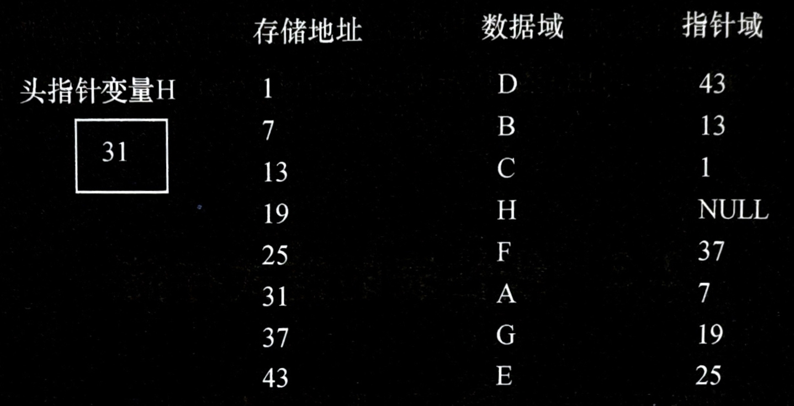

一般情况下，使用链表，只关心链表中结点间的逻辑顺序，并不关心每个结点的实际存储位置，因此通常用箭头来表示链域中的指针，于是链表就可以更直观地画成用箭头链接起来的结点序列。上图示例的单链表可表示为下图。

- 单链表的逻辑状态：
  

为了操作的统一、方便，可以在单链表的第一个结点之前附设一个**头结点**，头结点的数据域可以存储一些关于线性表的长度等附加信息，也可以不存储任何信息，对头结点数据域信息无特别规定，而头结点的指针域则用来存储指向第一个结点的指针（即第一个结点的存储位置）。此时**头指针**就不再指向表中第一个结点而是指向**头结点**。如果线性表为空表，则头结点的指针域为“空”，如下图所示。

- 带头结点单链表图示：
  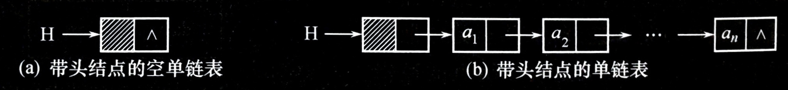

**单链表的存储结构描述如下**：
```c
typedef struct Node     /* 结点类型定义 */
{
   ElemType data;
   struct Node * next;
} Node, * LinkList;     /* LinkList 为结构指针类型 */
```

`LinkList` 与 `Node *` 同为结构指针类型，这两种类型是**等价**的。通常习惯上用 `LinkList` 说明指针变量，强调它是某个单链表的头指针变量。例如，使用定义 `LinkList L` ，则 `L` 为单链表的头指针，从而提高程序的可读性。用 `Node *` 来定义指向单链表中结点的指针，例如， `Node * p` ，则 `p` 为指向单链表中结点的指针变量。

`L` 是单链表的头指针，它指向表中第一个结点（对于带头结点的单链表，则指向单链表的头结点），若 `L == NULL` （对于带头结点的单链表为 `L->next == NULL` ）表达式为真，则表示单链表为一个空表，其长度为 $0$ 。若是非空表，则可以通过头指针 `L` 访问表中结点，从而找到要访问的所有结点的数据信息。例如，对于带头结点的单链表 `L` ，令 `p = L->next` ，则 `p` 指向表中的第一个元素结点（也称**首元结点**），通过 `p->data` 就可以访问到表中第一个元素的数据值了。


---


### 2.3.2 单链表上的基本运算
以单链表作存储结构实现线性表的基本运算。

<br>

#### 初始化单链表

**【算法描述】**
> ***算法：初始化单链表***
> ```c
> InitList(LinkList *L)
> {
>     *L = (Linklist)malloc(sizeof(Node));    /* 建立头结点 */
>     (*L)->next = NULL;                      /* 建立空的单链表 L */
> }
> ```
**注意**： `L` 是指向单链表的头结点的指针，用来接收主程序中待初始化单链表的头指针变量的地址， `*L` 相当于主程序中待初始化单链表的头指针变量。

<br>

#### 建立单链表
假设线性表中结点的数据类型是字符，逐个输入这些字符，并以 `$` 作为输入结束标志符。
常见的建表方法有如下两种。

- **头插法建表**
  **【算法思想】**
  从一个空表开始，每次读入数据，生成新结点，将读入数据存放到新结点的数据域中，然后将新结点插入到当前链表的表头结点之后，直至读入结束标志为止。头插法建立单链表过程如图所示。

  - 头插法建立单链表图示：
    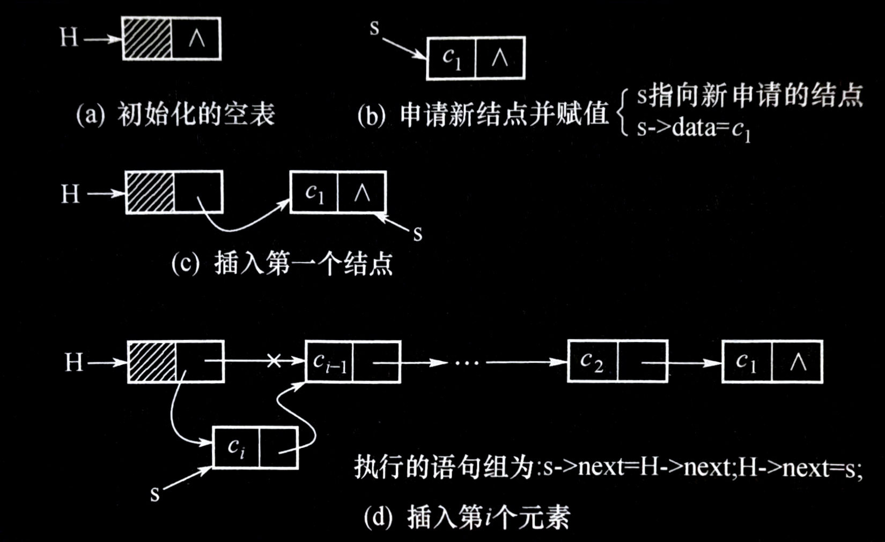

  **【算法描述】**
  > ***算法：用头插法建立单链表***
  > ```c
  > void CreateFromHead(LinkList L)
  > /* L 是带头结点的空链表头指针，通过键盘输入表中元素值，利用头插法建单链表 L */
  > {
  >     Node * s;
  >     char c;
  >     int flag = 1;
  >     while (flag)    /* flag 初值为 1，当输入 "$" 时，置 flag 为 0，建表结束 */
  >     {
  >         c = getchar();
  >         if (c != '$')
  >         {
  >             s = (Node *)malloc(sizeof(Node));   /* 建立新结点 s */
  >             s->data = c;
  >             s->next = L->next;                  /* 将 s 结点插入表头 */
  >             L->next = s;
  >         }
  >         else
  >             flag = 0;
  >     }
  > }
  > ```
  采用头插法得到的单链表的逻辑顺序**与输入元素顺序相反**，亦称**头插法建表**为**逆序建表法**。
  **注意**：在上述算法中， `L` 是指向单链表的头指针，习惯上称为单链表 `L` 。

<br>

- **尾插法建表**
  **【算法思想】**
  头插法建立链表虽然算法简单，但生成的链表中结点的次序和输入的顺序相反。若希望二者顺序一致，可采用尾插法建表。该方法是将新结点插到当前单链表的表尾上。为此需增加一个尾指针 `r` ，使之指向当前单链表的表尾。尾插法建立单链表过程如图所示。

  - 尾插法建立单链表图示：
    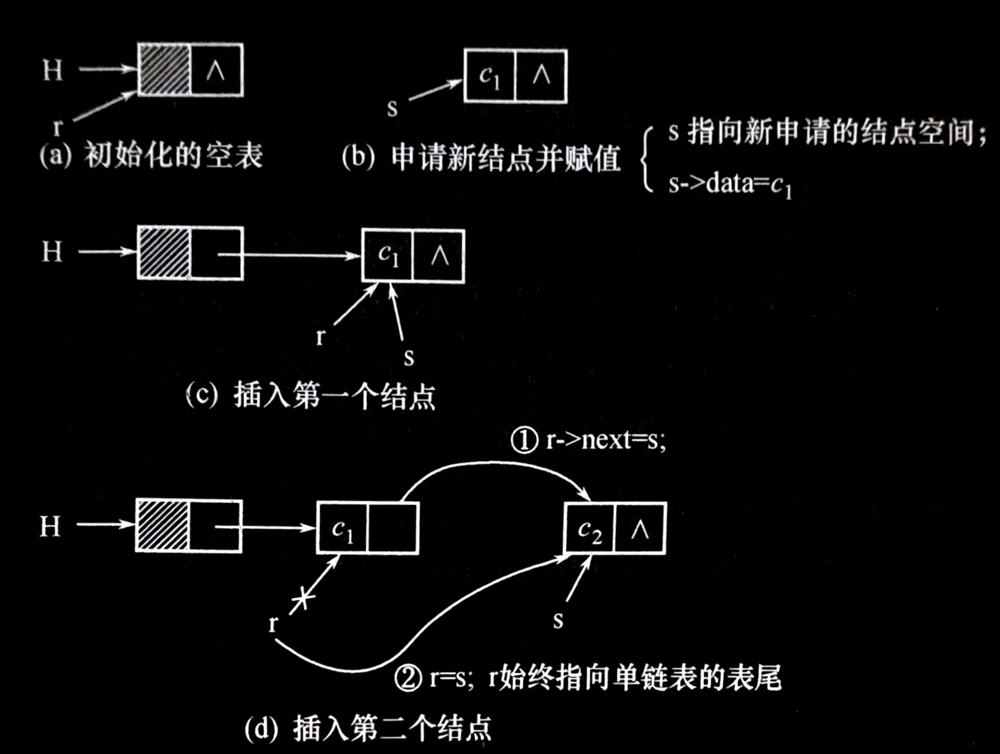

  **【算法描述】**
  > ***算法：用尾插法建立单链表***
  > ```c
  > void CreateFromTail(LinkList L)
  > /* L 是带头结点的空链表头指针，通过键盘输入元素值，利用尾插法建单链表 L */
  > {
  >     Node * r, * s;
  >     int flag = 1;     /* 设置一个标志，初值为 1，当输入 "$" 时，flag 为 0，建表结束 */
  >     r = L;            /* r 指针动态指向链表的当前表尾，以便于做尾插入，其初值指向头结点 */
  >     while (flag)      /* 循环输入表中元素值，将建立新结点 s 插入表尾 */
  >     {
  >         c = getchar();
  >         if (c != '$')
  >         {
  >             s = (Node *)malloc(sizeof(Node));
  >             s->data = c;
  >             r->next = s;
  >             r = s;
  >         }
  >         else
  >         {
  >             flag = 0;
  >             r->next = NULL; /* 将最后一个结点的 next 链域置为空，表示链表的结束 */
  >         }
  >     } /* while */
  > } /* CreateFromTail */
  > ```

<br>

#### 查找
1. **按序号查找**
   **【算法思想】**
   在单链表中，由于每个结点的存储位置都放在其前一结点的 next 域中，所以即使知道被访问结点的序号 $i$ ，也不能像顺序表那样直接按序号 $i$ 访问一维数组中的相应元素，实现随机存取，而只能从链表的头指针出发，顺链域 next 逐个结点往下搜索，直至搜索到第 $i$ 个结点为止。

   要查找带头结点的单链表中第 $i$ 个结点，则需要从单链表的头指针 `L` 出发，从头结点（`L->next`）开始顺着链域扫描，用指针 `p` 指向当前扫描到的结点，初值指向头结点，用 `j` 做计数器，累计当前扫描过的结点数（初值为 $0$ ），当 `j == i` 时，指针 `p` 所指的结点就是要找的第 $i$ 个结点。

   **【算法描述】**
   > ***算法：在单链表 `L` 中查找第 $i$ 个结点***
   > ```c
   > Node * Get(LinkList L, int i)
   > /* 在带头结点的单链表 L 中查找第 i 个结点（1 <= i <= n），
   >    若找到，则返回该结点的存储位置；否则返回 NULL */
   > {
   >     int j;
   >     Node * p;
   >     if (i <= 0)
   >         return NULL;
   >     p = L;
   >     j = 0;                /* 从头结点开始扫描 */
   >     while ((p->next != NULL) && (j < i))
   >     {
   >         p = p->next;      /* 扫描下一结点 */
   >         j++;              /* 已扫描结点计数器 */
   >     }
   >     if (i == j)
   >         return p;         /* 找到了第 i 个结点 */
   >     else
   >         return NULL;      /* 找不到，i <= 0 或 i > n */
   > } /* Get */
   > ```

<br>

2. **按值查找**
   **【算法思想】**
   按值查找是指在单链表中查找是否有值等于 $e$ 的结点。查找过程从单链表的头指针指向的头结点出发，顺链逐个将结点值和给定值 $e$ 作比较，返回查找结果。

   **【算法描述】**
   > ***算法：在单链表 `L` 中查找值为 `key` 的结点***
   > ```c
   > Node * Locate(LinkList L, ElemType key)
   > /* 在带头结点的单链表 L 中查找其结点值等于 key 的第一个结点，
   >    若找到则返回该结点的位置 p，否则返回 NULL */
   > {
   >     Node * p;
   >     p = L->next;          /* 从表中第一个结点开始 */
   >     while (p != NULL)     /* 当前表未查完 */
   >     {
   >         if (p->data != key)
   >             p = p->next;
   >         else
   >             break;        /* 找到结点值 = key 时退出循环 */
   >     }
   >     return p;
   > } /* Locate */
   > ```
  
**这两个算法的平均时间复杂度均为 $O(n)$ 。**

<br>

#### 求单链表长度操作
**【算法思想】**
采用“数”结点的方法求出带头结点单链表的长度。即从“头”开始“数”（ `p = L->next` ），用指针 `p` 依次指向各个结点，并附设计数器 `j` 计数，一直“数”到最后一个结点（ `p->next == NULL` ），从而得到单链表的长度。

**【算法描述】**
> ***算法：求单链表的长度***
> ```c
> int ListLength(LinkList L)
> /* 求带头结点的单链表 L 的长度 */
> {
>     Node * p;
>     p = L->next;
>     j = 0;          /* 用来存放单链表的长度 */
>     while (p != NULL)
>     {
>         p = p->next;
>         j++;
>     }
>     return j;       /* j 为求得的单链表长度 */
> } /* ListLength */
> ```

若单链表 `L` 为空表， `p` 的初值为 `NULL` ，算法中 `while` 循环未执行，则返回链表长度 `j` 为 $0$ 。
若单链表 `L` 为非空表，算法中 `while` 循环执行次数为表长度 `n` ，故**算法的时间复杂度为 $O(n)$** 。

<br>

#### 单链表插入操作
**【问题要求】**
在线性表的第 $i$ （ $1 ≤ i ≤ n+1$ ）个位置之前插入一个新元素 $e$ 。

**【算法思想】**
插入过程分为以下三步。
1. **查找**：在单链表中找到第 $i-1$ 个结点并由指针 `pre` 指示。
2. **申请**：申请新结点 `s` ，将其数据域的值置为 $e$ 。
3. **插入挂链**：通过修改指针域将新结点 `s` 挂入单链表 `L` 。

**【结果】**
将长度为 $n$ 的线性表（ $a_1, ..., a_{i-1}, a_i, ..., a_n$ ）变成长度为 $n + 1$ 的线性表（ $a_1, ..., a_{i-1}, a, a_i, ..., a_n$ ）。

单链表插入结点的过程如图所示。

- 在单链表第i个结点前插入一个结点的过程：
  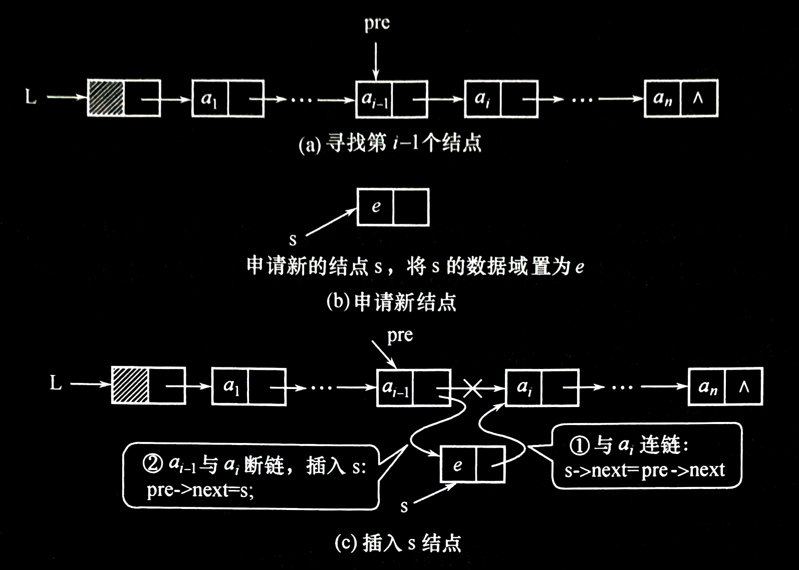

**【算法描述】**
> ***算法：单链表插入操作***
> ```c
> void InsList(LinkList L, int i, ElemType e)
> /* 在带头结点的单链表 L 中第 i 个位置插入值为 e 的新结点 */
> {
>     Node * pre, * s;
>     int k;
>     if (i <= 0)
>         return ERROR;
>     pre = L;
>     k = 0;                  /* 从“头”开始，查找第 i - 1 个结点 */
>     while ((pre != NULL) && (k < i - 1))    /* 表未查完且未查到第 i - 1 个时重复，找到 pre 指向第 i - 1 个 */
>     {
>         pre = pre->next;
>         k = k + 1;
>     }                       /* 查找第 i - 1 个结点 */
>     if (pre == NULL)        /* 如当前位置 pre 为空表示已找完，但还未数到第 i 个，说明插入位置不合理 */
>     {
>         printf("插入位置不合理！");
>         return ERROR;
>     }
>     s = (Node *)malloc(sizeof(Node));   /* 申请一个新的结点 s */
>     s->data = e;                        /* 值 e 置入 s 的数据域 */
>     s->next = pre->next;                /* 修改指针，完成插入操作 */
>     pre->next = s;
>     return OK;
> }
> ```

**说明**：若单链表中有 $m$ 个结点，则按头插法操作时插入位置有 $m + 1$ 个即 $1 ≤ i ≤ m + 1$ 。当 $i = m + 1$ 时，则认为是在单链表的尾部插入一个结点。

<br>

#### 单链表删除操作
**【问题要求】**
将线性表的第 $i$ （ $1 ≤ i ≤ n + 1$ ）个元素 $e$ 删除。

**【算法思想】**
删除过程分为以下两步。
1. **查找**：通过计数方式找到第 $i - 1$ 个结点并由指针 `pre` 指示。
2. **删除第 $i$ 个结点并释放结点空间**。

**【结果】**
将长度为 $n$ 的线性表（ $a_1, ..., a_{i-1}, a_i, ...,a_n$ ）变成长度为 $n - 1$ 的线性表（ $a_1, ..., a_{i-1}, a_{i+1}, ..., a_n$ ）单链表删除操作过程如图所示。

- 单链表的删除过程：
  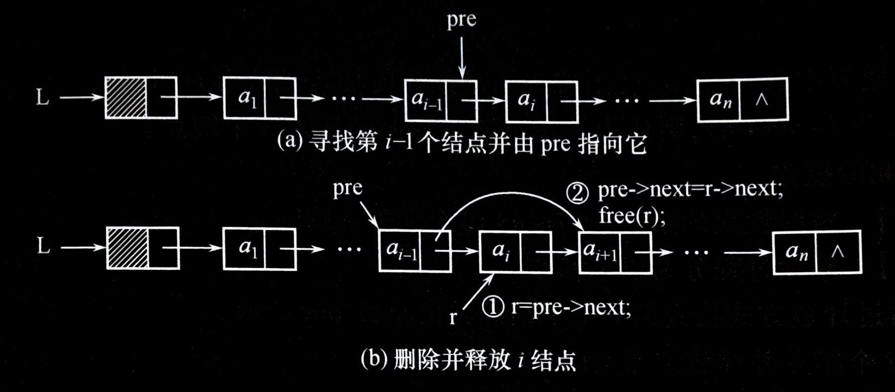

**【算法描述】**
> ***算法：单链表删除操作***
> ```c
> int DelList(LinkList L, int i, ElemType *e)
> /* 在带头结点的单链表 L 中删除第 i 个元素，并将删除的元素保存到变量 *e 中 */
> {
>     Node * pre, * r;
>     int k;
>     pre = L;
>     k = 0;
>     while ((pre->next != NULL) && (k < i - 1))
>     /* 寻找被删除结点 i 的前驱结点 i - 1 使 p 指向它 */
>     {
>         pre = pre->next;
>         k = k + 1;
>     }                   /* 查找第 i - 1 个结点 */
>     if (pre->next == NULL)  /* while 循环是因为 p->next == NULL 或 i < 1 而跳出的，
>                                因为pre->next为空，没有找到合法的前驱位置，说明删除位置 i 不合法 */
>     {
>         printf("删除结点的位置 i 不合理！");
>         return ERROR;
>     }
>     r = pre->next;
>     pre->next = r->next;    /* 修改指针,删除结点 r */
>     *e = r->data;
>     free(r);                /* 释放被删除的结点所占的内存空间 */
>     return OK;
> }
> ```

**说明**：删除算法中的循环条件（ `pre->next != NULL && k < i - 1` ）与前插算法中的循环条件（ `pre != NULL && k < i - 1` ）不同，因为前插时的插入位置有 $m + 1$ 个（ $m$ 为当前单链表中数据元素的个数）。 $i = m + 1$ 是指在第 $m + 1$ 个位置前插入，即在单链表的末尾插入。而删除操作中删除的合法位置只有 $m$ 个，若使用与前插操作相同的循环条件，则会出现指针指空的情况，使删除操作失败。

<br>

**例 2.4** 有两个单链表 `LA` 和 `LB` ，其元素均为非递减有序排列，编写一个算法，将它们合并成一个单链表 `LC` ，要求 `LC` 也是非递减有序排列。要求：利用新表 `LC` 利用现有的表 `LA` 和 `LB` 中的元素结点空间，而不要额外申请结点空间。例如 $LA = (2, 2, 3)$ ， $LB = (1, 3, 3, 4)$ ，则 $LC = (1, 2, 2, 3, 3, 3, 4)$ 。

**【算法思想】**
要求利用现有的表 `LA` 和 `LB` 中的结点空间来建立新表 `LC` ，可通过更改结点的 next 域来重建新的元素之间的线性关系。为保证新表仍然递增有序，可以利用尾插入法建立单链表的方法，只是新建表中的结点不用 `malloc` ，而只要从表 `LA` 和 `LB` 中选择合适的点插入到新表 `LC` 中即可。

**【算法描述】**
***算法：合并两个有序的单链表***
```c
LinkList MergeLinkList(LinkList LA, LinkList LB)
/* 将递增有序的单链表 LA 和 LB 合并成一个递增有序的单链表 LC */
{
    Node * pa, * pb;
    LinkList LC;
    /* 将 LC 初始置空表。pa 和 pb 分别指向两个单链表 LA 和 LB
       中的第一个结点，r 初值为 LC 且 r 始终指向 LC 的表尾 */
    pa = LA->next;
    pb = LB->next;
    LC = LA;
    LC->next = NULL;
    r = LC;
    /* 当两个表中均未处理完时，比较选择将较小值结点插入到新表 LC 中。 */
    while ((pa != NULL) && (pb != NULL))
    {
        if (pa->data <= pb->data)
        {
            r->next = pa;
            r = pa;
            pa = pa->next;
        }
        else
        {
            r->next = pb;
            r = pb;
            pb = pb->next;
        }
    }
    if (pa) /* 若表 LA 未完，将表 LA 中后续元素链到新表 LC 表尾 */
        r->next = pa;
    else    /* 否则将表 LB 中后续元素链到新表 LC 表尾 */
        r->next = pb;
    free(LB);
    return LC;
} /* MergeLinkList */
```

---


### 2.3.3 循环链表
**循环链表（Circular Linked List）是一个首尾相接的链表。** 将单链表最后一个结点的指针域由 `NULL` 改为指向表头结点，就得到了单链形式的循环链表，并称为循环单链表。同样还可以有多重链的循环链表。

在循环单链表中，表中所有结点都被链在一个环上，为使某些操作实现方便，在循环单链表中也可设置一个头结点。这样，空循环链表仅由一个自成循环的头结点表示。带头结点的循环单链表如图所示。

- 带头结点循环单链表：
  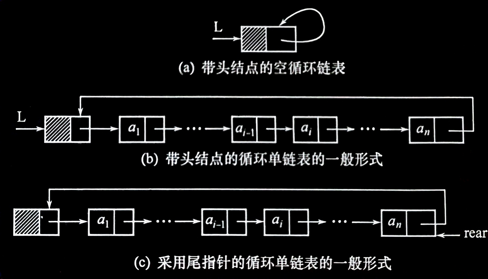

带头结点的循环单链表与带头结点的单链表的实现算法类似，**差别仅在于算法中判别当前结点 `p` 是否为表尾结点的条件不同**。单链表中判别条件为 `p != NULL` 或 `p->next != NULL` ，而单循环链表的判别条件则是 `p != L` 或 `p->next != L` 。

**在循环单链表中附设尾指针有时比附设头指针会使操作变得更简单**。例如，在用头指针表示的循环单链表中，找开始结点 $a_1$ 的时间复杂度是 $O(1)$ ，然而要找到终端结点 $a_n$ ，则需要从头指针开始遍历整个链表，其时间复杂度是 $O(n)$ 。如果用尾指针 rear 来表示循环单链表，则**查找开始结点和终端结点都很方便，它们的存储位置分别是 `rear->next->next` 和 `rear`** ，显然，查找时间复杂度都是 $O(1)$ 。因此，**实用中多采用尾指针表示循环单链表**。

<br>

#### 初始化循环单链表
```c
InitCLinkList(LinkList * CL)
/* CL 用来接收待初始化的循环单链表的头指针变量的地址 */
{
    *CL = (LinkList)malloc(sizeof(Node));   /* 建立头结点 */
    (*CL)->next = *CL;                      /*建立空的循环单链表 CL*/
}
```

<br>

#### 建立循环单链表
假设线性表中结点的数据类型是字符，逐个输入这些字符，并以 `$` 作为输入结束标志符。
```c
void CreateCLinkList(LinkList CL)
/* CL 是已经初始化好的、带头结点的空循环链表的头指针，通过键盘输入元素值，利用尾插法建立循环单链表 CL */
{
    Node * rear, * s;
    char c;
    rear = CL;          /* rear 指针动态指向链表的当前表尾，其初值指向头结点 */
    c = getchar();      /* 读入第一个元素 */
    while (c != '$')    /* 只要读入的元素不是结束标志，就存入新结点 s 并链到表尾，直到读入结束标志 */
    {
        s = (Node *)malloc(sizeof(Node));
        s->data = c;
        rear->next = s;
        rear = s;
        c = getchar();
    }
    rear->next = CL;    /* 让最后一个结点的 next 链域指向头结点 */
}
```

<br>

**例 2.5** 有两个带头结点的循环单链表 `LA` 、 `LB` ，编写算法，将两个循环单链表合并为一个循环单链表，其头指针为 `LA` 。

**【算法思想】**
先找到两个链表 `LA` 、 `LB` 的表尾，并分别由指针 `p` 、 `q` 指向它们，然后将第一个链表的尾与第二个表的第一个结点链接起来，并修改第二个表的表尾 `q` ，使它的链域指向第一个表的头结点。

**【算法描述】**
> ***算法：循环单链表的合并算法（1）***
> ```c
> LinkList merge_1(LinkList LA, LinkList LB)
> /* 此算法将两个采用头指针的循环单链表的首尾连接起来 */
> {
>     Node * P, * q;
>     p = LA;
>     q = LB;
>     while (p->next != LA)
>         p = p->next;    /* 找到表 LA 的表尾，用 p 指向它 */
>     while (q->next != LB)
>         q = q->next;    /* 找到表 LB 的表尾，用 q 指向它 */
>     q->next = LA;       /* 修改表 LB 的尾指针，使之指向表 LA 的头结点 */
>     p->next = LB->next; /* 修改表 LA 的尾指针，使之指向表 LB 中的第一个结点 */
>     free(LB);
>     return LA;
> }
> ```

**采用上面的方法，需要遍历链表，找到表尾，其执行时间是 $O(n)$ 。**

若单循环链表设置**尾指针**表示，在实现上述合并时，**无须循环遍历找尾结点，只需要直接修改尾结点的指针域，其执行时间是 $O(1)$ 。**

**【算法描述】**
> ***算法：循环单链表的合并算法（2）***
> ```c
> LinkList merge_2(LinkList RA, LinkList RB)
> /* 此算法将两个采用尾指针的循环链表首尾连接起来 */
> {
>     Node * p;
>     p = RA->next;     /* 保存链表 RA 的头结点地址 */
>     RA->next = RB->next->next;    /* 链表 RB 的开始结点链到链表 RA 的终端结点之后 */
>     free(RB->next);   /* 释放链表 RB 的头结点 */
>     RB->next = p;     /* 链表 RA 的头结点链到链表 RB 的终端结点之后 */
>     return RB;        /* 返回新循环链表的尾指针 */
> }
> ```


---


### 2.3.4 双向链表
循环单链表虽然能够实现从任一结点出发沿着链能找到其前驱结点，但时间耗费是 $O(n)$ 。如果希望从表中快速确定某一个结点的前驱，另一个解决方法就是在单链表的每个结点里再增加一个指向其前驱的指针域 prior。这样形成的链表中就**有两条方向不同的链，称之为双（向）链表（Double Linked List）**。双链表的结点结构如图所示。

- 双链表的结点结构
  | prior（前驱指针域） | data（数据域） | next（后继指针域） |
  |:------------------:|:-------------:|:-----------------:|

**双链表的结构定义如下**：
```c
typedef struct DNode
{
    ElemType data;
    struct DNode * prior, * next;
} DNode, * DoubleList;
```

与单链表类似，双链表也可增加头结点使双链表的某些运算变得方便。同时**双向链表也可以有循环表，称为双向循环链表**，其结构如图所示。

- 双向循环链表图示
  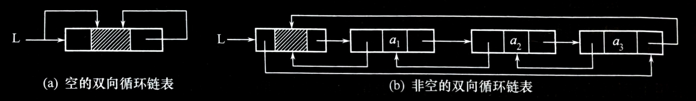

由于**在双向链表中既有前向链又有后向链**，寻找任一个结点的直接前驱结点与直接后继结点都变得非常方便了。

设指针 `p` 指向双链表中某一结点，则有下式成立：
```c
p->prior->next == p
p == p->next->prior
```

在双向链表中，那些**只涉及后继指针的算法**，如求表长度、取元素、元素定位等，**与单链表中相应的算法相同**；但**对于涉及前驱和后继两个方向指针变化的操作**，则**与单链表中的实现算法不同**。

<br>

#### 双向链表的前插操作
**【算法思想】**
欲在双向链表第i个结点之前插入一个的新的结点，则指针的变化情况如图所示。

- 双向链表插入操作
  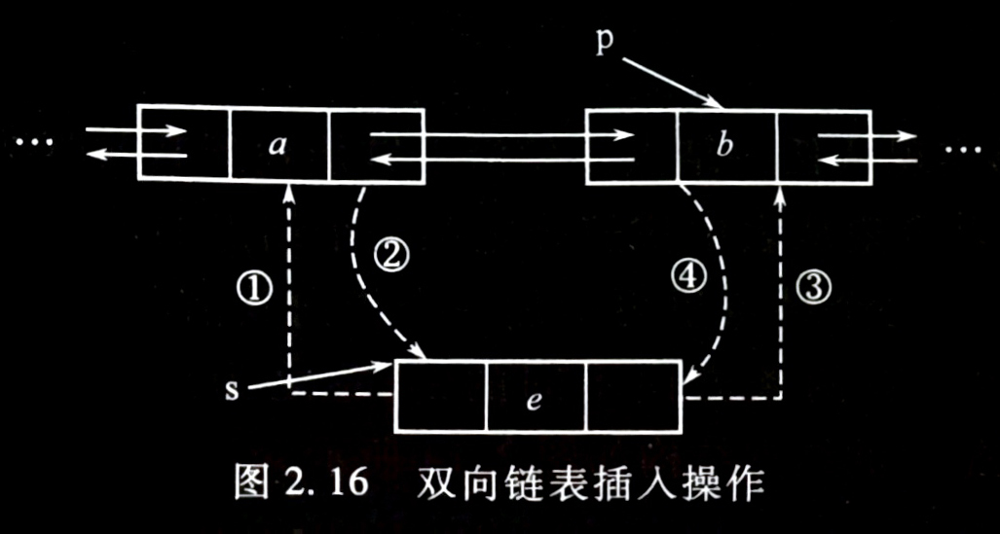

**【算法描述】**
> ***算法：双向链表的插入操作***
> ```c
> int DlinkIns(DoubleList L, int i, ElemType e)
> {
>     DNode * s, * p;
>     // ...  /* 先检查待插入的位置 i 是否合法（实现方法同单链表的前插操作） */
>     // ...  /* 若位置 i 合法，则找到第 i 个结点并让指针 p 指向它 */
>     s = (DNode *)malloc(sizeof(DNode));
>     if (s)
>     {
>         s->data = e;
>         s->prior = p->prior;    /* ① */
>         p->prior->next = s;     /* ② */
>         s->next = p;            /* ③ */
>         p->prior = s;           /* ④ */
>         return TRUE;
>     }
>     else
>         return FALSE;
> }
> ```

<br>

#### 双向链表的删除操作
**【算法思想】**
欲删除双向链表中的第 $i$ 个结点，则指针的变化情况如图所示。

- 双向链表的删除操作
  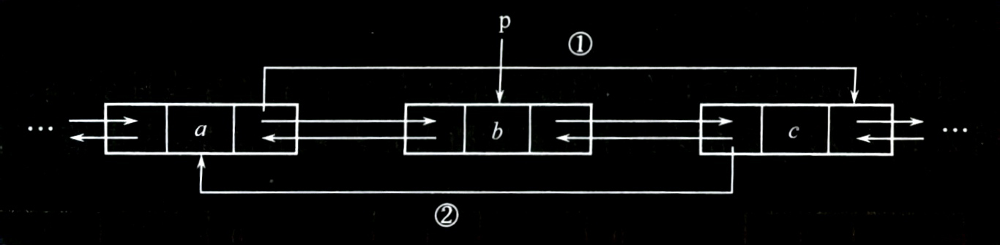

**【算法描述】**
> ***算法：双向链表的删除操作***
> ```c
> int DlinkDel(DoubleList L, int i, ElemType *e)
> {
>     DNode *p;
>     // ... /* 先检查待插入的位置 i 是否合法（实现方法同单链表的删除> 操作） */
>     // ... /* 若位置 i 合法，则找到第 i 个结点并让指针 p 指向它 */
>     *e = p->data;
>     p->prior->next = p->next;       /* ① */
>     p->next->prior = p->prior;      /* ② */
>     free(p);
>     return TRUE;
> }
> ```


---


### \* 2.3.5 静态链表
用于没有“指针”数据类型的高级语言，如 BASIC、FORTRAN，以便采用顺序存储结构数组模拟实现链表。在此不作具体讨论。


---


## 2.4 线性表应用——一元多项式的表示及相加

<br>

### 一元多项式的表示
一元多项式可按升幂的形式写成

$$P_n(x) = p_0 + p_1x^1 + p_2x^2 + ... + p_nx^n$$

其中， $p_i$ 是指数 $i$ 的项的系数。

假设 $Q_m(x)$ 是一个一元多项式，则它也可以用一个线性表 $Q$ 来表示，即

$$Q = (q_0, q_1, q_2, ..., q_m)$$

若假设 $m < n$ ，则两个多项式相加的结果 $R_n(x) = P_n(x) + Q_m(x)$ ，也可以用线性表 $R$ 来表示：

$$R = (p_0 + q_0, p_1 + q_1, p_2 + q_2, ..., p_m + q_m, p_{m+1}, ..., p_n)$$

<br>

### 一元多项式的存储
对于一元多项式各种操作，实际上可以利用线性表来处理。对应于线性表的两种存储方式，一元多项式可采用**顺序存储**和**链式存储**两种方法。

- **一元多项式的顺序存储表示**
  一元多项式 $P(x)$ 的顺序表示有两种。

  - 一种方法是**只存储该一元多项式各项的系数，每个系数所对应的指数项则隐含在存储系数的顺序表的下标中**。
    即 $p[0]$ 存系数 $p_0$ ，对应为 $x_0$ 的系数， $p[1]$ 存系数 $p_1$ ，对应为 $x_1$ 的系数，……， $p[n]$ 存系数 $p_n$ ，对应为 $x$ 的系数。采用这种存储方法使得多项式的相加运算的算法定义十分简单，只需将下标相同的单元的内容相加即可，适合于存储非零系数较多的多项式。

    > 在通常的应用中，若多项式的非零项指数很高并且非零项很少，例如：
    > 
    > $$R(x) = 1 + 5x^{10000} + 7x^{20000}$$
    > 
    > 若采用顺序存储每项系数，则需要 $20001$ 个空间，而存储的有用数据只有 $3$ 个，无疑是一种浪费。

  - 另一种方法是**只存储非零项，此时每个非零项只需要存储非零项系数和非零项指数这两项，适合存储非零项少的多项式**。

<br>

- **一元多项式的链式存储表示**
  1. **多项式链式存储的结点结构**。
     在链式存储中，对一元多项式**只存非零项**，则该多项式中每一非零项**由两部分（指数项和系数项）构成**，用单链表存储表示的结点结构如下所示。

     - 一元多项式链式存储结点示意图：
       | 系数 coef | 指数 exp | 指针 next |
       |:---------:|:--------:|:---------:|

     **结点结构定义如下**：
     ```c
     typedef struct Polynode
     {
         int coef;
         int exp;
         struct Polynode * next;
     } Polynode, * Polylist;
     ```

  2. **建立一元多项式链式存储算法**。
     **【算法思想】**
     通过键盘输入一组多项式的系数和指数，用**尾插法**建立一元多项式的链表。以输入系数 `0` 为结束标志，并约定建立多项式链表时，总是按指数从小到大的顺序排列。

     **【算法描述】**
     > ***算法：用尾插法建立一元多项式的链表***
     > ```c
     > Polylist PolyCreate()
     > {
     >     Polynode * head, * rear, * s;
     >     int c, e;
     >     head = (Polynode *)malloc(sizeof(Polynode));   /* 建立多项式的头结点 */
     >     rear = head;               /* rear 始终指向单链表的尾，便于尾插法建表 */
     >     scanf("%d %d", &c, &e);   /* 输入多项式的系数和指数项 */
     >     while (c != 0)             /* 若 c = 0，则代表多项式的输入结束 */
     >     {
     >         s = (Polynode *)malloc(sizeof(Polynode));  /* 申请新的结点 */
     >         s->coef = c;
     >         s->exp = e;
     >         rear->next = s;        /* 在当前表尾做插入 */
     >         rear = s;
     >         scanf("%d %d", &c, &e);
     >     }
     >     rear->next = NULL;         /* 将表的最后一个结点的 next 置 NULL，以表示结束 */
     >     return head;
     > }
     > ```

<br>

### 一元多项式的相加运算
- **用单链表表示的两个一元多项式**
  如图所示，用单链表分别表示两个多项式 $A(x) = 7 + 3x + 9x^8 + 5x^{17}$ 和 $B(x) = 8x + 22x^7 - 9x^8$ 。

  - 多项式的单链表表示法：
  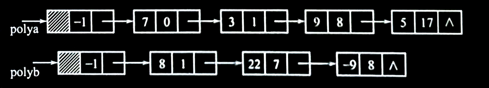

<br>

- **多项式相加的运算规则**
  为了保证“和多项式”中各项仍按**升幂排列**，在两个多项式中：
  1. **指数相同项的对应系数相加，若和不为零，则构成“和多项式”中的一项**。
  2. **指数不相同的项仍按升幂顺序复制到“和多项式”中**。

  **【算法思想】**
  以单链表 `polya` 和 `polyb` 分别表示两个一元多项式 $A$ 和 $B$ ， $A + B$ 的求和运算，就等同于单链表的插入问题（将单链表 `polyb` 中的结点插入到单链表 `polya` 中），因此“和多项式”中的结点无须另生成。

  为实现处理，设 `p` 、 `q` 分别指向单链表 `polya` 和 `polyb` 的当前项，比较 `p` 、 `q` 结点的指数项，由此得到下列运算规则：
  1. **若 `p->exp < q->exp`** ，则结点 `p` 所指的结点应是“和多项式”中的一项，令指针 `p` 后移。
  2. **若 `p->exp = q->exp`** ，则将两个结点中的系数相加，当和不为零时修改结点 `p` 的系数域，释放 `q` 结点；若和为零，则和多项式中无此项，从 `p`olya 中删去 `p` 结点，同时释放 `p` 和 `q` 结点。
  3. **若 `p->exp > q->exp`** ，则结点 `q` 所指的结点应是“和多项式”中的一项，将结点 `q` 插入在结点 `p` 之前，且令指针 `q` 在原来的链表上后移。

  算法采用**尾插法**生成“和多项式”单链表， `tail` 指针动态记录当前生成的“和多项式”的尾结点，是待插入“和多项式”的结点的直接前驱。为实现插入运算，所采用的正是在 2.3.2 小节中提到的**保留待插入结点前驱的处理技术**。

  **【算法描述】**
  > ***算法：多项式相加***
  > ```c
  > void PolyAdd(Polylist polya, Polylist polyb)
  > /* 将两个多项式相加，然后将和多项式存放在多项式 polya 中，并将多项式 ployb 删除 */
  > {
  >    Polynode * p, * q, * tail, * temp;
  >    int sum;
  >    p = polya->next;
  >    q = polyb->next;   /* 令 p 和 q 分别指向 polya 和 polyb 多项式链表中的第一个结点 */
  >    tail = polya;      /* tail 指向和多项式的尾结点 */
  >    while (p != NULL && q != NULL) /* 当两个多项式均未扫描结束时 */
  >    {
  >        if (p->exp < q->exp)
  >        /* 规则（1）：p 指向的多项式项指数小于 q 的指数，将 p 结点加入到和多项式中 */
  >        {
  >            tail->next = p;
  >            tail = p;
  >            p = p->next;
  >        }
  >        else if (p->exp == q->exp)
  >        /* 规则（2）：若指数相等，则相应的系数相加 */
  >        {
  >            sum = p->coef + q->coef;
  >            if (sum != 0)
  >            /* 系数和非零，则系数和置入结点 p，p 加入到和多项式，释放结点 q，并将指针后移 */
  >            {
  >                p->coef = sum;
  >                tail->next = p;
  >                tail = p;
  >                p = p->next;
  >                temp = q; q = q->next; free(temp);
  >            }
  >            else
  >            /* 若系数和为零，则删除结点 p 与 q，并将指针指向下一个结点 */
  >            {
  >                temp=p; p=p->next; free(temp);
  >                temp=q; q=q->next; free(temp);
  >            }
  >        }
  >        else
  >        {
  >            tail->next = q;
  >            tail = q;  /* 规则（3）：将 q 结点加入到“和多项式中” */
  >            q = q->next;
  >        }
  >    }
  >    if (p != NULL)     /* 多项式 A 中还有剩余，则将剩余的结点加入到和多项式中 */
  >        tail->next = p;
  >    else               /* 否则，将 B 中的结点加入到和多项式中 */
  >        tail->next = q;
  > }
  > ```

  **假设 `A` 多项式有 $M$ 项， `B` 多项式有 $N$ 项，则上述算法的时间复杂度为 $O(M + N)$** 。
  
  下图所示为上图中两个多项式的和，其中孤立的结点代表被释放的结点。
  
  - 多项式相加得到的多项式和：
    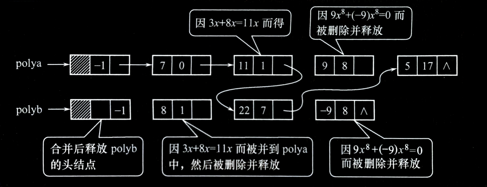

<br>

**通过对多项式加法的介绍，可以将其推广到实现两个多项式的相乘，因为乘法可以分解为一系列的加法运算。**


---


## 2.5 顺序表与链表的综合比较

### 2.5.1 顺序表和链表的比较

<br>

#### 基于空间的考虑
顺序表的存储空间是静态分配的，在程序执行之前必须明确规定它的存储规模。若线性表的长度变化较大，则存储规模难以预先确定。估计过大则造成空间浪费，估计太小又可能导致空间溢出。**当线性表的长度变化较大、难以估计其存储规模时，采用动态链表作为存储结构较好**。

**存储密度（Storage Density）**，是指**结点数据本身所占的存储量和整个结点结构所占的存储量之比**。链表中的每个结点，除了数据域外，还要额外设置指针（或游标）域，从存储密度来讲，这是不经济的。

**一般地，存储密度越大,存储空间的利用率就越高**。显然，**顺序表的存储密度为 $1$ ，而链表的存储密度小于 $1$** 。
> 例如，单链表中各结点的数据均为整数，指针所占空间和整型量相同，则单链表的存储密度为50%。因此若不考虑顺序表中的备用结点空间，则顺序表的存储空间利用率为100%，而单链表的存储空间利用率为50%。

由此可知，**当线性表的长度变化不大、易于事先确定其大小时，为了节约存储空间，宜采用顺序表作为存储结构**。

<br>

#### 基于时间的考虑
顺序表是由向量实现的，它是一种随机存取结构，对表中任一结点都可以在 $O(1)$ 时间内直接地存取，而链表中的结点则需从头指针起顺着链查找才能取得。因此，**若线性表的操作主要是进行查找，很少做插入或删除操作，宜采用顺序表作为存储结构**。

在链表中的任何位置上进行插入或删除，都只需要修改指针。而在顺序表中进行插入或删除时，平均要移动表中近一半的结点，尤其是当每个结点的信息量较大时，移动结点的时间开销就相当可观。因此，**对于频繁进行插入或删除操作的线性表，宜采用链表作为存储结构**。**若表的插入或删除操作主要发生在表的首尾两端，则宜采用带尾指针的单循环链表**。

<br>

#### 基于语言的考虑
在没有提供指针类型的高级语言环境中，若要采用链表结构，则可以使用游标来实现静态链表。虽然静态链表在存储分配上有不足之处，但它和动态链表一样，具有插入和删除方便的特点。

**值得一提的是，即使是对那些具有指针类型的语言，静态链表也有其用武之地。特别是当线性表的长度不变，仅需改变结点之间的相对关系时，静态链表比动态链表可能更方便。**


---


### 2.5.2 线性表链式存储方式的比较

|         操作名称→<br>链表名称↓         |           找表中首元素结点           |            找表尾结点           |                        找 `P` 结点前驱结点                        |
|:--------------------------------------:|:------------------------------------:|:-------------------------------:|:-----------------------------------------------------------------:|
|             带头结点单链表 `L`         |    `L->next` <br> 时间耗费 $O(1)$    |  一重循环 <br> 时间耗费 $O(n)$  |            顺 `P` 结点的 next 域无法找到 `P` 结点的前驱           |
| 带头结点循环单链表 <br> （头指针） `L` |    `L->next` <br> 时间耗费 $O(1)$    |  一重循环 <br> 时间耗费 $O(n)$  | 顺 `P` 结点的 next 域可以找到 `P` 结点的前驱 <br> 时间耗费 $O(n)$ |
|        带尾指针的循环单链表 `R`        | `R->next->next` <br> 时间耗费 $O(1)$ |     `R` <br> 时间耗费 $O(1)$    | 顺 `P` 结点的 next 域可以找到 `P` 结点的前驱 <br> 时间耗费 $O(n)$ |
|        带头结点双向循环链表 `L`        |    `L->next` <br> 时间耗费 $O(1)$    | `L->proir` <br> 时间耗费 $O(1)$ |                  `R->proir` <br> 时间耗费 $O(1)$                  |