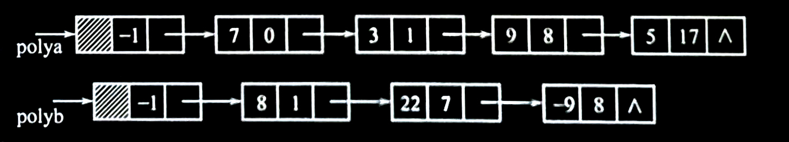
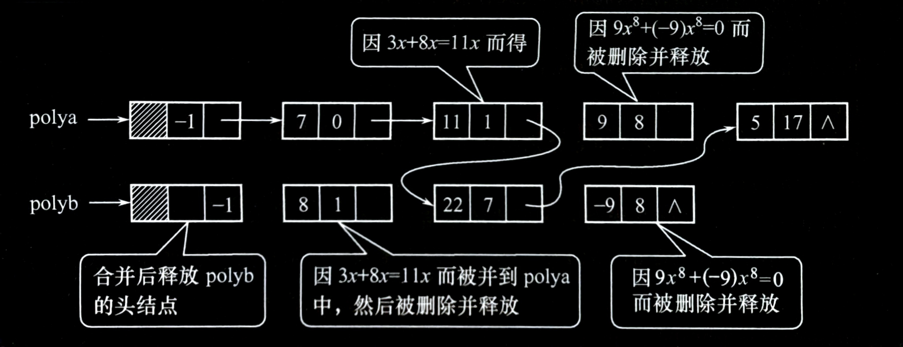

# 2.4 线性表应用——一元多项式的表示及相加


<br>

### 一元多项式的表示
一元多项式可按升幂的形式写成

$$P_n(x) = p_0 + p_1x^1 + p_2x^2 + \cdots  + p_nx^n$$

其中， $p_i$ 是指数 $i$ 的项的系数。

假设 $Q_m(x)$ 是一个一元多项式，则它也可以用一个线性表 $Q$ 来表示，即

$$Q = (q_0, q_1, q_2, \cdots , q_m)$$

若假设 $m < n$ ，则两个多项式相加的结果 $R_n(x) = P_n(x) + Q_m(x)$ ，也可以用线性表 $R$ 来表示：

$$R = (p_0 + q_0, p_1 + q_1, p_2 + q_2, \cdots , p_m + q_m, p_{m+1}, \cdots , p_n)$$

<br>

### 一元多项式的存储
对于一元多项式各种操作，实际上可以利用线性表来处理。对应于线性表的两种存储方式，一元多项式可采用**顺序存储**和**链式存储**两种方法。

- **一元多项式的顺序存储表示**

  一元多项式 $P(x)$ 的顺序表示有两种。

    - 一种方法是**只存储该一元多项式各项的系数，每个系数所对应的指数项则隐含在存储系数的顺序表的下标中**。
      即 $p[0]$ 存系数 $p_0$ ，对应为 $x_0$ 的系数， $p[1]$ 存系数 $p_1$ ，对应为 $x_1$ 的系数，……， $p[n]$ 存系数 $p_n$ ，对应为 $x$ 的系数。采用这种存储方法使得多项式的相加运算的算法定义十分简单，只需将下标相同的单元的内容相加即可，适合于存储非零系数较多的多项式。

      > 在通常的应用中，若多项式的非零项指数很高并且非零项很少，例如：
      >
      > $$R(x) = 1 + 5x^{10000} + 7x^{20000}$$
      >
      > 若采用顺序存储每项系数，则需要 $20001$ 个空间，而存储的有用数据只有 $3$ 个，无疑是一种浪费。

    - 另一种方法是**只存储非零项，此时每个非零项只需要存储非零项系数和非零项指数这两项，适合存储非零项少的多项式**。

<br>

- **一元多项式的链式存储表示**

    1. **多项式链式存储的结点结构**。

       在链式存储中，对一元多项式**只存非零项**，则该多项式中每一非零项**由两部分（指数项和系数项）构成**，用单链表存储表示的结点结构如下所示。

        - 一元多项式链式存储结点示意图：
          | 系数 coef | 指数 exp | 指针 next |
          |:---------:|:--------:|:---------:|

       **结点结构定义如下**：
       ```c
       typedef struct Polynode
       {
           int coef;
           int exp;
           struct Polynode * next;
       } Polynode, * Polylist;
       ```

    2. **建立一元多项式链式存储算法**。

       **【算法思想】**

       通过键盘输入一组多项式的系数和指数，用**尾插法**建立一元多项式的链表。以输入系数 `0` 为结束标志，并约定建立多项式链表时，总是按指数从小到大的顺序排列。

       **【算法描述】**

       > ***算法：用尾插法建立一元多项式的链表***
       >
       > ```c
       > Polylist PolyCreate()
       > {
       >     Polynode * head, * rear, * s;
       >     int c, e;
       >     head = (Polynode *)malloc(sizeof(Polynode));   /* 建立多项式的头结点 */
       >     rear = head;               /* rear 始终指向单链表的尾，便于尾插法建表 */
       >     scanf("%d %d", &c, &e);   /* 输入多项式的系数和指数项 */
       >     while (c != 0)             /* 若 c = 0，则代表多项式的输入结束 */
       >     {
       >         s = (Polynode *)malloc(sizeof(Polynode));  /* 申请新的结点 */
       >         s->coef = c;
       >         s->exp = e;
       >         rear->next = s;        /* 在当前表尾做插入 */
       >         rear = s;
       >         scanf("%d %d", &c, &e);
       >     }
       >     rear->next = NULL;         /* 将表的最后一个结点的 next 置 NULL，以表示结束 */
       >     return head;
       > }
       > ```

<br>

### 一元多项式的相加运算
- **用单链表表示的两个一元多项式**

  如图所示，用单链表分别表示两个多项式 $A(x) = 7 + 3x + 9x^8 + 5x^{17}$ 和 $B(x) = 8x + 22x^7 - 9x^8$ 。

    - 多项式的单链表表示法：
      

<br>

- **多项式相加的运算规则**

  为了保证“和多项式”中各项仍按**升幂排列**，在两个多项式中：
    1. **指数相同项的对应系数相加，若和不为零，则构成“和多项式”中的一项**。
    2. **指数不相同的项仍按升幂顺序复制到“和多项式”中**。

  **【算法思想】**

  以单链表 `polya` 和 `polyb` 分别表示两个一元多项式 $A$ 和 $B$ ， $A + B$ 的求和运算，就等同于单链表的插入问题（将单链表 `polyb` 中的结点插入到单链表 `polya` 中），因此“和多项式”中的结点无须另生成。

  为实现处理，设 `p` 、 `q` 分别指向单链表 `polya` 和 `polyb` 的当前项，比较 `p` 、 `q` 结点的指数项，由此得到下列运算规则：
    1. **若 `p->exp < q->exp`** ，则结点 `p` 所指的结点应是“和多项式”中的一项，令指针 `p` 后移。
    2. **若 `p->exp = q->exp`** ，则将两个结点中的系数相加，当和不为零时修改结点 `p` 的系数域，释放 `q` 结点；若和为零，则和多项式中无此项，从 `polya` 中删去 `p` 结点，同时释放 `p` 和 `q` 结点。
    3. **若 `p->exp > q->exp`** ，则结点 `q` 所指的结点应是“和多项式”中的一项，将结点 `q` 插入在结点 `p` 之前，且令指针 `q` 在原来的链表上后移。

  算法采用**尾插法**生成“和多项式”单链表， `tail` 指针动态记录当前生成的“和多项式”的尾结点，是待插入“和多项式”的结点的直接前驱。为实现插入运算，所采用的正是在 2.3.2 小节中提到的**保留待插入结点前驱的处理技术**。

  **【算法描述】**

  > ***算法：多项式相加***
  >
  > ```c
  > void PolyAdd(Polylist polya, Polylist polyb)
  > /* 将两个多项式相加，然后将和多项式存放在多项式 polya 中，并将多项式 ployb 删除 */
  > {
  >    Polynode * p, * q, * tail, * temp;
  >    int sum;
  >    p = polya->next;
  >    q = polyb->next;   /* 令 p 和 q 分别指向 polya 和 polyb 多项式链表中的第一个结点 */
  >    tail = polya;      /* tail 指向和多项式的尾结点 */
  >    while (p != NULL && q != NULL) /* 当两个多项式均未扫描结束时 */
  >    {
  >        if (p->exp < q->exp)
  >        /* 规则（1）：p 指向的多项式项指数小于 q 的指数，将 p 结点加入到和多项式中 */
  >        {
  >            tail->next = p;
  >            tail = p;
  >            p = p->next;
  >        }
  >        else if (p->exp == q->exp)
  >        /* 规则（2）：若指数相等，则相应的系数相加 */
  >        {
  >            sum = p->coef + q->coef;
  >            if (sum != 0)
  >            /* 系数和非零，则系数和置入结点 p，p 加入到和多项式，释放结点 q，并将指针后移 */
  >            {
  >                p->coef = sum;
  >                tail->next = p;
  >                tail = p;
  >                p = p->next;
  >                temp = q; q = q->next; free(temp);
  >            }
  >            else
  >            /* 若系数和为零，则删除结点 p 与 q，并将指针指向下一个结点 */
  >            {
  >                temp=p; p=p->next; free(temp);
  >                temp=q; q=q->next; free(temp);
  >            }
  >        }
  >        else
  >        {
  >            tail->next = q;
  >            tail = q;  /* 规则（3）：将 q 结点加入到“和多项式中” */
  >            q = q->next;
  >        }
  >    }
  >    if (p != NULL)     /* 多项式 A 中还有剩余，则将剩余的结点加入到和多项式中 */
  >        tail->next = p;
  >    else               /* 否则，将 B 中的结点加入到和多项式中 */
  >        tail->next = q;
  > }
  > ```

  **假设 `A` 多项式有 $M$ 项， `B` 多项式有 $N$ 项，则上述算法的时间复杂度为 $O(M + N)$** 。

  下图所示为上图中两个多项式的和，其中孤立的结点代表被释放的结点。

    - 多项式相加得到的多项式和：
      

<br>

**通过对多项式加法的介绍，可以将其推广到实现两个多项式的相乘，因为乘法可以分解为一系列的加法运算。**
