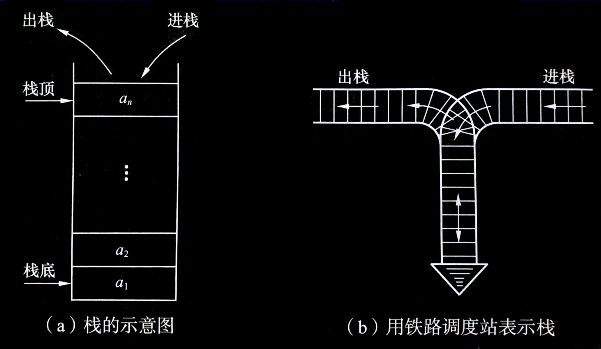
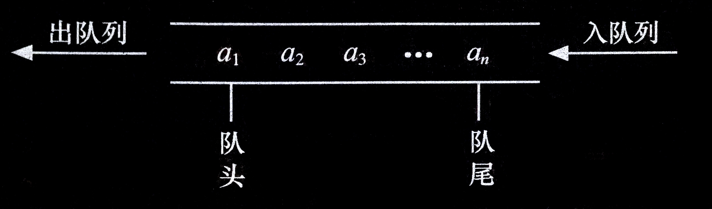
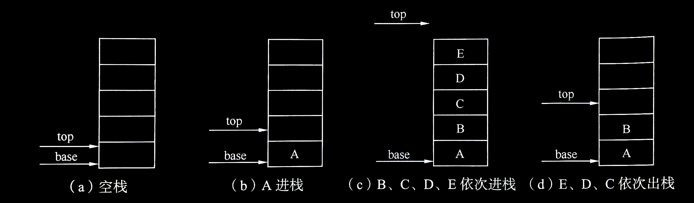
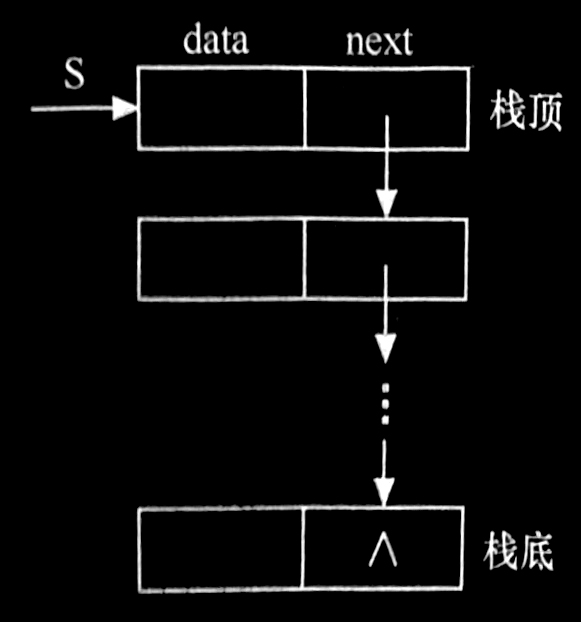
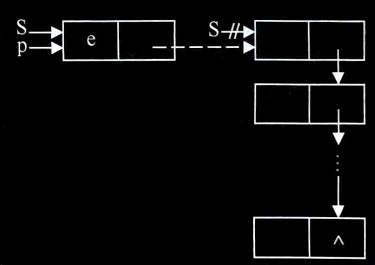
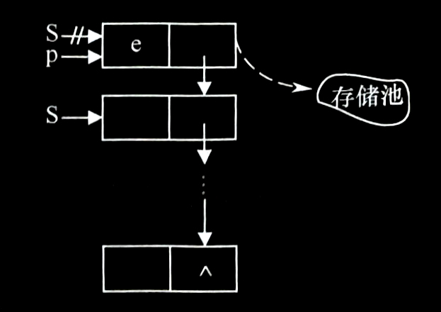
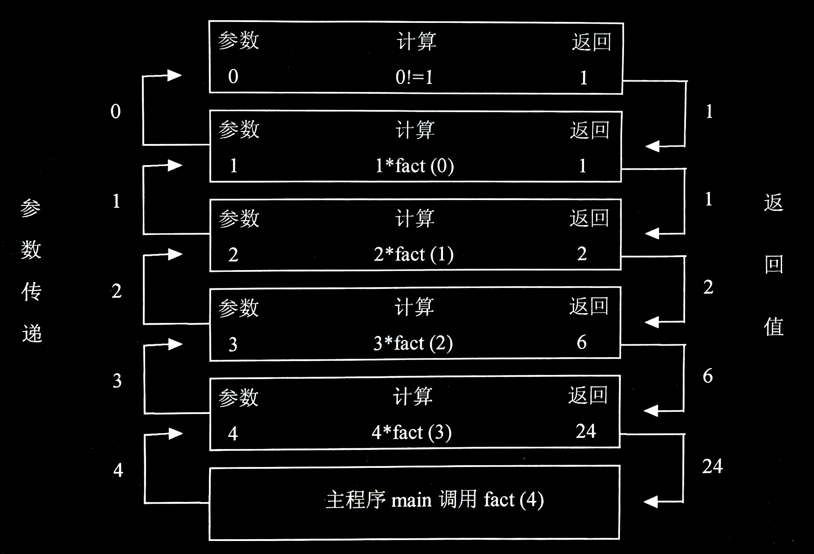
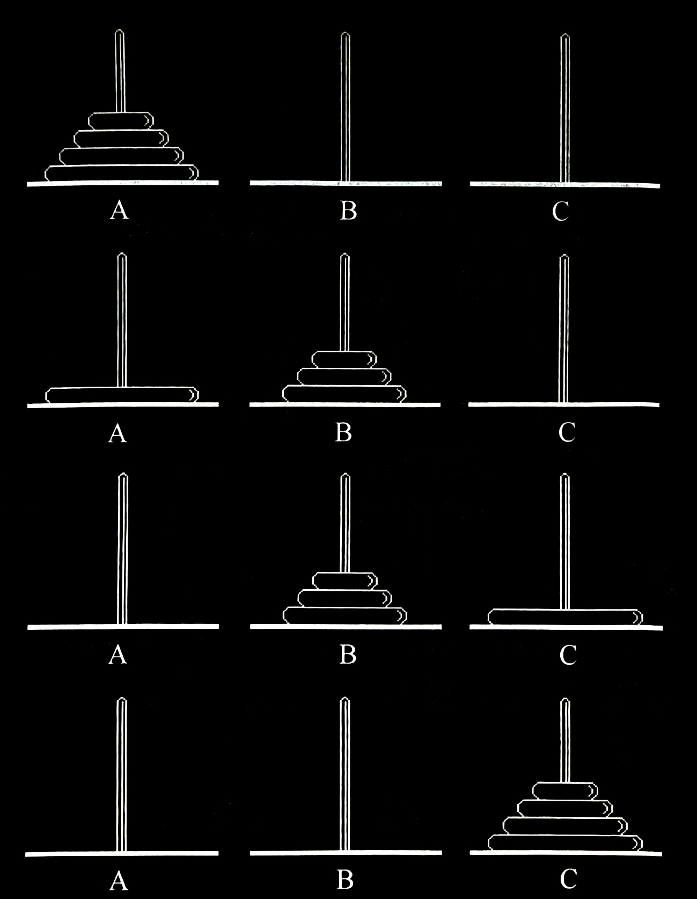

# 第 3 章 栈和队列

## 3.1 栈和队列的定义和特点
栈和队列是两种重要的**线性结构**。

从**数据结构角度**看，栈和队列**也是线性表**，其特殊性在子栈和队列的基本操作是线性表操作的子集，它们**是操作受限的线性表**，因此，可称为**限定性的数据结构**。

但从**数据类型角度**看，它们是**和线性表不相同的两类重要的抽象数据类型**。

### 3.1.1 栈的定义和特点
**栈（stack）**是**限定仅在表尾进行插入或删除操作的线性表**。因此，对栈来说，**表尾端**有其特殊含义，**称为栈顶（top）**，相应地，**表头端称为栈底（bottom）**。不含元素的空表称为**空栈**。

假设栈 $S = (a_1, a_2, ..., a_n)$ ，则称 $a_1$ 为栈底元素， $a_n$ 为栈顶元素。栈的修改是按**后进先出**的原则进行的。因此，栈又称为**后进先出（Last In First Out, LIFO）的线性表**。

- 栈：
  


---


### 3.1.2 队列的定义和特点
和栈相反，**队列（queue）**是一种**先进先出（First In First Out, FIFO）的线性表**。它只允许在表的**一端进行插入**，而在**另一端删除元素**。这和日常生活中的排队是一致的，**最早进入队列的元素最早离开**。在队列中，**允许插入的一端称为队尾（rear）**，**允许删除的一端则称为队头（front）**。

假设队列为 $q = (a_1, a_2, ..., a_n)$ ，那么， $a_1$ 就是队头元素， $a_n$ 则是队尾元素。

- 队列的示意图：
  


---


## 3.2 案例引入

- **案例3.1：数制的转换**
  
  十进制数 $N$ 和其他 $d$ 进制数的转换是计算机实现计算的基本问题，其解决方法很多，其中一个简单算法基于下列原理：

  $$N = (N\ \ div\ \ d) × d + N\ mod\ d$$ 

  （其中， $div$ 为整除运算， $mod$ 为求余运算）

  > 例如： $(1348)_{10} = (2504)_8$ ，其运算过程如下：
  > 
  > |   $N$  | $N\ div\ 8$ | $N\ mod\ 8$ |
  > |:------:|:-----------:|:-----------:|
  > | $1348$ |    $168$    |     $4$     |
  > |  $168$ |     $21$    |     $0$     |
  > |  $21$  |     $2$     |     $5$     |
  > |   $2$  |     $0$     |     $2$     |

  假设现要编制一个满足下列要求的程序：对于输入的任意一个非负十进制整数，输出与其等值的八进制数。上述计算过程是从低位到高位顺序产生八进制数的各个数位；而输出过程应从高位到低位进行，恰好和计算过程相反，因而我们可以使用栈来解决这个问题。在计算过程中依次将得到的余数压入栈中，计算完毕后，再依次弹出栈中的余数就是数制转换的结果。

<br>

- **案例3.2：括号匹配的检验**
  
  假设表达式中允许包含两种括号：圆括号和方括号，其嵌套的顺序随意，即 `([ ]( ))` 或 `[([ ][ ])]` 等为正确的格式， `[( ]` 或 `([( ))` 或 `( )])` 均为不正确的格式。检验括号是否匹配的方法可用“期待的急迫程度”这个概念来描述。

  > 例如，考虑下列括号序列：
  > ```cpp
  > [ ( [ ] [ ] ) ]
  > 1 2 3 4 5 6 7 8
  > ```
  > 
  > 当计算机接受了第一个括号后，它期待着与其匹配的第八个括号的出现，然而等来的却是第二个括号，显然第二个括号的期待急迫性高于第一个括号，此时第一个括号 `[` 只能暂时靠边，而迫切等待与第二个括号相匹配的、第七个括号 `)` 的出现。类似地，因等来的是第三个括号 `[` ，其期待匹配的程度较第二个括号更急迫，则第二个括号也只能靠边，让位于第三个括号。在接受了第四个括号之后，第三个括号的期待得到满足，消解之后，第二个括号的期待匹配就成为当前最急迫的任务了，……，依次类推。可见，这个处理过程恰与栈的特点相吻合。每读入一个括号，若是右括号，则或者使置于栈顶的最急迫的期待得以消解，或者是不合法的情况；若是左括号，则作为一个新的更急迫的期待压入栈中，自然使原有的在栈中的所有未消解的期待的急迫性都降了一级。

<br>

- **案例3.3：表达式求值**
  
  表达式求值是程序设计语言编译中的一个最基本问题，其实现是栈应用的又一个典型例子。“算符优先法”，是一种简单直观、广为使用的表达式求值算法。

  要把一个表达式翻译成正确求值的一个机器指令序列，或者直接对表达式求值，首先要能够正确解释表达式。算符优先法就是根据算术四则运算规则确定的运算优先关系，实现对表达式的编译或解释执行的。

  在表达式计算中先出现的运算符不一定先运算，具体运算顺序是需要通过运算符优先关系的比较，确定合适的运算时机，而运算时机的确定是可以借助栈来完成的。将扫描到的不能进行运算的运算数和运算符先分别压入运算数栈和运算符栈中，在条件满足时再分别从栈中弹出进行运算。

**上述3个应用实例都是借助栈的后进先出的特性来处理问题的，在日常生活中，符合先进先出特性的应用更为常见。**

- **案例3.4：舞伴问题**
  
  假设在周末舞会上，男士们和女士们进入舞厅时，各自排成一队。跳舞开始时，依次从男队和女队的队头各出一人配成舞伴。若两队初始人数不相同，则较长的那一队中未配对者等待下一轮舞曲。现要求写一算法模拟上述舞伴配对问题。

  先入队的男士或女士应先出队配成舞伴，因此该问题具有典型的先进先出特性，可用队列作为算法的数据结构。

  从上面的应用案例可以看出，不论是借助栈还是队列来解决问题，最基本的操作都是“入”和“出”。对于栈，在栈顶插入元素的操作称作“入栈”，删除栈顶元素的操作称作“出栈”；对于队列，在队尾插入元素的操作称作“入队”，在队头删除元素的操作称作“出队”。和线性表一样栈和队列的存储结构也包括顺序和链式两种。


---


## 3.3 栈的表示和操作的实现

### 3.3.1 栈的类型定义
栈的基本操作除了入栈和出栈外，还有栈的初始化、栈空的判定，以及取栈顶元素等。

> ***下面给出栈的抽象数据类型定义：***
> 
> **$ADT\ Stack$** {
> 
> &ensp;&ensp;&ensp;&ensp;**数据对象**： $D = \{ a_i\ |\ a_i∈ElemSet,\ i = 1, 2, ..., n,\ n ≥ 0 \}$
> 
> &ensp;&ensp;&ensp;&ensp;**数据关系**： $R = \{ \langle a_{i-1}, a_i \rangle\ |\ a_{i-1}, a_i∈D,\ i = 2, ..., n \}$
> 
> &ensp;&ensp;&ensp;&ensp;&ensp;&ensp;&ensp;&ensp;&ensp;&ensp;&ensp;&ensp;&ensp;&ensp;约定 $a_n$ 端为栈顶， $a_1$ 端为栈底。
> 
> &ensp;&ensp;&ensp;&ensp;**基本操作**：
> 
> &ensp;&ensp;&ensp;&ensp;&ensp;&ensp; $InitStack(\& S)$
> 
> &ensp;&ensp;&ensp;&ensp;&ensp;&ensp;&ensp;&ensp; 操作结果：构造一个空栈 $S$ 。
> 
> &ensp;&ensp;&ensp;&ensp;&ensp;&ensp; $DestroyStack(\& S)$
> 
> &ensp;&ensp;&ensp;&ensp;&ensp;&ensp;&ensp;&ensp; 初始条件：栈 $S$ 已存在。
> 
> &ensp;&ensp;&ensp;&ensp;&ensp;&ensp;&ensp;&ensp; 操作结果：栈 $S$ 被销毁。
> 
> &ensp;&ensp;&ensp;&ensp;&ensp;&ensp; $ClearStack(\& S)$
> 
> &ensp;&ensp;&ensp;&ensp;&ensp;&ensp;&ensp;&ensp; 初始条件：栈 $S$ 已存在。
> 
> &ensp;&ensp;&ensp;&ensp;&ensp;&ensp;&ensp;&ensp; 操作结果：将 $S$ 清为空栈。
> 
> &ensp;&ensp;&ensp;&ensp;&ensp;&ensp; $StackEmpty(S)$
> 
> &ensp;&ensp;&ensp;&ensp;&ensp;&ensp;&ensp;&ensp; 初始条件：栈 $S$ 已存在。
> 
> &ensp;&ensp;&ensp;&ensp;&ensp;&ensp;&ensp;&ensp; 操作结果：若栈 $S$ 为空栈，则返回 $true$ ，否则返回 $false$ 。
> 
> &ensp;&ensp;&ensp;&ensp;&ensp;&ensp; $StackLength(S)$
> 
> &ensp;&ensp;&ensp;&ensp;&ensp;&ensp;&ensp;&ensp; 初始条件：栈 $S$ 已存在。
> 
> &ensp;&ensp;&ensp;&ensp;&ensp;&ensp;&ensp;&ensp; 操作结果：返回 $S$ 的元素个数，即栈的长度。
> 
> &ensp;&ensp;&ensp;&ensp;&ensp;&ensp; $GetTop(S)$
> 
> &ensp;&ensp;&ensp;&ensp;&ensp;&ensp;&ensp;&ensp; 初始条件：栈 $S$ 已存在且非空。
> 
> &ensp;&ensp;&ensp;&ensp;&ensp;&ensp;&ensp;&ensp; 操作结果：返回 $S$ 的栈顶元素，不修改栈顶指针。
> 
> &ensp;&ensp;&ensp;&ensp;&ensp;&ensp; $Push(\& S, e)$
> 
> &ensp;&ensp;&ensp;&ensp;&ensp;&ensp;&ensp;&ensp; 初始条件：栈 $S$ 已存在。
> 
> &ensp;&ensp;&ensp;&ensp;&ensp;&ensp;&ensp;&ensp; 操作结果：插入元素 $e$ 为新的栈顶元素。
> 
> &ensp;&ensp;&ensp;&ensp;&ensp;&ensp; $Pop(\& S, \& e)$
> 
> &ensp;&ensp;&ensp;&ensp;&ensp;&ensp;&ensp;&ensp; 初始条件：栈 $S$ 已存在且非空。
> 
> &ensp;&ensp;&ensp;&ensp;&ensp;&ensp;&ensp;&ensp; 操作结果：删除 $S$ 的栈顶元素，并用 $e$ 返回其值。
> 
> &ensp;&ensp;&ensp;&ensp;&ensp;&ensp; $StackTraverse(S)$
> 
> &ensp;&ensp;&ensp;&ensp;&ensp;&ensp;&ensp;&ensp; 初始条件：栈 $S$ 已存在且非空。
> 
> &ensp;&ensp;&ensp;&ensp;&ensp;&ensp;&ensp;&ensp; 操作结果：从栈底到栈顶依次对 $S$ 的每个数据元素进行访问。
> 
> } **$ADT\ Stack$**

和线性表类似，栈也有两种存储表示方法，分别称为**顺序栈**和**链栈**。


---


### 3.3.2 顺序栈的表示和实现
顺序栈是指**利用顺序存储结构实现**的栈，即利用一组地址连续的存储单元依次存放自栈底到栈顶的数据元素，同时附设指针 `top` 指示栈顶元素在顺序栈中的位置。

通常习惯的做法是：以 `top = 0` 表示空栈，鉴于 C 语言中数组的下标约定从 `0` 开始，则当以 C 语言作描述语言时，如此设定会带来很大不便，因此另设指针 `base` 指示栈底元素在顺序栈中的位置。当 `top` 和 `base` 的值相等时，表示空栈。

**顺序栈的定义如下**：

```cpp
//-----顺序栈的存储结构-----
#define MAXSIZE 100     // 顺序栈存储空间的初始分配量
typedef struct {
    SElemType * base;   // 栈底指针
    SElemType * top;    // 栈顶指针
    int stacksize;      // 栈可用的最大容量
} SqStack;
```

> ***说明***：
> 
> 1. `base` 为栈底指针，初始化完成后，栈底指针 `base` 始终指向栈底的位置，若 `base` 的值为 `NULL` ，则表明栈结构不存在。
>    `top` 为栈顶指针，其初值指向栈底。每当插入新的栈顶元素时，指针 `top` 增 `1` ；删除栈顶元素时，指针 `top` 减 `1` 。
>    因此，栈空时， `top` 和 `base` 的值相等，都指向栈底；栈非空时， `top` 始终指向栈顶元素的上一个位置。
> 
> 2. `stacksize` 指示栈可使用的最大容量，后面算法的初始化操作为顺序栈动态分配 `MAXSIZE` 大小的数组空间，将 `stacksize` 置为 `MAXSIZE` 。

- 栈中元素和栈指针之间的关系：
  

由于顺序栈的插入和删除操作只在栈顶进行，因此顺序栈的基本操作比顺序表要简单得多。

<br>

#### 初始化
顺序栈的初始化操作就是为顺序栈**动态分配一个预定义大小的数组空间**。

> ***算法：顺序栈的初始化***
> 
> **【算法步骤】**
> 
> 1. 为顺序栈动态分配一个最大容量为 `MAXSIZE` 的数组空间，使 `base` 指向这段空间的基地址，即栈底。
> 2. 栈顶指针 `top` 初始为 `base` ，表示栈为空。
> 3. `stacksize` 置为栈的最大容量 `MAXSIZE` 。
> 
> **【算法描述】**
> 
> ```cpp
> Status InitStack(SqStack &S)
> {   // 构造一个空栈 s
>     S.base = new SElemType[MAXSIZE];    // 为顺序栈动态分配一个最大容量为 MAXSIZE 的数组空间
>     if (!S.base)
>         exit(OVERFLOW);                 // 存储分配失败
>     S.top = S.base;                     // top 初始为 base，空栈
>     S.stacksize = MAXSIZE;              // stacksize 置为栈的最大容量 MAXSIZE
>     return OK;
> }
> ```

<br>

#### 入栈
入栈操作是指**在栈顶插入一个新的元素**。

> ***算法：顺序栈的入栈***
> 
> **【算法步骤】**
> 
> 1. 判断栈是否满，若满则返回 `ERROR` 。
> 2. 将新元素压入栈顶，栈顶指针加 $1$。
> 
> **【算法描述】**
> 
> ```cpp
> Status Push(SqStack &S, SElemType e)
> {   //插入元素 e 为新的栈顶元素
>     if (S.top-S.base == s.stacksize)
>         return ERROR;
>     *(S.top++) = e;   // 栈满
>     return OK;      // 元素 e 压入栈顶，栈顶指针加 1
> }
> ```

<br>

#### 出栈
出栈操作是**将栈顶元素删除**。

> ***算法：顺序栈的出栈***
> 
> **【算法步骤】**
> 
> 1. 判断栈是否空，若空则返回 `ERROR` 。
> 2. 栈顶指针减 $1$ ，栈顶元素出栈。
> 
> **【算法描述】**
> 
> ```cpp
> Status Pop(SqStack &S, SElemType &e)
> {   // 删除 S 的栈顶元素，用 e 返回其值
>     if(S.top == S.base)
>         return ERROR;   // 栈空
>     e = *(--S.top);     // 栈顶指针减 1，将栈顶元素赋给 e
>     return OK;
> }
> ```

<br>

#### 取栈顶元素
当栈非空时，此操作**返回当前栈顶元素的值**，栈顶指针保持不变。

> ***算法：取顺序栈的栈顶元素***
> 
> **【算法描述】**
> 
> ```cpp
> SElemType GetTop(SqStack S)
> {   //返回 s 的栈顶元素，不修改栈顶指针
>     if (S.top != S.base)        // 栈非空
>         return *(S.top - 1);    // 返回栈顶元素的值，栈顶指针不变
> }
> ```

由于顺序栈和顺序表一样，**受到最大空间容量的限制**，虽然可以在“满员”时重新分配空间扩大容量，但工作量较大，**应该尽量避免**。因此在应用程序无法预先估计栈可能达到的最大容量时，还是**应该使用链栈**。


---


### 3.3.3 链栈的表示和实现
链栈是指采用链式存储结构实现的栈。通常链栈用单链表来表示，如图所示。

- 链栈示意图：
  

链栈的结点结构与单链表的结构相同，在此用 `StackNode` 表示，定义如下：

```cpp
//-----链栈的存储结构-----
typedef struct StackNode {
    ElemType data;
    struct StackNode * next;
} StackNode, * LinkStack;
```

由于栈的主要操作是在栈顶插入和删除，显然**以链表的头部作为栈顶是最方便的**，而且**没必要像单链表那样为了操作方便附加一个头结点**。

<br>

#### 初始化
链栈的初始化操作就是**构造一个空栈**，因为没必要设头结点，所以直接**将栈顶指针置空即可**。

> ***算法：链栈的初始化***
> 
> **【算法描述】**
> 
> ```cpp
> Status InitStack(LinkStack &S)
> {   // 构造一个空栈 S，栈顶指针置空
>     S = NULL;
>     return OK;
> }
> ```

<br>

#### 入栈
和顺序栈的入栈操作不同的是，链栈在入栈前**不需要判断栈是否满**，只需要**为入栈元素动态分配一个结点空间**。

- 链栈的入栈过程：
  

> ***算法：链栈的入栈***
> 
> **【算法步骤】**
> 
> 1. 为入栈元素 `e` 分配空间，用指针 `p` 指向。
> 2. 将新结点数据域置为 `e` 。
> 3. 将新结点插入栈顶。
> 4. 修改栈顶指针为 `p` 。
> 
> **【算法描述】**
> 
> ```cpp
> Status Push(LinkStack &s, SElemType e)
> {   // 在栈顶插入元素 e
>     p = new StackNode;  // 生成新结点
>     p->data = e;        // 将新结点数据域置为 e
>     p->next = S;        // 将新结点插入栈顶
>     S = p;              // 修改栈顶指针为 p
>     return OK;
> }
> ```

<br>

#### 出栈
和顺序栈一样，链栈在出栈前也**需要判断栈是否为空**，不同的是，链栈在出栈后**需要释放出栈元素的栈顶空间**。

- 链栈的出栈过程：
  

> ***算法：链栈的出栈***
> 
> **【算法步骤】**
> 
> 1. 判断栈是否为空，若空则返回 `ERROR` 。
> 2. 将栈顶元素赋给 `e` 。
> 3. 临时保存栈顶元素的空间，以备释放。
> 4. 修改栈顶指针，指向新的栈顶元素。
> 5. 释放原栈顶元素的空间。
> 
> **【算法描述】**
> 
> ```cpp
> Status Pop(LinkStack &S, SElemType &e)
> {   //删除 S 的栈顶元素，用 e 返回其值
>     if (S== NULL)
>         return ERROR;   // 栈空
>     e = S->data;        // 将栈顶元素赋给 e
>     p = s;              // 用 p 临时保存栈顶元素空间，以备释放
>     S = S->next;        // 修改栈顶指针
>     delete p;           // 释放原栈顶元素的空间
>     return OK;
> }
> ```

<br>

#### 取栈顶元素
与顺序栈一样，当栈非空时，此操作**返回当前栈顶元素的值**，栈顶指针 `S` 保持不变。

> ***算法：取链栈的栈顶元素***
> 
> **【算法描述】**
> 
> ```cpp
> SElemType GetTop(LinkStack S)
> {   //返回 s 的栈顶元素，不修改栈顶指针
>     if (S != NULL)      // 栈非空
>         return S->data; // 返回栈顶元素的值，栈顶指针不变
> }
> ```


---


## 3.4 栈与递归
栈有一个重要应用是在程序设计语言中实现递归。递归是算法设计中最常用的手段，它通常把一个大型复杂问题的描述和求解变得简洁和清晰。因此递归算法常常比非递归算法更易设计，尤其是当问题本身或所涉及的数据结构是递归定义的时候，使用递归方法更加合适。

### 3.4.1 采用递归算法解决的问题
所谓递归是指，**若在一个函数、过程或者数据结构定义的内部又直接（或间接）出现定义本身的应用，则称它们是递归的，或者是递归定义的**。

在以下三种情况下，常常使用递归的方法。

<br>

#### 定义是递归的
有很多数学函数是递归定义的，如大家熟悉的阶乘函数

$$Fact (n) = \left\{\begin{matrix}
 1 & 若n=0\\
 n * Fact(n-1) & 若n>0
\end{matrix}\right.$$

二阶 Fibonacci 数列

$$Fib (n) = \left\{\begin{matrix}
 1 & 若n=1或n=2\\
 Fib (n-1) + Fib (n-2) & 其他情形
\end{matrix}\right.$$

**对于阶乘函数，可以使用递归过程来求解**。
```cpp
long Fact(long n)
{
    if (n == 0)                 // 递归终止的条件
        return 1;
    else
        return n * Fact(n - 1); // 递归步骤
}
```

- 求解 $4!$ 的过程：
  

如图所示为主程序调用函数 `Fact(4)` 的执行过程。在函数过程体中， `else` 语句以参数 `3` 、 `2` 、 `1` 、 `0` 执行递归调用。最后一次递归调用的函数因参数 `n` 为 `0` 执行 `if` 语句，递归终止，逐步返回返回时依次计算 `1 * 1` 、 `2 * 1` 、 `3 * 2` 、 `4 * 6` ，最后将计算结果 `24` 返回给主程序。

类似地，可写出 **Fibonacci 数列的递归程序**：
```cpp
long Fib(long n)
{
    if (n == 1 || n == 2)               // 递归终止的条件
        return 1;
    else
        return Fib(n - 1) + Fib(n - 2); // 递归步骤
}
```

对于类似这种的复杂问题，若能够分解成几个相对简单且解法相同或类似的子问题来求解，便称作递归求解。这种**分解 - 求解的策略叫做“分治法”**。

采取“分治法”进行递归求解的问题需要满足以下三个条件。
1. **能将一个问题转变成一个新问题，而新问题与原问题的解法相同或类同**，不同的仅是处理的对象，并且这些处理对象更小且变化有规律。
2. **可以通过上述转化而使问题简化**。
3. **必须有一个明确的递归出口**，或称**递归的边界**。

**“分治法”求解递归问题算法的一般形式为**：
```cpp
void p(参数表)
{
    if (递归结束条件成立)   // 递归终止的条件
        可直接求解;
    else
        p(较小的参数);      // 递归步骤
}
```

<br>

#### 数据结构是递归的
某些数据结构本身具有递归的特性，则它们的操作可递归地描述。

例如，对于链表，其结点 `LNode` 的定义由数据域 data 和指针域 next 组成，而指针域 next 是一种指向 `LNode` 类型的指针，即 `LNode` 的定义中又用到了其自身，所以**链表是一种递归的数据结构**。

对于递归的数据结构，相应算法采用递归的方法来实现特别方便。**链表的创建和链表结点的遍历输出都可以采用递归的方法**。

下面的算法是从前向后遍历输出链表结点的递归算法，调用此递归函数前，参数 `p` 指向单链表的首元结点，在递归过程中， `p` 不断指向后继结点，直到 `p` 为 `NULL` 时递归结束。显然，这个问题满足上述给出的采用“分治法”进行递归求解的问题需要满足的三个条件。

> ***算法：遍历输出链表中各个结点的递归算法***
> 
> **【算法步骤】**
> 
> 1. 如果 `p` 为 `NULL` ，递归结束返回。
> 2. 否则输出 `p->data` ， `p` 指向后继结点继续递归。
> 
> **【算法描述】**
> 
> ```cpp
> void TraverseList(LinkList p)
> {
>     if (p == NULL)                  // 递归终止
>         return;
>     else
>     {
>         cout << p->data << endl;    // 输出当前结点的数据域
>         TraverseList(p->next);      // p 指向后继结点继续递归
>     }
> }
> ```

在递归算法中，**如果当递归结束条件成立，只执行 `return` 操作时，“分治法”求解递归问题算法的一般形式可以简化为**：
```cpp
void p(参数表)
{
    if (递归结束条件不成立)
        p(较小的参数);
}
```

> **因此，*算法：遍历输出链表中各个结点的递归算法*可以简化为**：
> 
> ```cpp
> void TraverseList(LinkList p)
> {
>     if (p)
>     {
>         cout << p->data << endl;
>         TraverseList(p->next);
>     }
> }
> ```

后面章节要介绍的**广义表**、**二叉树**等也是典型的**具有递归特性**的数据结构，其相应算法也可采用递归的方法来实现。

<br>

#### 问题的解法是递归的
还有一类问题，**虽然问题本身没有明显的递归结构，但用递归求解比迭代求解更简单**，如 Hanoi 塔问题、八皇后问题、迷宫问题等。

<br>

**例 3.1** $n$ 阶 Hanoi 塔问题

**【问题描述】**

假设有 $3$ 个分别命名为 $A$ 、 $B$ 和 $C$ 的塔座，在塔座 $A$ 上插有 $n$ 个直径大小各不相同，依小到大编号为 $1, 2, ..., n$ 的圆盘。现要求将塔座 $A$ 上的 $n$ 个圆盘移至塔座 $C$ 上，并仍按同样顺序叠排，圆盘移动时必须遵循下列规则：
1. 每次只能移动一个圆盘；
2. 圆盘可以插在 $A$ 、 $B$ 和 $C$ 中的任一塔座上；
3. 任何时刻都不能将一个较大的圆盘压在较小的圆盘之上。

**【问题分析】**

如何实现移动圆盘的操作呢？可以用分治求解的递归方法来解决这个问题。设 $A$ 柱上最初的盘子总数为 $n$ ，则当 $n=1$ 时，只要将编号为 $1$ 的圆盘从塔座 $A$ 直接移至塔座 $C$ 上即可；否则，执行以下三步：
1. 用 $C$ 柱做过渡，将 $A$ 柱上的 $(n-1)$ 个盘子移到 $B$ 柱上；
2. 将 $A$ 柱上最后一个盘子直接移到 $C$ 柱上;
3. 用 $A$ 柱做过渡，将 $B$ 柱上的 $(n-1)$ 个盘子移到 $C$ 柱上。

具体移动过程如图所示，图中 $n=4$ 。

- Hanoi 塔问题：
  

根据这种解法，如何将 $n-1$ 个圆盘从一个塔座移至另一个塔座的问题是一个和原问题具有相同特征属性的问题，只是问题的规模小 $1$ ，因此可以用同样的方法求解。

为了便于描述算法，将搬动操作定义为 `move(A, n, C)` ，是指将编号为 $n$ 的圆盘从 $A$ 移到 $C$ ，同时设一个初值为 $0$ 的全局变量 `m` ，对搬动进行计数：

```cpp
int m = 0;
void move(char A, int n, char C)
{
    cout << ++m << "," << n << "," << A << "," << C << endl;
}
```

> ***算法：Hanoi 塔问题的的递归算法***
> 
> **【算法步骤】**
> 
> 1. 如果 $n = 1$ ，则直接将编号为 $1$ 的圆盘从 $A$ 移到 $C$ ，递归结束。
> 2. 否则：
>    - 递归，将 $A$ 上编号为 $1$ 至 $n-1$ 的圆盘移到 $B$ ，$C$ 做辅助塔:
>    - 直接将编号为 $n$ 的圆盘从 $A$ 移到 $C$ ;
>    - 递归，将 $B$ 上编号为 $1$ 至 $n-1$ 的圆盘移到 $C$ ， $A$ 做辅助塔。
> 
> **【算法描述】**
> 
> ```cpp
> void Hanoi(int n, char A, char B, char C)
> {   // 将塔座 A 上的 n 个圆盘按规则搬到 C 上，B 做辅助塔
>     if (n == 1)
>         move(A, 1, C);          // 将编号为 1 的圆盘从 A 移到 C
>     else
>     {
>         Hanoi(n - 1, A, C, B);  // 将 A 上编号为 1 至 n - 1 的圆盘移到 B，C 做辅助塔
>         move(A, n, C);          // 将编号为 n 的圆盘从 A 移到 C
>         Hanoi(n - 1, B, A, C);  // 将 B 上编号为 1 至 n - 1 的圆盘移到 C，A 做辅助塔
>     }
> }
> ```


---


### 3.4.2 递归过程与递归工作栈
