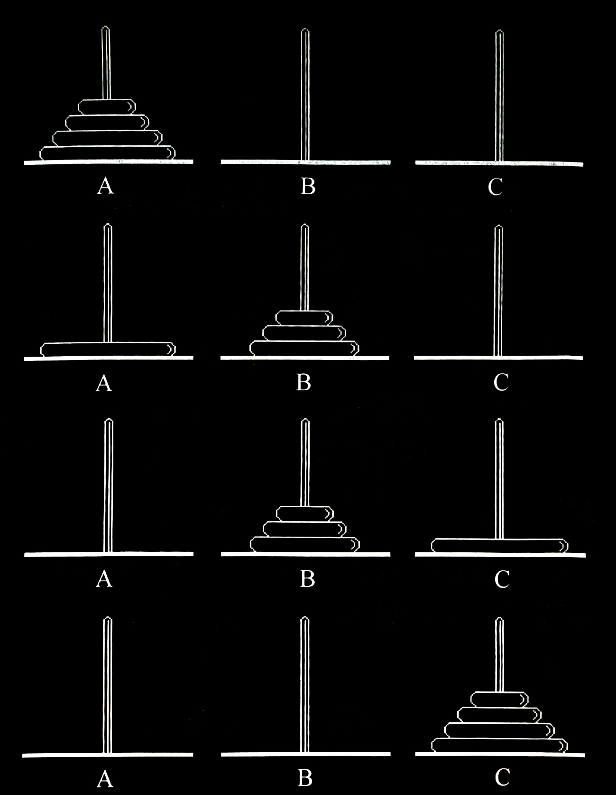
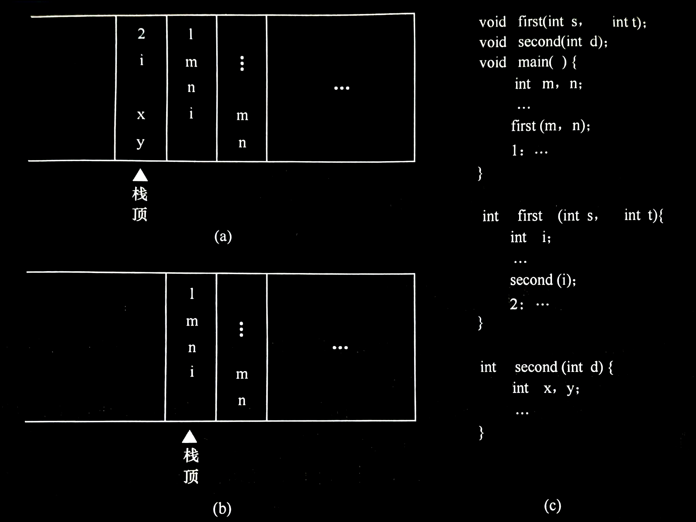
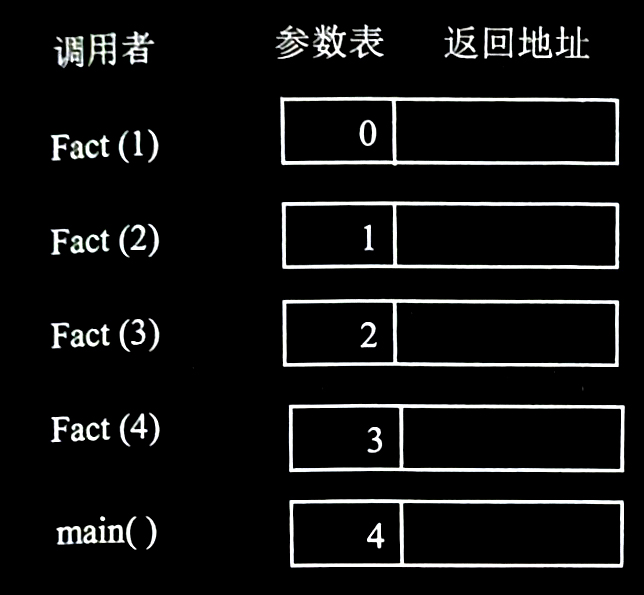
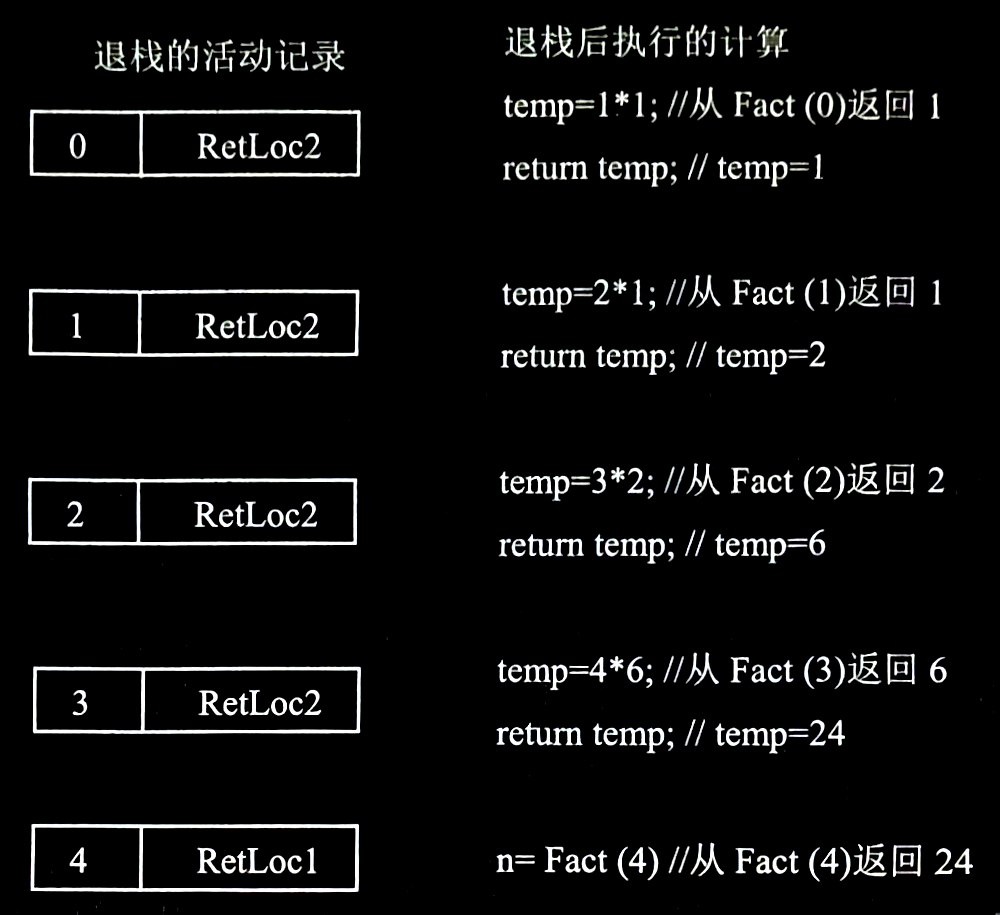

# 3.4 栈与递归
栈有一个重要应用是在程序设计语言中实现递归。递归是算法设计中最常用的手段，它通常把一个大型复杂问题的描述和求解变得简洁和清晰。因此递归算法常常比非递归算法更易设计，尤其是当问题本身或所涉及的数据结构是递归定义的时候，使用递归方法更加合适。

## 3.4.1 采用递归算法解决的问题
所谓递归是指，**若在一个函数、过程或者数据结构定义的内部又直接（或间接）出现定义本身的应用，则称它们是递归的，或者是递归定义的**。

在以下三种情况下，常常使用递归的方法。

<br>

### 定义是递归的
有很多数学函数是递归定义的，如大家熟悉的阶乘函数

$$Fact (n) = \left\{\begin{matrix}
1 & 若n=0\\
n * Fact(n-1) & 若n>0
\end{matrix}\right.$$

二阶 Fibonacci 数列

$$Fib (n) = \left\{\begin{matrix}
1 & 若n=1或n=2\\
Fib (n-1) + Fib (n-2) & 其他情形
\end{matrix}\right.$$

**对于阶乘函数，可以使用递归过程来求解**。
```cpp
long Fact(long n)
{
    if (n == 0)                 // 递归终止的条件
        return 1;
    else
        return n * Fact(n - 1); // 递归步骤
}
```

- 求解 $4!$ 的过程：
  

如图所示为主程序调用函数 `Fact(4)` 的执行过程。在函数过程体中， `else` 语句以参数 `3` 、 `2` 、 `1` 、 `0` 执行递归调用。最后一次递归调用的函数因参数 `n` 为 `0` 执行 `if` 语句，递归终止，逐步返回返回时依次计算 `1 * 1` 、 `2 * 1` 、 `3 * 2` 、 `4 * 6` ，最后将计算结果 `24` 返回给主程序。

类似地，可写出 **Fibonacci 数列的递归程序**：
```cpp
long Fib(long n)
{
    if (n == 1 || n == 2)               // 递归终止的条件
        return 1;
    else
        return Fib(n - 1) + Fib(n - 2); // 递归步骤
}
```

对于类似这种的复杂问题，若能够分解成几个相对简单且解法相同或类似的子问题来求解，便称作递归求解。这种**分解 - 求解的策略叫做“分治法”**。

采取“分治法”进行递归求解的问题需要满足以下三个条件。
1. **能将一个问题转变成一个新问题，而新问题与原问题的解法相同或类同**，不同的仅是处理的对象，并且这些处理对象更小且变化有规律。
2. **可以通过上述转化而使问题简化**。
3. **必须有一个明确的递归出口**，或称**递归的边界**。

**“分治法”求解递归问题算法的一般形式为**：
```cpp
void p(参数表)
{
    if (递归结束条件成立)   // 递归终止的条件
        可直接求解;
    else
        p(较小的参数);      // 递归步骤
}
```

<br>

### 数据结构是递归的
某些数据结构本身具有递归的特性，则它们的操作可递归地描述。

例如，对于链表，其结点 `LNode` 的定义由数据域 data 和指针域 next 组成，而指针域 next 是一种指向 `LNode` 类型的指针，即 `LNode` 的定义中又用到了其自身，所以**链表是一种递归的数据结构**。

对于递归的数据结构，相应算法采用递归的方法来实现特别方便。**链表的创建和链表结点的遍历输出都可以采用递归的方法**。

下面的算法是从前向后遍历输出链表结点的递归算法，调用此递归函数前，参数 `p` 指向单链表的首元结点，在递归过程中， `p` 不断指向后继结点，直到 `p` 为 `NULL` 时递归结束。显然，这个问题满足上述给出的采用“分治法”进行递归求解的问题需要满足的三个条件。

> ***算法：遍历输出链表中各个结点的递归算法***
>
> **【算法步骤】**
>
> 1. 如果 `p` 为 `NULL` ，递归结束返回。
> 2. 否则输出 `p->data` ， `p` 指向后继结点继续递归。
>
> **【算法描述】**
>
> ```cpp
> void TraverseList(LinkList p)
> {
>     if (p == NULL)                  // 递归终止
>         return;
>     else
>     {
>         cout << p->data << endl;    // 输出当前结点的数据域
>         TraverseList(p->next);      // p 指向后继结点继续递归
>     }
> }
> ```

在递归算法中，**如果当递归结束条件成立，只执行 `return` 操作时，“分治法”求解递归问题算法的一般形式可以简化为**：
```cpp
void p(参数表)
{
    if (递归结束条件不成立)
        p(较小的参数);
}
```

> **因此，*算法：遍历输出链表中各个结点的递归算法*可以简化为**：
>
> ```cpp
> void TraverseList(LinkList p)
> {
>     if (p)
>     {
>         cout << p->data << endl;
>         TraverseList(p->next);
>     }
> }
> ```

后面章节要介绍的**广义表**、**二叉树**等也是典型的**具有递归特性**的数据结构，其相应算法也可采用递归的方法来实现。

<br>

### 问题的解法是递归的
还有一类问题，**虽然问题本身没有明显的递归结构，但用递归求解比迭代求解更简单**，如 Hanoi 塔问题、八皇后问题、迷宫问题等。

<br>

**例 3.1** $n$ 阶 Hanoi 塔问题

**【问题描述】**

假设有 $3$ 个分别命名为 $A$ 、 $B$ 和 $C$ 的塔座，在塔座 $A$ 上插有 $n$ 个直径大小各不相同，依小到大编号为 $1, 2, ..., n$ 的圆盘。现要求将塔座 $A$ 上的 $n$ 个圆盘移至塔座 $C$ 上，并仍按同样顺序叠排，圆盘移动时必须遵循下列规则：
1. 每次只能移动一个圆盘；
2. 圆盘可以插在 $A$ 、 $B$ 和 $C$ 中的任一塔座上；
3. 任何时刻都不能将一个较大的圆盘压在较小的圆盘之上。

**【问题分析】**

如何实现移动圆盘的操作呢？可以用分治求解的递归方法来解决这个问题。设 $A$ 柱上最初的盘子总数为 $n$ ，则当 $n=1$ 时，只要将编号为 $1$ 的圆盘从塔座 $A$ 直接移至塔座 $C$ 上即可；否则，执行以下三步：
1. 用 $C$ 柱做过渡，将 $A$ 柱上的 $(n-1)$ 个盘子移到 $B$ 柱上；
2. 将 $A$ 柱上最后一个盘子直接移到 $C$ 柱上;
3. 用 $A$ 柱做过渡，将 $B$ 柱上的 $(n-1)$ 个盘子移到 $C$ 柱上。

具体移动过程如图所示，图中 $n=4$ 。

- Hanoi 塔问题：
  

根据这种解法，如何将 $n-1$ 个圆盘从一个塔座移至另一个塔座的问题是一个和原问题具有相同特征属性的问题，只是问题的规模小 $1$ ，因此可以用同样的方法求解。

为了便于描述算法，将搬动操作定义为 `move(A, n, C)` ，是指将编号为 $n$ 的圆盘从 $A$ 移到 $C$ ，同时设一个初值为 $0$ 的全局变量 `m` ，对搬动进行计数：

```cpp
int m = 0;
void move(char A, int n, char C)
{
    cout << ++m << "," << n << "," << A << "," << C << endl;
}
```

> ***算法：Hanoi 塔问题的的递归算法***
>
> **【算法步骤】**
>
> 1. 如果 $n = 1$ ，则直接将编号为 $1$ 的圆盘从 $A$ 移到 $C$ ，递归结束。
> 2. 否则：
     >    - 递归，将 $A$ 上编号为 $1$ 至 $n-1$ 的圆盘移到 $B$ ，$C$ 做辅助塔:
>    - 直接将编号为 $n$ 的圆盘从 $A$ 移到 $C$ ;
>    - 递归，将 $B$ 上编号为 $1$ 至 $n-1$ 的圆盘移到 $C$ ， $A$ 做辅助塔。
>
> **【算法描述】**
>
> ```cpp
> void Hanoi(int n, char A, char B, char C)
> {   // 将塔座 A 上的 n 个圆盘按规则搬到 C 上，B 做辅助塔
>     if (n == 1)
>         move(A, 1, C);          // 将编号为 1 的圆盘从 A 移到 C
>     else
>     {
>         Hanoi(n - 1, A, C, B);  // 将 A 上编号为 1 至 n - 1 的圆盘移到 B，C 做辅助塔
>         move(A, n, C);          // 将编号为 n 的圆盘从 A 移到 C
>         Hanoi(n - 1, B, A, C);  // 将 B 上编号为 1 至 n - 1 的圆盘移到 C，A 做辅助塔
>     }
> }
> ```


---


## 3.4.2 递归过程与递归工作栈
一个递归函数，在函数的执行过程中，需多次进行自我调用。那么，这个递归函数是如何执行的？先看任意两个函数之间进行调用的情形。

与汇编语言程序设计中主程序和子程序之间的链接及信息交换相类似，在高级语言编制的程序中，调用函数和被调用函数之间的链接及信息交换需通过栈来进行。

通常，当在一个函数的运行期间调用另一个函数时，在运行被调用函数之前，系统需先完成 3 件事：
1. 将所有的**实参**、**返回地址**等**信息**传递给**被调用函数**保存；
2. 为**被调用函数的局部变量**分配**存储区**;
3. 将**控制转移到被调函数的入口**。

而从被调用函数返回调用函数之前，系统也应完成 3 件工作：
1. **保存**被调函数的**计算结果**；
2. **释放**被调函数的**数据区**；
3. 依照被调函数保存的**返回地址**将**控制转移到调用函数**。

当有多个函数构成嵌套调用时，按照“**后调用先返回**”的原则，上述函数之间的信息传递和控制转移必须通过“**栈**”来实现，即系统将整个程序运行时所需的数据空间安排在一个栈中，每当调用一个函数时，就为它在栈顶分配一个存储区，每当从一个函数退出时，就释放它的存储区，则当前正运行的函数的数据区必在栈顶。

例如，在图中 (c) 所示的主函数 `main` 中调用了函数 `first`，而在函数 `first` 中又调用了函数 `second` ，则图 (a) 所示为当前正在执行函数 `second` 中某个语句时栈的状态，而图 (b) 展示从函数 `second` 退出之后正执行函数 `first` 中某个语句时栈的状态（图中以语句标号表示返回地址）。

- 主函数 `main` 执行期间运行栈的状态：
  

一个递归函数的运行过程类似于多个函数的嵌套调用，只是调用函数和被调用函数是同一个函数，因此，和每次调用相关的一个重要概念是递归函数运行的“层次”。假设调用该递归函数的主函数为第 $0$ 层，则从主函数调用递归函数为进入第 $1$ 层；从第 $i$ 层递归调用本函数为进入“下一层”，即第 $i+1$ 层。反之，退出第 $i$ 层递归应返回至“上一层”，即第 $i-1$ 层。为了保证递归函数正确执行，系统需设立一个“递归工作栈”作为整个递归函数运行期间使用的数据存储区。每一层递归所需信息构成一个工作记录，其中包括所有的实参、所有的局部变量，以及上一层的返回地址。每进入一层递归，就产生一个新的工作记录压入栈顶。每退出一层递归，就从栈顶弹出一个工作记录，则当前执行层的工作记录必是递归工作栈栈顶的工作记录，称这个记录为“**活动记录**”。

- 求解 $4!$ 活动记录进栈过程：
  

下面以上图所示的阶乘函数 `Fact(4)` 为例，介绍递归过程中递归工作栈和活动记录的使用。主函数调用 `Fact(4)` ，当函数运行结束后，控制返回到 `RetLoc1` ，在此处 `n` 被赋为 `24` （即 $4!$ ）：
```cpp
void main()
{
    long n;         // 调用 Fact(4) 时记录进栈
    n = Fact(4);    // 返回地址 RetLoc1 在赋值语句
//  ^
//  |
//  |
// RetLoc1
}
```

为说明方便起见，将阶乘函数算法改写为：
```cpp
long Fact(long n)
{
    long temp;
    if (n == 0)
        return 1;                   // 活动记录退栈
    else
        temp = n * Fact(n - 1);     // 活动记录进栈
//           ^                      // 返回地址 RetLoc2 在计算语句
//           |
//           |
//        RetLoc2
    return temp;                    // 活动记录退栈
}
```

这里暂忽略局部变量 `temp` 的入栈和出栈情况。 `RetLoc2` 是递归调用 `Fact(n - 1)` 的返回地址，当 `Fact(n - 1)` 结束后，返回到 `RetLoc2` ，在此处计算 $n * (n - 1)!$ ，然后将结果赋给临时变量 `temp` 。

主函数执行后依次启动了 $5$ 个函数调用。上图所示为每次函数调用时活动记录的进栈情况。主程序外部调用 `Fact(4)` 的活动记录在栈底， `Fact(1)` 调用 `Fact(0)` 进栈的活动记录在栈顶。

递归结束条件出现于函数 `Fact(0)` 的内部，执行 `Fact(0)` 引起了返回语句的执行。退出栈顶的活动记录，返回地址返回到上一层 `Fact(1)` 的调用递归处 `RetLoc2` ，继续执行语句 `temp = 1 * 1` ，接着执行 `return temp;` 又引起新的退栈操作。此退栈过程直至 `Fact(4)` 执行完毕后，将控制权转移给 `main` 为止，其过程如下图所示。

- 求解 $4!$ 活动记录退栈过程：
  


---


## 3.4.3 递归算法的效率分析

<br>

### 时间复杂度的分析
在算法分析中，当一个算法中包含递归调用时，其时间复杂度的分析可以转化为一个递归方程求解。实际上，这个问题是数学上求解渐近阶的问题，而递归方程的形式多种多样，其求解方法也不一而足。**迭代法是求解递归方程的一种常用方法，其基本步骤是迭代地展开递归方程的右端，使之成为一个非递归的和式，然后通过对和式的估计来达到对方程左端（即方程的解）的估计**。

下面以阶乘的递归函数 `Fact(n)` 为例，说明通过迭代法求解递归方程来计算时间复杂度的方法。

设 `Fact(n)` 的执行时间是 $T(n)$ 。此递归函数中语句 `if (n == 0) return 1;` 的执行时间是 $O(1)$ ，递归调用 `Fact(n - 1)` 的执行时间是 $T(n - 1)$ ，所以 `else return n * Fact(n - 1);` 的执行时间是 $O(1) + T(n-1)$。其中，设两数相乘和赋值操作的执行时间为 $O(1)$ ，则对某常数 $C$ 、 $D$ 有如下递归方程：

$$T(n) = \left\{\begin{matrix}
D & n=0\\
C + T(n-1) & n≥1
\end{matrix}\right.$$

设 $n>2$ ，利用上式对 $T(n-1)$ 展开，即在上式中用 $n-1$ 代替 $n$ 得到

$$T(n-1)=C+T(n-2)$$

再代入 $T(n)=C+T(n-1)$ 中，有

$$T(n)=2C+T(n-2)$$

同理，当 $n>3$ 时有

$$T(n)=3C+T(n-3)$$

依次类推，当 $n>i$ 时有

$$T(n)=iC+T(n-1)$$

最后，当 $i=n$ 时有

$$T(n)=nC+T(0)=nC+D$$

求得递归方程的解为： $T(n)=O(n)$

**采用这种方法计算 Fibonacci 数列和 Hanoi 塔问题递归算法的时间复杂度均为 $O(2^n)$** 。

<br>

### 空间复杂度的分析
递归函数在执行时，系统需设立一个“递归工作栈”存储每一层递归所需的信息，此工作栈是递归函数执行的辅助空间，因此，分析递归算法的空间复杂度需要分析工作栈的大小。

对于递归算法，**空间复杂度**

$$S(n)=O(f(n))$$

其中， **$f(n)$ 为“递归工作栈”中工作记录的个数与问题规模 $n$ 的函数关系**。

根据这种分析方法不难得到，**前面讨论的阶乘问题、Fibonacci 数列问题、Hanoi 塔问题的递归算法的空间复杂度均为 $O(n)$** 。


---


## 3.4.4 利用栈将递归转换为非递归的方法
通过上述讨论，可以看出递归程序在执行时需要系统提供隐式栈这种数据结构来实现，对于一般的递归过程，仿照递归算法执行过程中递归工作栈的状态变化可直接写出相应的**非递归算法这种利用栈消除递归过程的步骤**如下：

1. **设置一个工作栈存放递归工作记录**（包括实参、返回地址及局部变量等）。
2. **进入非递归调用入口**（即被调用程序开始处）**将调用程序传来的实在参数和返回地址入栈**（递归程序不可以作为主程序，因而可认为初始是被某个调用程序调用）。
3. **进入递归调用入口：当不满足递归结束条件时，逐层递归，将实参、返回地址及局部变量入栈**，这一过程可用循环语句来实现——模拟递归分解的过程。
4. **递归结束条件满足，将到达递归出口的给定常数作为当前的函数值**。
5. **返回处理：在栈不空的情况下，反复退出栈顶记录，根据记录中的返回地址进行题意规定的操作，即逐层计算当前函数值，直至栈空为止**——模拟递归求值过程。

**通过以上步骤，可将任何递归算法改写成非递归算法**。但改写后的非递归算法和原来比较起来，结构不够清晰，可读性差，有的还需要经过一系列的优化，这里不再举例详述，具体示例参见 5.5.1 节中二叉树中序遍历的非递归算法。

由于递归函数结构清晰，程序易读，而且其正确性容易得到证明，因此，利用允许递归调用的语言（如 C 语言）进行程序设计时，给用户编制程序和调试程序带来很大方便。因为对这样类递归问题编程时，不需用户自己而由系统来管理递归工作栈。
