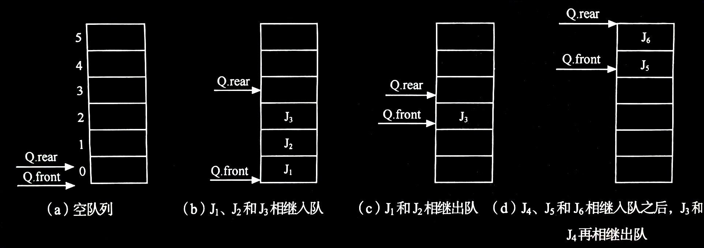
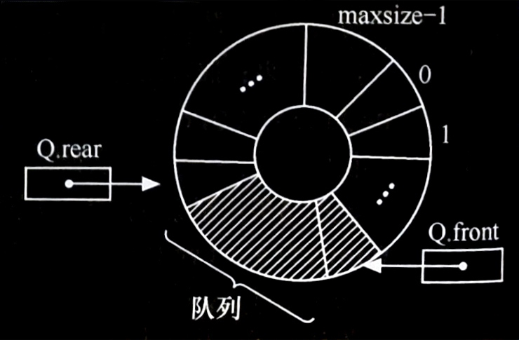
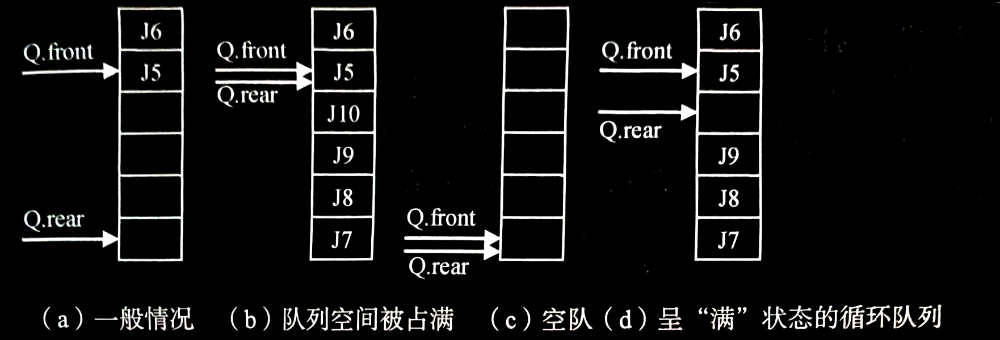
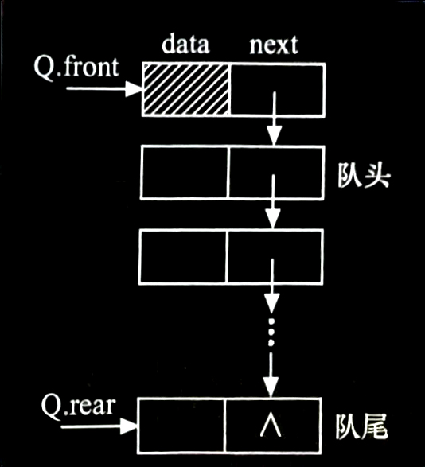
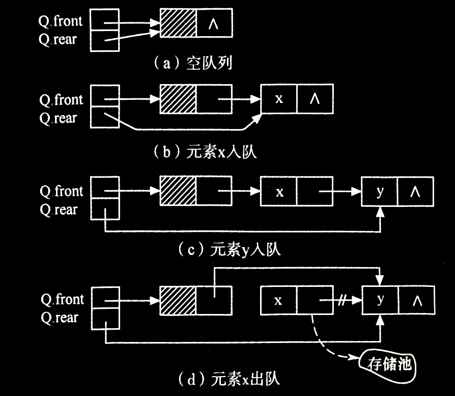

## 3.5 队列的表示和操作的实现

### 3.5.1 队列的类型定义
队列的操作与栈的操作类似，不同的是，删除是在表的头部（即队头）进行。

> ***下面给出队列的抽象数据类型定义：***
> 
> **$ADT\ Queue$** {
> 
> &ensp;&ensp;&ensp;&ensp;**数据对象**： $D = \{a_i\ |\ a_i∈ElemSet,\ i = 1, 2, ..., n,\ n ≥ 0\}$
> 
> &ensp;&ensp;&ensp;&ensp;**数据关系**： $R = \{\langle a_{i-1}, ai \rangle\ |\ a_{i-1}, a_i∈D,\ i = 2, ..., n\}$
> 
> &ensp;&ensp;&ensp;&ensp;&ensp;&ensp;&ensp;&ensp;&ensp;&ensp;&ensp;&ensp;&ensp;&ensp;约定其中 $a_1$ 端为队列头， $a_n$ 端为队列尾。
> 
> &ensp;&ensp;&ensp;&ensp;**基本操作**：
> 
> &ensp;&ensp;&ensp;&ensp;&ensp;&ensp; $InitQueue(\And Q)$
> 
> &ensp;&ensp;&ensp;&ensp;&ensp;&ensp;&ensp;&ensp;操作结果：构造一个空队列 $Q$ 。
> 
> &ensp;&ensp;&ensp;&ensp;&ensp;&ensp; $DestroyQueue(\And Q)$
> 
> &ensp;&ensp;&ensp;&ensp;&ensp;&ensp;&ensp;&ensp;初始条件：队列 $Q$ 已存在。
> 
> &ensp;&ensp;&ensp;&ensp;&ensp;&ensp;&ensp;&ensp;操作结果：队列 $Q$ 被销毁，不再存在。
> 
> &ensp;&ensp;&ensp;&ensp;&ensp;&ensp; $ClearQueue(\And Q)$
> 
> &ensp;&ensp;&ensp;&ensp;&ensp;&ensp;&ensp;&ensp;初始条件：队列 $Q$ 已存在。
> 
> &ensp;&ensp;&ensp;&ensp;&ensp;&ensp;&ensp;&ensp;操作结果：将 $Q$ 清为空队列。
> 
> &ensp;&ensp;&ensp;&ensp;&ensp;&ensp; $QueueEmpty(Q)$
> 
> &ensp;&ensp;&ensp;&ensp;&ensp;&ensp;&ensp;&ensp;初始条件：队列 $Q$ 已存在。
> 
> &ensp;&ensp;&ensp;&ensp;&ensp;&ensp;&ensp;&ensp;操作结果：若 $Q$ 为空队列，则返回 $true$ ，否则返回 $false$ 。
> 
> &ensp;&ensp;&ensp;&ensp;&ensp;&ensp; $QueueLength(Q)$
> 
> &ensp;&ensp;&ensp;&ensp;&ensp;&ensp;&ensp;&ensp;初始条件：队列 $Q$ 已存在。
> 
> &ensp;&ensp;&ensp;&ensp;&ensp;&ensp;&ensp;&ensp;操作结果：返回 $Q$ 的元素个数，即队列的长度。
> 
> &ensp;&ensp;&ensp;&ensp;&ensp;&ensp; $GetHead(Q)$
> 
> &ensp;&ensp;&ensp;&ensp;&ensp;&ensp;&ensp;&ensp;初始条件： $Q$ 为非空队列。
> 
> &ensp;&ensp;&ensp;&ensp;&ensp;&ensp;&ensp;&ensp;操作结果：返回 $Q$ 的队头元素。
> 
> &ensp;&ensp;&ensp;&ensp;&ensp;&ensp;$EnQueue(\And Q, e)$
> 
> &ensp;&ensp;&ensp;&ensp;&ensp;&ensp;&ensp;&ensp;初始条件：队列 $Q$ 已存在。
> 
> &ensp;&ensp;&ensp;&ensp;&ensp;&ensp;&ensp;&ensp;操作结果：插入元素 $e$ 为 $Q$ 的新的队尾元素。
> 
> &ensp;&ensp;&ensp;&ensp;&ensp;&ensp; $DeQueue(\And Q, \And e)$
> 
> &ensp;&ensp;&ensp;&ensp;&ensp;&ensp;&ensp;&ensp;初始条件： $Q$ 为非空队列。
> 
> &ensp;&ensp;&ensp;&ensp;&ensp;&ensp;&ensp;&ensp;操作结果：删除 $Q$ 的队头元素，并用 $e$ 返回其值。
> 
> &ensp;&ensp;&ensp;&ensp;&ensp;&ensp; $QueueTraverse(Q)$
> 
> &ensp;&ensp;&ensp;&ensp;&ensp;&ensp;&ensp;&ensp;初始条件： $Q$ 已存在且非空。
> 
> &ensp;&ensp;&ensp;&ensp;&ensp;&ensp;&ensp;&ensp;操作结果：从队头到队尾，依次对 $Q$ 的每个数据元素访问。
> 
> } **$ADT\ Queue$**


---


### 3.5.2 循环队列——队列的顺序表示和实现
队列也有两种存储表示，**顺序表示**和**链式表示**。

和顺序栈相类似，在队列的顺序存储结构中，除了用一组地址连续的存储单元依次存放从队列头到队列尾的元素之外，尚需附设两个整型变量 `front` 和 `rear` 分别指示队列头元素及队列尾元素的位置（后面分别称为头指针和尾指针）。

**队列的顺序存储结构表示如下：**
```cpp
// -----队列的顺序存储结构-----
#define MAXQSIZE 100    // 队列可能达到的最大长度
typedef struct {
    QElemType * base;   // 存储空间的基地址
    int front;          // 头指针
    int rear;           // 尾指针
) SqQueue;
```

为了在 C 语言中描述方便起见，在此约定：初始化创建空队列时，令 `front = rear = 0` ，每当**插入新的队列尾元素时，尾指针 `rear` 增 $1$**；每当**删除队列头元素时，头指针 `front` 增 $1$**。因此，在非空队列中，头指针始终指向队列头元素，而尾指针始终指向队列尾元素的下一个位置，如图所示。

- 顺序分配的队列中头、尾指针和元素之间的关系：
  

假设当前队列分配的最大空间为 $6$ ，则当队列处于图 (d) 所示的状态时不可再继续插入新的队尾元素，否则会出现**溢出现象**，即因数组越界而导致程序的非法操作错误。事实上，此时队列的实际可用空间并未占满，所以这种现象称为“**假溢出**”。这是由“队尾入队，队头出队”这种受限制的操作造成的。

怎样解决这种“假溢出”问题呢？一个较巧妙的办法是将顺序队列变为一个环状的空间，如图所示，称之为**循环队列**。

- 循环队列示意图：
  

头、尾指针以及队列元素之间的关系不变，只是在循环队列中，头、尾指针“依环状增 $1$ ”的操作可用“模”运算来实现。通过取模，头指针和尾指针就可以在顺序表空间内以头尾衔接的方式“循环”移动。

- 循环队列中头、尾指针和元素之间的关系：
  

在图 (a) 中，队头元素是 $J_5$ ，在元素 $J_6$ 入队之前，在 `Q.rear` 的值为 $5$ ，当元素 $J_6$ 入队之后，通过“模”运算， `Q.rear = (Q.rear +1) % 6` ，得到 `Q.rear` 的值为 $0$ ，而不会出现图 (d) 的“假溢出”状态。

在图 (b) 中， $J_7$ 、 $J_8$ 、 $J_9$ 、 $J_{10}$ 相继入队，则队列空间均被占满，此时头、尾指针相同。

在图 (c) 中，若 $J_5$ 和 $J_6$ 相继从图 (a) 所示的队列中出队，使队列此时呈“空”的状态，头、尾指针的值也是相同的。


由此可见，**对于循环队列不能以头、尾指针的值是否相同来判别队列空间是“满”还是“空”**。在这种情况下，如何区别队满还是队空呢?

**通常有以下两种处理方法**：

1. **少用一个元素空间**，即队列空间大小为 $m$ 时，有 $m-1$ 个元素就认为是队满。这样判断队空的条件不变，即当头、尾指针的值相同时，则认为队空；而当尾指针在循环意义上加 $1$ 后是等于头指针，则认为队满。因此，在循环队列中队空和队满的条件是：
   队空的条件： `Q.front == Q.rear`
   队满的条件： `(Q.rear + 1) % MAXQSIZE == Q.front`
   如图 (d) 所示，当 $J_7$ 、 $J_8$ 、 $J_9$ 进入图 (a) 所示的队列后， `(Q.rear + 1) % MAXQSIZE` 的值等于 `Q.front` ，此时认为队满。

2. **另设一个标志位以区别队列是“空”还是“满”**。

下面给出用第一种方法实现循环队列的操作，循环队列的类型定义同前面给出的顺序队列的类型定义。

<br>

#### 初始化
循环队列的初始化操作就是动态分配一个预定义大小为 `MAXQSIZE` 的数组空间。

> ***算法：循环队列的初始化***
> 
> **【算法步骤】**
> 
> 1. 为队列分配一个最大容量为 `MAXQSIZE` 的数组空间， `base` 指向数组空间的首地址。
> 2. 头指针和尾指针置为零，表示队列为空。
> 
> **【算法描述】**
> 
> ```cpp
> Status InitQueue(SqQueue &Q)
> {   // 构造一个空队列 Q
>     Q.base = new QElemType[MAXQSIZE];   // 为队列分配一个最大容量为 MAXQSIZE 的数组空间
>     if (!Q.base)
>         exit(OVERFLOW);                 // 存储分配失败
>     Q.front = Q.rear = 0;               // 头指针和尾指针置为零，队列为空
>     return OK;
> }
> ```

<br>

#### 求队列长度
对于非循环队列，尾指针和头指针的差值便是队列长度，而对于循环队列，差值可能为负数所以需要将差值加上 `MAXQSIZE` ，然后与 `MAXQSIZE` 求余。

> ***算法：求循环队列的长度***
> 
> **【算法描述】**
> 
> ```cpp
> int QueueLength(SqQueue Q)
> {   // 返回Q的元素个数，即队列的长度
>     return (Q.rear - Q.front + MAXQSIZE) % MAXQSIZE;
> }
> ```

<br>

#### 入队
入队操作是指在队尾插入一个新的元素。

> ***算法：循环队列的入队***
> 
> **【算法步骤】**
> 
> 1. 判断队列是否满，若满则返回 `ERROR` 。
> 2. 将新元素插入队尾。
> 3. 队尾指针加 `1`。
> 
> **【算法描述】**
> 
> ```cpp
> Status EnQueue(SqQueue &Q, QElemType e)
> {   // 插入元素 e 为 Q 的新的队尾元素
>     if ((Q.rear + 1) % MAXQSIZE == Q.front) // 尾指针在循环意义上加 1 后等于头指针，表明队满
>         return ERROR;
>     Q.base[Q.rear] = e;                     // 新元素插入队尾
>     Q.rear = (Q.rear + 1) % MAXQSIZE;       // 队尾指针加 1
>     return OK;
> }
> ```

<br>

#### 出队
出队操作是将队头元素删除。

> ***算法：循环队列的出队***
> 
> **【算法步骤】**
> 
> 1. 判断队列是否为空，若空则返回 `ERROR` 。
> 2. 保存队头元素。
> 3. 队头指针加 `1` 。
> 
> **【算法描述】**
> 
> ```cpp
> Status DeQueue(SqQueue &Q, QElemType &e)
> {   // 删除 Q 的队头元素，用 e 返回其值
>     if (Q.front == Q.rear)
>         return ERROR;                   // 队空
>     e = Q.base[Q.front];                // 保存队头元素
>     Q.front = (Q.front + 1) % MAXQSIZE; // 队头指针加 1
>     return OK;
> }
> ```

<br>

#### 取队头元素
当队列非空时，此操作**返回当前队头元素的值，队头指针保持不变**。

> ***算法：取循环队列的队头元素***
> 
> **【算法描述】**
> 
> ```cpp
> QElemType GetHead(SqQueue Q)
> {   // 返回 Q 的队头元素，不修改队头指针
>     if (Q.front != Q.rear)      // 队列非空
>         return Q.base[Q.front]; // 返回队头元素的值，队头指针不变
> }
> ```


取循环队列的队头元素由上述分析可见，**如果用户的应用程序中设有循环队列，则必须为它设定一个最大队列长度；若用户无法预估所用队列的最大长度，则宜采用链队**。


---


### 3.5.3 链队——队列的链式表示和实现
**链队是指采用链式存储结构实现的队列**。通常链队用单链表来表示，如图所示。

- 链队列示意图：
  

**一个链队显然需要两个分别指示队头和队尾的指针（分别称为头指针和尾指针）才能唯一确定**。

**队列的链式存储结构表示如下**：

```cpp
// -----队列的链式存储结构-----
typedef struct QNode {
    QElemType data;
    struct QNode * next;
} QNode, * QueuePtr;

typedef struct {
    QueuePtr front; // 队头指针
    QueuePtr rear;  // 队尾指针
} LinkQueue;
```

链队的操作即为单链表插入和删除操作的特殊情况，只是需进一步修改尾指针或头指针。下面给出链队初始化、入队、出队操作的实现。

<br>

#### 初始化
- 队列运算指针变化状况：
  

链队的初始化操作就是构造一个只有一个头结点的空队，如图 (a) 所示。

> ***算法：链队的初始化***
> 
> **【算法步骤】**
> 
> 1. 生成新结点作为头结点，队头和队尾指针指向此结点。
> 2. 头结点的指针域置空。
> 
> **【算法描述】**
> 
> ```cpp
> Status InitQueue(LinkQueue &Q)
> {   // 构造一个空队列 Q
>     Q.front = Q.rear = new QNode;   // 生成新结点作为头结点，队头和队尾指针指向此结点
>     Q.front->next = NULL;           // 头结点的指针域置空
>     return OK;
> }
> ```

<br>

#### 入队
和循环队列的入队操作不同的是，**链队在入队前不需要判断队是否满，需要为入队元素动态分配一个结点空间**，如图 (b) 和 (c) 所示。

> ***算法：链队的入队***
> 
> **【算法步骤】**
> 
> 1. 为入队元素分配结点空间，用指针 `p` 指向。
> 2. 将新结点数据域置为 `e` 。
> 3. 将新结点插入到队尾。
> 4. 修改队尾指针为 `p` 。
> 
> **【算法描述】**
> 
> ```cpp
> Status EnQueue(LinkQueue &Q, QElemType e)
> {   // 插入元素 e 为 Q 的新的队尾元素
>     p = new QNode;      // 为入队元素分配结点空间，用指针 p 指向
>     p->data = e;        // 将新结点数据域置为 e
>     p->next = NULL;
>     Q.rear->next = p;   // 将新结点插入到队尾
>     Q.rear = p;         // 修改队尾指针
>     return OK;
> }
> ```

<br>

#### 出队
和循环队列一样，**链队在出队前也需要判断队列是否为空**，不同的是，**链队在出队后需要释放出队头元素的所占空间**，如图 (d) 所示。

> ***算法：链队的出队***
> 
> **【算法步骤】**
> 
> 1. 判断队列是否为空，若空则返回 `ERROR` 。
> 2. 临时保存队头元素的空间，以备释放。
> 3. 修改头结点的指针域，指向下一个结点。
> 4. 判断出队元素是否为最后一个元素，若是，则将队尾指针重新赋值，指向头结点。
> 5. 释放原队头元素的空间。
> 
> **【算法描述】**
> 
> ```cpp
> Status DeQueue(LinkQueue &Q, QElemType &e)
> {   // 删除 Q 的队头元素，用 e 返回其值
>     if (Q.front == Q.rear)
>         return ERROR;           // 若队列空，则返回 ERROR
>     p = Q.front->next;          // p 指向队头元素
>     e = p->data;                // e 保存队头元素的值
>     Q.front->next = p->next;    // 修改头结点的指针域
>     if (Q.rear == p)
>         Q.rear = Q.front;       // 最后一个元素被删，队尾指针指向头结点
>     delete p;                   // 释放原队头元素的空间
>     return OK;
> }
> ```

需要注意的是，**在链队出队操作时还要考虑当队列中最后一个元素被删后，队列尾指针也丢失了，因此需对队尾指针重新赋值（指向头结点）**。

<br>

#### 取队头元素
与循环队列一样，**当队列非空时，此操作返回当前队头元素的值，队头指针保持不变**。

> ***算法：取链队的队头元素***
> 
> **【算法描述】**
> 
> ```cpp
> QElemType GetHead(LinkQueue Q)
> {   // 返回 Q 的队头元素，不修改队头指针
>     if (Q.front != Q.rear)          // 队列非空
>         return Q.front->next->data; // 返回队头元素的值，队头指针不变
> }
> ```
