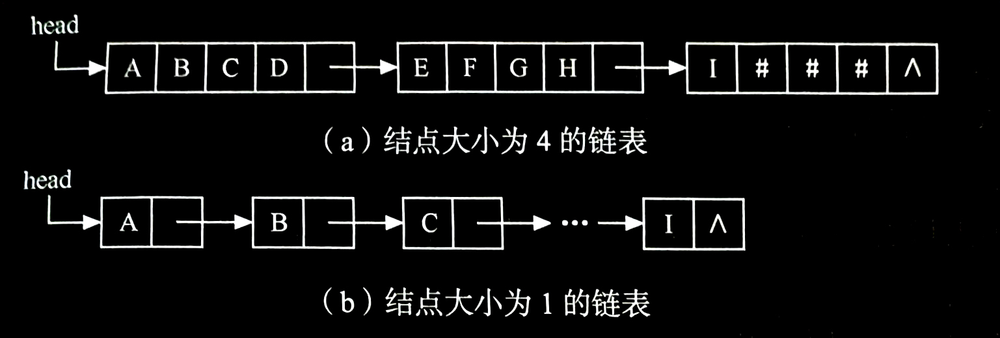
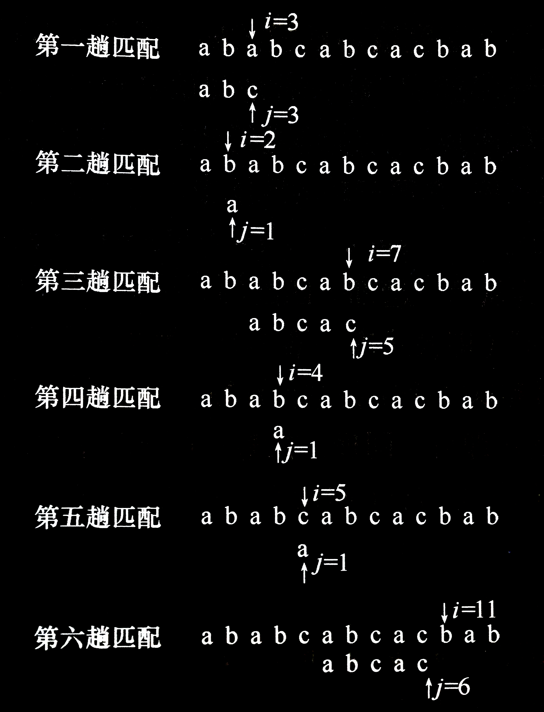
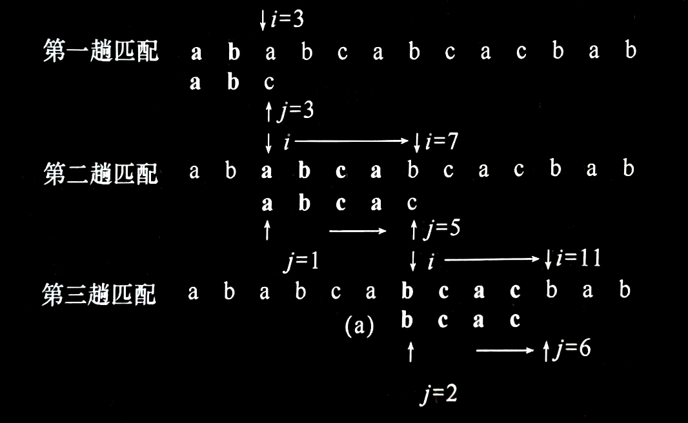
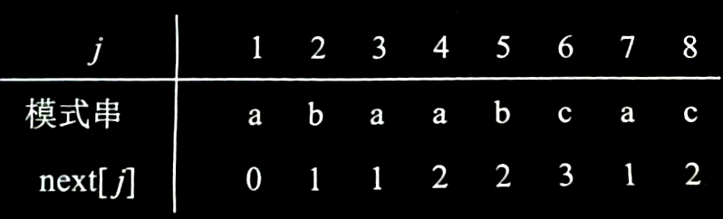
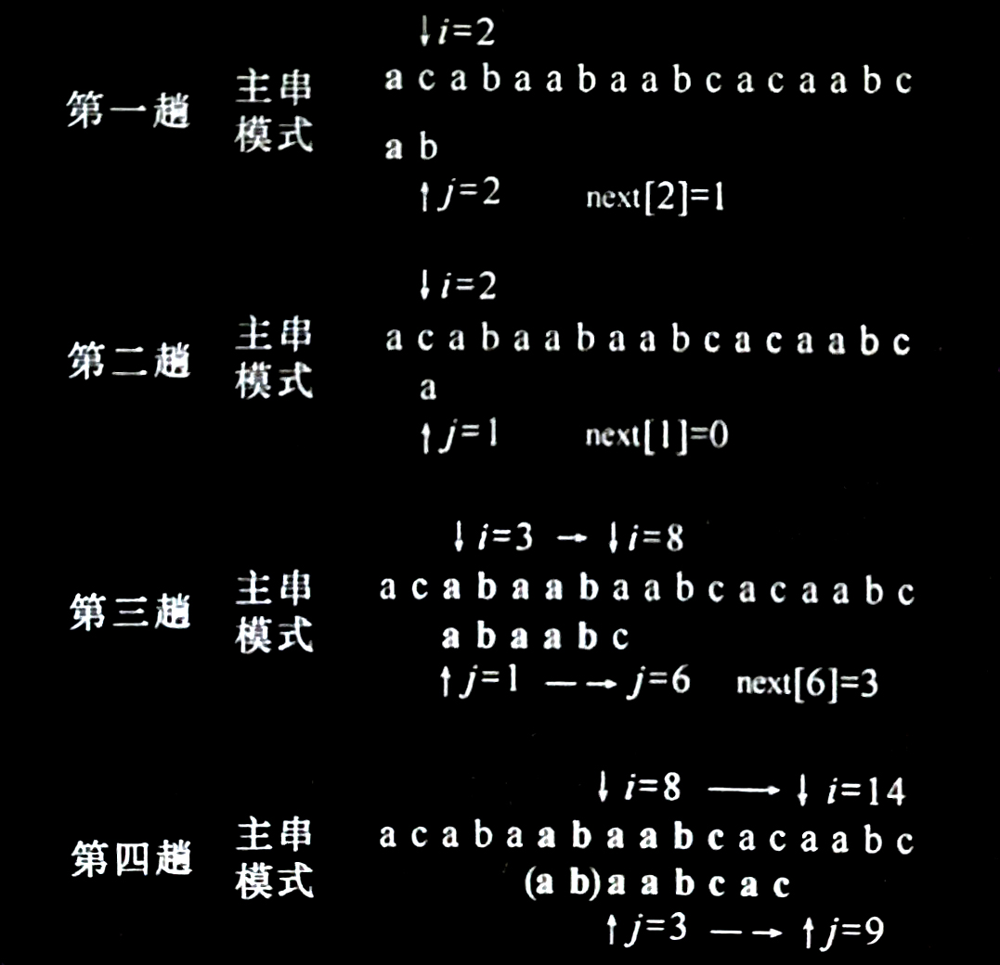
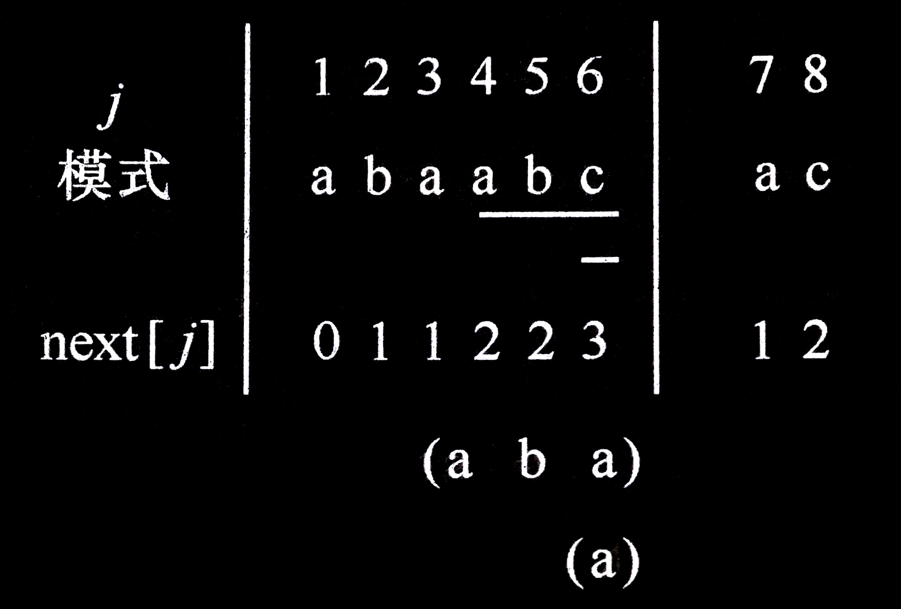

# 4.3 串的类型定义、存储结构及其运算

## 4.3.1 串的抽象类型定义

串的逻辑结构和线性表极为相似，区别仅在于串的数据对象约束为字符集。然而，串的基本操作和线性表有很大差别。在线性表的基本操作中，大多以“单个元素”作为操作对象。例如，在线性表中查找某个元素，求取某个元素，在某个位置上插入一个元素或删除一个元素等；而在串的基本操作中，通常以“串的整体”作为操作对象，例如，在串中查找某个子串，求取一个子串，在串的某个位置上插入一个子串，以及删除一个子串等。

> ***串的抽象数据类型的定义如下：***
> 
> **$ADT\ String$** {
> 
> &ensp;&ensp;&ensp;&ensp;**数据对象**： $D=\{a_i\ |\ a_i∈CharacterSet,\ i=1,2,\cdots ,n,\ n≥0\}$
> 
> &ensp;&ensp;&ensp;&ensp;**数据关系**： $R1=\{\langle a_{i-1},a_i\rangle\ |\ a_{i-1},a_i∈D,\ i=2,\cdots ,n\}$
> 
> &ensp;&ensp;&ensp;&ensp;**基本操作**：
> 
> &ensp;&ensp;&ensp;&ensp;&ensp;&ensp; $StrAssign(\&T,chars)$
> 
> &ensp;&ensp;&ensp;&ensp;&ensp;&ensp;&ensp;&ensp; 初始条件： $chars$ 是字符串常量。
> 
> &ensp;&ensp;&ensp;&ensp;&ensp;&ensp;&ensp;&ensp; 操作结果：生成一个其值等于 $chars$ 的串 $T$ 。
> 
> &ensp;&ensp;&ensp;&ensp;&ensp;&ensp; $StrCopy(\&T,S)$
> 
> &ensp;&ensp;&ensp;&ensp;&ensp;&ensp;&ensp;&ensp; 初始条件：串 $S$ 存在。
> 
> &ensp;&ensp;&ensp;&ensp;&ensp;&ensp;&ensp;&ensp; 操作结果：由串 $S$ 复制得串 $T$ 。
> 
> &ensp;&ensp;&ensp;&ensp;&ensp;&ensp; $StrEmpty(S)$
> 
> &ensp;&ensp;&ensp;&ensp;&ensp;&ensp;&ensp;&ensp; 初始条件：串 $S$ 存在。
> 
> &ensp;&ensp;&ensp;&ensp;&ensp;&ensp;&ensp;&ensp; 操作结果：若 $S$ 为空串，则返回 $true$ ，否则返回 $false$ 。
> 
> &ensp;&ensp;&ensp;&ensp;&ensp;&ensp; $StrCompare(S,T)$
> 
> &ensp;&ensp;&ensp;&ensp;&ensp;&ensp;&ensp;&ensp; 初始条件：串 $S$ 和 $T$ 存在。
> 
> &ensp;&ensp;&ensp;&ensp;&ensp;&ensp;&ensp;&ensp; 操作结果：若 $S>T$ ，则返回值 $>0$ ；若 $S=T$ ，则返回值 $=0$ ；若 $S<T$ ，则返回值 $<0$ 。
> 
> &ensp;&ensp;&ensp;&ensp;&ensp;&ensp; $StrLength(S)$
> 
> &ensp;&ensp;&ensp;&ensp;&ensp;&ensp;&ensp;&ensp; 初始条件：串 $S$ 存在。
> 
> &ensp;&ensp;&ensp;&ensp;&ensp;&ensp;&ensp;&ensp; 操作结果：返回 $S$ 的元素个数，称为串的长度。
> 
> &ensp;&ensp;&ensp;&ensp;&ensp;&ensp; $ClearString(\&S)$
> 
> &ensp;&ensp;&ensp;&ensp;&ensp;&ensp;&ensp;&ensp; 初始条件：串 $S$ 存在。
> 
> &ensp;&ensp;&ensp;&ensp;&ensp;&ensp;&ensp;&ensp; 操作结果：将 $S$ 清为空串。
> 
> &ensp;&ensp;&ensp;&ensp;&ensp;&ensp; $Concat(\&T,S1,S2)$
> 
> &ensp;&ensp;&ensp;&ensp;&ensp;&ensp;&ensp;&ensp; 初始条件：串 $S1$ 和 $S2$ 存在。
> 
> &ensp;&ensp;&ensp;&ensp;&ensp;&ensp;&ensp;&ensp; 操作结果：用 $T$ 返回由 $S1$ 和 $S2$ 联接而成的新串。
> 
> &ensp;&ensp;&ensp;&ensp;&ensp;&ensp; $SubString(\&Sub,S,pos,len)$
> 
> &ensp;&ensp;&ensp;&ensp;&ensp;&ensp;&ensp;&ensp; 初始条件：串 $S$ 存在， $1≤pos≤StrLength(S)$ 且 $0≤len≤StrLength(S)-pos+1$ 。
> 
> &ensp;&ensp;&ensp;&ensp;&ensp;&ensp;&ensp;&ensp; 操作结果：用 $Sub$ 返回串 $S$ 的第 $pos$ 个字符起长度为 $len$ 的子串。
> 
> &ensp;&ensp;&ensp;&ensp;&ensp;&ensp; $Index(S,T,pos)$
> 
> &ensp;&ensp;&ensp;&ensp;&ensp;&ensp;&ensp;&ensp; 初始条件：串 $S$ 和 $T$ 存在， $T$ 是非空串， $1≤pos≤StrLength(S)$ 。
> 
> &ensp;&ensp;&ensp;&ensp;&ensp;&ensp;&ensp;&ensp; 操作结果：若主串 $S$ 中存在和串 $T$ 值相同的子串，则返回它在主串 $S$ 中第 $pos$ 个字符之后第一次出现的位置；否则函数值为 $0$ 。
> 
> &ensp;&ensp;&ensp;&ensp;&ensp;&ensp; $Replace (\&S,T,V)$
> 
> &ensp;&ensp;&ensp;&ensp;&ensp;&ensp;&ensp;&ensp; 初始条件：串 $S$ ， $T$ 和 $V$ 存在， $T$ 是非空串。
> 
> &ensp;&ensp;&ensp;&ensp;&ensp;&ensp;&ensp;&ensp; 操作结果：用 $V$ 替换主串 $S$ 中出现的所有与 $T$ 相等的不重叠的子串。
> 
> &ensp;&ensp;&ensp;&ensp;&ensp;&ensp; $StrInsert (\&S,pos,T)$
> 
> &ensp;&ensp;&ensp;&ensp;&ensp;&ensp;&ensp;&ensp; 初始条件：串 $S$ 和 $T$ 存在， $1≤pos≤StrLength(S)+1$ 。
> 
> &ensp;&ensp;&ensp;&ensp;&ensp;&ensp;&ensp;&ensp; 操作结果：在串 $S$ 的第 $pos$ 个字符之前插入串 $T$ 。
> 
> &ensp;&ensp;&ensp;&ensp;&ensp;&ensp; $StrDelete(\&S,pos,len)$
> 
> &ensp;&ensp;&ensp;&ensp;&ensp;&ensp;&ensp;&ensp; 初始条件：串 $S$ 存在， $1≤pos≤StrLength(S)-len+1$ 。
> 
> &ensp;&ensp;&ensp;&ensp;&ensp;&ensp;&ensp;&ensp; 操作结果：从串 $S$ 中删除第 $pos$ 个字符起长度为 $len$ 的子串。
> 
> &ensp;&ensp;&ensp;&ensp;&ensp;&ensp; $DestroyString(\&S)$
> 
> &ensp;&ensp;&ensp;&ensp;&ensp;&ensp;&ensp;&ensp; 初始条件：串 $S$ 存在。
> 
> &ensp;&ensp;&ensp;&ensp;&ensp;&ensp;&ensp;&ensp; 操作结果：串 $S$ 被销毁。
> 
> } **$ADT\ String$**

对于串的基本操作集可以有不同的定义方法，读者在使用高级程序设计语言中的串类型时应以该语言的参考手册为准。


---


## 4.3.2 串的存储结构
与线性表类似，串也有两种基本存储结构：顺序存储和链式存储。但考虑到存储效率和算法的方便性，**串多采用顺序存储结构**。

<br>

### 串的顺序存储
类似于线性表的顺序存储结构，用一组地址连续的存储单元存储串值的字符序列。按照预定义的大小，为每个定义的串变量分配一个固定长度的存储区，则可用定长数组如下描述：

```cpp
// -----串的定长顺序存储结构-----
#define MAXLEN 255          // 串的最大长度
typedef struct {
    char ch[MAXLEN + 1];    // 存储串的一维数组
    int length;             // 串的当前长度
} SString;
```

其中， `MAXLEN` 表示串的最大长度， `ch` 是存储字符串的一维数组，每个分量存储一个字符， `length` 表示字符串的当前长度。为了便于说明问题，本章后面算法描述当中所用到的顺序存储的字符串都是从下标为 `1` 的数组分量开始存储的，下标为 `0` 的分量闲置不用。

这种定义方式是静态的，在编译时刻就确定了串空间的大小。而多数情况下，串的操作是以串的整体形式参与的，串变量之间的长度相差较大，在操作中串值长度的变化也较大，这样为串变量设定固定大小的空间不尽合理。因此最好是根据实际需要，在程序执行过程中动态地分配和释放字符数组空间。在 C 语言中，存在一个称之为“堆”（Heap）的自由存储区，可以为每个新产生的串动态分配一块实际串长所需的存储空间，若分配成功，则返回一个指向起始地址的指针，作为串的基址，同时为了以后处理方便，约定串长也作为存储结构的一部分。这种字符串的存储方式也称为**串的堆式顺序存储结构**，定义如下：

```cpp
//-----串的堆式顺序存储结构-----
typedef struct {
    char * ch;  // 若是非空串，则按串长分配存储区，否则 ch 为 NULL
    int length; // 串的当前长度
} HString;
```

<br>

### 串的链式存储
顺序串的插入和删除操作不方便，需要移动大量的字符。因此，可采用单链表方式存储串。由于串结构的特殊性——结构中的每个数据元素是一个字符，则在用链表存储串值时，存在一个“结点大小”的问题，即每个结点可以存放一个字符，也可以存放多个字符。例如，图 (a) 所示为结点大小为 $4$ （即每个结点存放 $4$ 个字符）的链表，图 (b) 所示为结点大小为 $1$ 的链表。当结点大小大于 $1$ 时，由于串长不一定是结点大小的整倍数，则链表中的最后一个结点不一定全被串值占满，此时通常补上 `#` 或其他的非串值字符（通常 `#` 不属于串的字符集，是一个特殊的符号）。

- 串值的链表存储方式：
  

为了便于进行串的操作，当以链表存储串值时，除头指针外，还可附设一个尾指针指示链表中的最后一个结点，并给出当前串的长度。称如此定义的串存储结构为块链结构，说明如下：

```cpp
// -----串的链式存储结构-----
#define CHUNKSIZE 80        // 可由用户定义的块大小
typedef struct Chunk {
    char ch[CHUNKSIZE];
    struct Chunk * next;
} Chunk;

typedef struct {
    Chunk * head, * tail;   // 串的头和尾指针
    int length;             // 串的当前长度
} LString;
```

在链式存储方式中，结点大小的选择直接影响着串处理的效率。在各种串的处理系统中，所处理的串往往很长或很多，如一本书的几百万个字符，情报资料的成千上万个条目，这就要求考虑串值的存储密度。

显然，存储密度小（如结点大小为 $1$ 时），运算处理方便，然而，存储占用量大。如果在串处理过程中需进行内、外存交换的话，则会因为内、外存交换操作过多而影响处理的总效率。应该看到，串的字符集的大小也是一个重要因素。一般来说，字符集小，则字符的机内编码就短，这也影响串值存储方式的选取。

串值的链式存储结构对某些串操作，如联接操作等，有一定方便之处，但总的说来，不如顺序存储结构灵活，它占用存储量大且操作复杂。此外，串值在链式存储结构时，串操作的实现和线性表在链表存储结构中的操作类似，故在此不作详细讨论。下面 4.3.3 小节的模式匹配算法是采用串的定长顺序存储结构实现的。


---


## 4.3.3 串的模式匹配算法
子串的定位运算通常称为串的**模式匹配**或**串匹配**。此运算的应用非常广泛，比如在搜索引擎、拼写检查、语言翻译、数据压缩等应用中，都需要进行串匹配。

串的模式匹配设有两个字符串 `S` 和 `T` ，设 `S` 为主串，也称正文串；设 `T` 为子串，也称为模式。在主串 `S` 中查找与模式 `T` 相匹配的子串，如果匹配成功，确定相匹配的子串中的第一个字符在主串 `S` 中出现的位置。

著名的模式匹配算法有 BF 算法和 KMP 算法，下面详细介绍这两种算法。

<br>

### BF 算法
最简单直观的模式匹配算法是 BF（Brute-Force）算法。

> <span id="算法：BF算法">***算法：BF 算法***</span>
> 
> 模式匹配不一定是从主串的第一个位置开始，可以指定主串中查找的起始位置 `pos` 。如果采用字符串顺序存储结构，可以写出不依赖于其他串操作的匹配算法。
> 
> **【算法步骤】**
> 
> 1. 分别利用计数指针 `i` 和 `j` 指示主串 `S` 和模式 `T` 中当前正待比较的字符位置， `i` 初值为 `pos` ， `i` 初值为 `1` 
> 2. 如果两个串均未比较到串尾，即 `i` 和 `j` 均分别小于等于 `S` 和 `T` 的长度时，则循环执行以下操作：
>    - `S.ch[i]` 和 `T.ch[j]` 比较，若相等，则 `i` 和 `j` 分别指示串中下个位置，继续比较后续字符；
>    - 若不等，指针后退重新开始匹配，从主串的下一个字符（ `i = i - j + 2` ）起再重新和模式的第一个字符（ `j = 1` ）比较。
> 3. 如果 `j > T.length` ，说明模式 `T` 中的每个字符依次和主串 `S` 中的一个连续的字符序列相等，则匹配成功，返回和模式 `T` 中第一个字符相等的字符在主串 `S` 中的序号（ `i - T.length` ）；否则称匹配不成功，返回 `0` 。
> 
> **【算法描述】**
> 
> ```cpp
> int Index_BF(SString S, SString T, int pos)
> {   // 返回模式 T 在主串 S 中第 pos 个字符开始第一次出现的位置。若不存在，则返回值为 0
>     // 其中，T 非空，1 <= pos <= S.length
>     i = pos;
>     j = 1;                                  // 初始化
>     while (i <= S.length && j <= T.length)  // 两个串均未比较到串尾
>     {
>         if (s.ch[i] == T.ch[j])
>         {
>             ++i;
>             ++j;                            // 继续比较后继字符
>         }
>         else
>         {
>             i = i - j + 2;
>             j = 1;                          // 指针后退重新开始匹配
>         }
>         if (j > T.length)
>             return i - T.length;            // 匹配成功
>         else
>             return 0;                       // 匹配失败
>     }
> }
> ```
> 
> 下图展示了模式 `T = "abcac"` 和主串 `S` 的匹配过程（ `pos = 1` ）。
> 
> - BF 算法的匹配过程：
>   
> 
> **【算法分析】**
> 
> BF 算法的匹配过程易于理解，且在某些应用场合效率也较高。在匹配成功的情况下，考虑以下两种极端情况。
> 
> 1. 最好情况下，每趟不成功的匹配都发生在模式串的第一个字符与主串中相应字符的比较。
>    例如：
> 
>    ```cpp
>    S = "aaaaaba"
>    T = "ba"
>    ```
> 
>    设主串的长度为 $n$ ，子串的长度为 $m$ ，假设从主串的第 $i$ 个位置开始与模式串匹配成功，则在前 $i - 1$ 趟匹配中字符总共比较了 $i - 1$ 次；若第 $i$ 趟成功的字符比较次数为 $m $，则总比较次数为 $i - 1 + m$ 。对于成功匹配的主串，其起始位置由 $1$ 到 $n - m + 1$ ，假定这 $n - m + 1$ 个起始位置上的匹配成功概率相等，则最好的情况下匹配成功的平均比较次数为
> 
>    $$\sum_{i=1}^{n-m+1} p_i(i-1+m) = \frac{1}{n-m+1} \sum_{i=1}^{n-m+1} i-1+m = \frac{1}{2} (n+m)$$
>    
>    即**最好情况下的平均时间复杂度是 $O(n+m)$** 。
> 
> 2. 最坏情况下，每趟不成功的匹配都发生在模式串的最后一个字符与主串中相应字符的比较。
>    例如：
> 
>    ```cpp
>    S = "aaaaaab"
>    T = "aab"
>    ```
> 
>    假设从主串的第 $i$ 个位置开始与模式串匹配成功，则在前 $i - 1$ 趟匹配中字符总共比较了 $(i - 1) × m$ 次；若第 $i$ 趟成功的字符比较次数为 $m$ ，则总比较次数 $i x m$ 。因此最坏情况下匹配成功的平均比较次数为
> 
>    $$\sum_{i=1}^{n-m+1} p_i(i \times m) = \frac{1}{n-m+1} \sum_{i=1}^{n-m+1} i \times m = \frac{1}{2} m \times (n-m+2)$$
> 
>    即**最坏情况下的平均时间复杂度是 $O(n×m)$** 。

BF 算法思路直观简明。但当匹配失败时，主串的指针 `i` 总是回溯到 `i - j + 2` 位置，模式串的指针总是恢复到首字符位置 `j = 1` ，因此，算法时间复杂度高。下面将介绍另一种改进的模式匹配算法。

<br>

### KMP 算法
这种改进算法是由 Knuth、Morris 和 Pratt 同时设计实现的，因此简称 KMP 算法。此算法可以在 $O(n+m)$ 的时间数量级上完成串的模式匹配操作。其改进在于：每当一趟匹配过码中出现字符比较不等时，不需回溯 `i` 指针，而是利用已经得到的“部分匹配”的结果将模式向右“滑动”尽可能远的一段距离后，继续进行比较。下面先从具体例子看起。

回顾上图中的匹配过程示例，在第三趟的匹配中，当 `i = 7` 、 `j = 5` 字符比较不等时，又从 `i = 4` 、 `j = 1` 重新开始比较。然后，经仔细观察可发现， `i = 4` 和 `j = 1` ， `i = 5` 和 `j = 1` ，以及 `i = 6` 和 `j = 1` 这 3 次比较都是不必进行的。因为从第三趟部分匹配的结果就可得出，主串中第 4 个、第 5 个和第 6 个字符必然是 `b` 、 `c` 和 `a` （即模式串中第 2 个、第 3 个和第 4 个字符）。因为模式中的第个字符是 `a` ，因此它无需再和这 3 个字符进行比较，而仅需将模式向右滑动 3 个字符的位置继续进行 `i = 7` 、 `j = 2` 时的字符比较即可。同理，在第一趟匹配中出现字符不等时，仅需将模式向右移动两个字符的位置继续进行 `i = 3` 、 `j = 1` 时的字符比较。由此，在整个匹配的过程中， `i` 指针没有回溯，如下图所示。

- KMP 算法的匹配过程：
  

现在讨论一般情况。假设主串为 $``s_1s_2\cdots s_n"$ ，模式串为 $``t_1t_2\cdots t_m"$ ，从上例的分析可知，为了实现改进算法，需要解决下述问题：当匹配过程中产生“失配”（即 $s_i≠t_j$ ）时，模式串“向右滑动”可行的距离多远，换句话说，当主串中第 $i$ 个字符与模式中第 $j$ 个字符“失配”（即比较不等）时，主串中第 $i$ 个字符（ `i` 指针不回溯）应与模式中哪个字符再比较？

假设此时应与模式中第 $\begin{matrix} k & (k<j) \end{matrix}$ 个字符继续比较，则模式中前 $k-1$ 个字符的子串必须满足下列关系式，且不可能存在 $k'>k$ 满足下列关系式

$$``t_1t_2\cdots t_{k-1}"=``s_{i-k+1}s_{i-k+2}\cdots s_{i-1}"$$

而已经得到的“部分匹配”的结果是

$$``t_{j-k+1}t_{j-k+2}\cdots t_{j-1}"=``s_{i-k+1}s_{i-k+2}\cdots s_{i-1}"$$

由两式推得下列等式

$$``t_1t_2t_{k-1}"=``t_{j-k+1}t_{j-k+2}\cdots t_{j-1}"$$

反之，若模式串中存在满足上式的两个子串，则当匹配过程中，主串中第 $i$ 个字符与模式中第 $j$ 个字符比较不等时，仅需将模式向右滑动至模式中第 $k$ 个字符和主串中第 $i$ 个字符对齐，此时，模式中头 $k-1$ 个字符的子串 $``t_1t_2\cdots t_{k-1}"$ 必定与主串中第 $i$ 个字符之前长度为 $k-1$ 的子串 $``s_{i-k+1}s_{i-k+2}\cdots s_{i-1}"$ 相等，由此，匹配仅需从模式中第 $k$ 个字符与主串中第 $i$ 个字符开始，依次向后进行比较。

若令 $next[j] = k$ ，则 $next[j]$ 表明当模式中第 $j$ 个字符与主串中相应字符“失配”时，在模式中需重新和主串中该字符进行比较的字符的位置。由此可引出模式串的 $next$ 函数的定义：

$$
next[j]=\left\{\begin{matrix}
 0 & j=1（t_1与s_i比较不等时，下一步进行t_1与s_{i+1}的比较）\\
 Max & \{k\ |\ 1<k<j且有``t_1t_2\cdots t_{k-1}"=``t_{j-k+1}t_{j-k+2}\cdots t_{j-1}"\}\\
 1 & k=1（不存在相同子串时，下一步进行t与s的比较）
\end{matrix}\right.
$$

由此定义可推出模式串的 $next$ 函数值，如图所示。

- 模式串的 $next$ 函数值：
  

在求得模式的 $next$ 函数之后，匹配可如下进行：假设以指针 $i$ 和 $j$ 分别指示主串和模式中正待比较的字符，令 $i$ 的初值为 $pos$ ， $j$ 的初值为 $1$ 。若在匹配过程中 $s_i=t_j$ ，则 $i$ 和 $j$ 分别增 $1$ ，否则， $i$ 不变，而 $j$ 退到 $next[j]$ 的位置再比较，若相等，则指针各自增 $1$ ，否则 $j$ 再退到下一个 $next$ 值的位置，依次类推，直至下列两种可能：一种是 $j$ 退到某个 $next$ 值（ $next[next[next[j]\cdots ]]$ )时字符比较相等，则指针各自增 $1$ ，继续进行匹配；另一种是 $j$ 退到值为零（即模式的第一个字符“失配”），则此时需将模式继续向右滑动一个位置，即从主串的下一个字符 $s_{i+1}$ 起和模式重新开始匹配。下图所示正是上述匹配过程的一个例子。

- 利用模式的 $next$ 函数进行匹配的过程示例：


KMP 算法如下所示，它在形式上和 [*算法：BF 算法*](#算法：BF算法) 极为相似。不同之处仅在于：当匹配过程中产生“失配”时，指针i不变，指针 `j` 退回到 `next[j]` 所指示的位置上重新进行比较，并且当指针 `j` 退至零时，指针 `i` 和指针 `j` 需同时增 `1` 。即若主串的第 `i` 个字符和模式的第 `1` 个字符不等，应从主串的第 `i + 1` 个字符起重新进行匹配。

> ***算法：KMP 算法***
> 
> **【算法描述】**
> 
> ```cpp
> int Index_KMP(SString S, SString T, int pos)
> {   // 利用模式串 T 的 next 函数求 T 在主串 S 中第 pos 个字符之后的位置
>     // 其中，T 非空，1 <= pos <= S.length
>     i = pos;
>     j = 1;
>     while (i <= S.length && j <= T.length)  // 两个串均未比较到串尾
>     {
>         if (j == 0 || S.ch[i] == T.ch[j])
>         {
>             ++i;
>             ++j;                            // 继续比较后继字符
>         }
>         else
>             j = next[j];                    // 模式串向右移动
>     }
>     if (j > T.length)
>         return i - T.length;                // 匹配成功
>     else
>         return 0;                           // 匹配失败
> }
> ```

KMP 算法是在已知模式串的 $next$ 函数值的基础上执行的，那么，如何求得模式串的 $next$ 数值呢？

从上述讨论可见，此函数值仅取决于模式串本身，而和相匹配的主串无关，可从分析其定义出发用递推的方法求得 $next$ 函数值。

由定义得知：

$$next[1]=0$$

设 $next[j]=k$ ，这表明在模式串中存在下列关系：

$$``t_1t_2\cdots t_{k-1}"=``t_{j-k+1}t_{j-k+2}\cdots t_{j-1}"$$

其中 $k$ 为满足 $1<k<j$ 的某个值，并且不可能存在 $k'>k$ 满足下面第一个等式。此时 $next[j+1]=?$ 可能有以下两种情况。

1. 若 $t_k=t_j$ ，则表明在模式串中

   $$``t_1t_2\cdots t_k"=``t_{j-k+1}t_{j-k+2}\cdots t_{j-1}"$$

   并且不可能存在 $k'>k$ 满足上式，这就是说 $next[j+1]=k+1$ ，即

   $$next[j+1]=next[j]+1$$

2. 若 $t_k≠t_j$ ，则表明在模式串中
   
   $$``t_1t_2\cdots t_k"≠``t_{j-k+1}t_{j-k+2}\cdots t_{j-1}"$$

   此时可把求 $next$ 函数值的问题看成是一个模式匹配的问题，整个模式串既是主串又是模式串，而当前在匹配的过程中，已有 $t_{j-k+1}=t_1$ ， $t_{j-k+2}=t_2$ ， $\cdots$ ， $t_{j-1}=t_{k-1}$ ，则当 $t_j≠t_k$ 时应将模式向右滑动至以模式中的第 $next[k]$ 个字符和主串中的第 $j$ 个字符相比较。若 $next[k]=k'$ ，且 $t_j=t_{k'}$ ，则说明在主串中第 $j+1$ 个字符之前存在一个长度为 $k'$ （即 $next[k]$ ）的最长子串，和模式串中从首字符起长度为 $k'$ 的子串相等，即
   
   $$
   \begin{matrix}
    ``t_1t_2\cdots t_{k'}"=``t_{j-k'+1}t_{j-k'+2}\cdots t_{j-1}" & (1<k'<k<j)
   \end{matrix}
   $$
   
   这就是说 $next[j+1]=k'+1$ ，即

   $$next[j+1]=next[k]+1$$
   
   同理，若 $t_j≠t_{k'}$ ，则将模式继续向右滑动直至将模式中第 $next[k]$ 个字符和 $t_j$ 对齐， $\cdots$ ，依次类推，直至 $t_j$ 和模式中某个字符匹配成功或者不存在任何 $\begin{matrix} k' & (1<k'<j) \end{matrix}$ 满足上数第二个等式，则
   
   $$next[j+1]=1$$
   
   例如，下图中的模式串，已求得前 $6$ 个字符的 $next$ 函数值，现求 $next[7]$ ，因为 $next[6]=3$ ，又 $t_6 \neq t_3$ ，则需比较 $t_6$ 和 $t_1$ （因为 $next[3]=1$ ），这相当于将子串模式向右滑动。由于 $t_6 \neq t_1$，而且 $next[1]=0$ ，所以 $next[7]=1$ ，而因为 $t_7=t_1$ ，则 $next[8]=2$ 。

   - 模式中的 $next$ 函数值：
     

根据上述分析所得结果，仿照 KMP 算法，可得到求 $next$ 函数值的算法，如下所示。

> ***算法：计算 `next` 函数值***
> 
> **【算法描述】**
> 
> ```cpp
> void get_next(SString T, int next[])
> {   // 求模式串 T 的 next 函数值并存入数组 next
>     i = 1;
>     next[1] = 0;
>     j = 0;
>     while (i < T.length)
>     {
>         if (j == 0 || T.ch[i] == T.ch[j])
>         {
>             ++i;
>             ++j;
>             next[i] = j;
>         }
>         else
>             j = next[j];
>     }
> }
> ```

**该算法时间复杂度为 $O(m)$** 。通常，模式串的长度 $m$ 比主串的长度 $n$ 要小得多，因此，对整个匹配算法来说，所增加的这点时间是值得的。

最后，要说明以下两点。

1. 虽然 BF 算法的时间复杂度是 $O(n×m)$ ，但在一般情况下，其实际的执行时间近似于 $O(n+m)$ ，因此至今仍被采用。KMP 算法仅当模式与主串之间存在许多“部分匹配”的情况下，才显得比 BF 算法快得多。但是 KMP 算法的最大特点是指示主串的指针不需回溯，整个匹配过程中，对主串仅需从头至尾扫描一遍，这对处理从外设输入的庞大文件很有效，可以边读人边匹配，而无需回头重读。

2. 前面定义的 $next$ 函数在某些情况下尚有缺陷。例如模式 $``aaaab"$ 在和主串 $``aaabaaaab"$ 匹配时，当 $i=4$ 、 $j=4$ 时 $s.ch[4]≠t.ch[4]$ ，由 $next[j]$ 的指示还需进行 $i=4,j=3$ 、 $i=4,j=2$ 、 $i=4,j=1$ 这 3 次比较。实际上，因为模式中第 1 ~ 3 个字符和第 4 个字符都相等，因此不需要再和主串中第 4 个字符相比较，而可以将模式连续向右滑动 4 个字符的位置直接进行 $i=5,j=1$ 时的字符比较。这就是说，若按上述定义得到 $next[j]=k$ ，而模式中 $t_j=t_k$ ，则当主串中字符 $s_i$ 和 $t_j$ 比较不等时，不需要再和 $t_k$ 进行比较，而直接和 $T_{next[k]}$ 进行比较，换句话说，此时的 $next[j]$ 应和 $next[k]$ 相同。由此可得计算 $next$ 函数修正值的算法如下算法所示， $next$ 函数修正值的计算结果如下图所示。此时匹配算法不变。

> ***算法：计算 `next` 函数修正值***
> 
> **【算法描述】**
> 
> ```cpp
> void get_nextval(Sstring T, int nextval[])
> {   // 求模式串 T 的 next 函数修正值并存入数组 nextval
>     i = 1;
>     nextval[1] = 0;
>     j = 0;
>     while (i < T.length)
>     {
>         if (j == 0 || T.ch[i] == T.ch[j])
>         {
>             ++i;
>             ++j;
>             if (T.ch[i] != T.ch[j])
>                 nextval[i] = j;
>             else
>                 nextval[i] = nextval[j];
>         }
>         else
>             j = nextval[j];
>     }
> }
> ```

- `next` 函数修正值：

