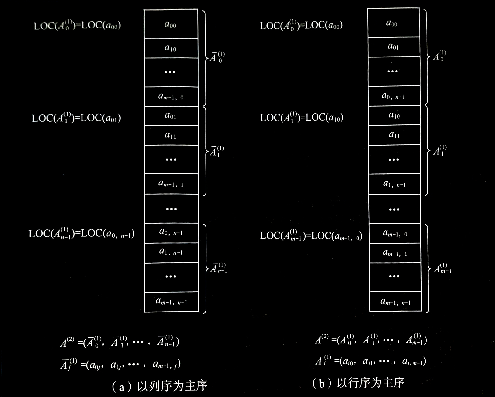
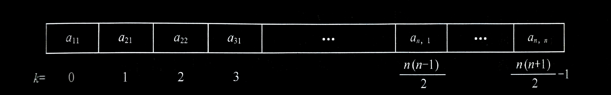
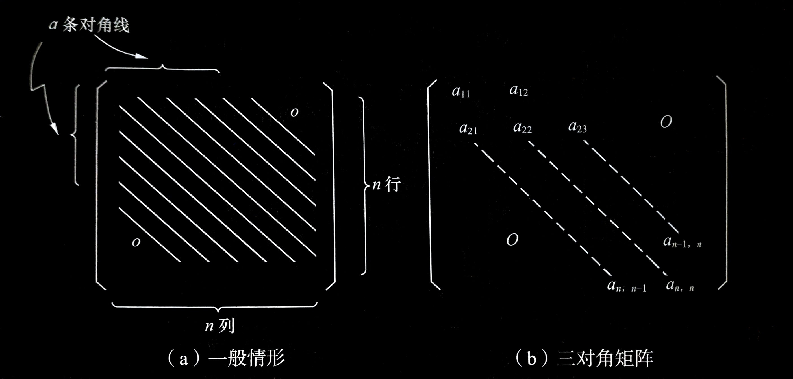

# 数组

## 4.4.1 数组的类型定义

数组是由类型相同的数据元素构成的有序集合，每个元素称为数组元素，每个元素受 $\begin{matrix} n & (n\ge 1) \end{matrix}$ 个线性关系的约束，每个元素在 $n$ 个线性关系中的序号 $i_1,i_2,\cdots ,i_n$ 称为该元素的下标，可以通过下标访问该数据元素。因为数组中每个元素处于 $\begin{matrix} n & (n\ge 1) \end{matrix}$ 个关系中，故称该数组为 $n$ 维数组。数组可以看成是线性表的推广，其特点是结构中的元素本身可以是具有某种结构的数据，但属于同一数据类型。

例如，一维数组可以看成是一个线性表，二维数组可以看成数据元素是线性表的线性表。下图所示的二维数组

- 二维数组图例：
  
  (a) 矩阵形式表示

  $$
  A_{m\times n}=\begin{bmatrix}
   a_{00} & a_{01} & a_{02} & \cdots & a_{0,n-1} \\
   a_{10} & a_{11} & a_{12} & \cdots & a_{1,n-1} \\
   \vdots  & \vdots & \vdots &  & \vdots \\
   a_{m-1,0} & a_{m-1,1} & a_{m-1,2} & \cdots & a_{m-1,n-1}
  \end{bmatrix}
  $$
  
  (b) 列向量的一维数组

  $$
  A_{m\times n}=\begin{bmatrix}
   \begin{bmatrix}
   a_{00}\\
   a_{10}\\
   \vdots\\
   a_{m-1,0}
  \end{bmatrix} & \begin{bmatrix}
   a_{01}\\
   a_{11}\\
   \vdots\\
   a_{m-1,1}
  \end{bmatrix} & \cdots & \begin{bmatrix}
   a_{0,n-1}\\
   a_{1,n-1}\\
   \vdots\\
   a_{m-1,n-1}
  \end{bmatrix}
  \end{bmatrix}
  $$

  (c) 行向量的一维数组

  $$
  A_{m\times n}=\begin{pmatrix}
   \begin{pmatrix}
   a_{00} & a_{01} & \cdots & a_{0,n-1}
  \end{pmatrix} &
   \begin{pmatrix}
   a_{10} & a_{11} & \cdots & a_{1,n-1}
  \end{pmatrix} &
   \cdots &
   \begin{pmatrix}
   a_{m-1,0} & a_{m-1,2} & \cdots & a_{m-1,n-1}
  \end{pmatrix}
  \end{pmatrix}
  $$
  
可以看成是一个线性表：

$$\begin{matrix} A=(a_0,a_1,\cdots ,a_{i,n-1}) & (p=m-1或n-1) \end{matrix}$$

其中每个数据元素 $a_j$ 是一个列向量形式的线性表（见图 (b)）：

$$\begin{matrix} a_j=(a_{0j},a_{1j},\cdots ,a_{m-1,j}) & 0≤j≤n-1 \end{matrix}$$

或者 $a_i$ 是一个行向量形式的线性表（见图 (c)）：

$$\begin{matrix} a_i=(a_{i0},a_{i1},\cdots ,a_{i,n-1}) &
 0≤i≤m-1 \end{matrix}$$

在 C 语言中，一个二维数组类型可以定义为其分量类型为一维数组类型的一维数组类型，也就是说，

```c
typedef ElemType    Array2[m][n];
```

等价于

```c
typedef ElemType    Array1[n];
typedef Array1      Array2[m];
```

同理，一个 $n$ 维数组类型可以定义为其数据元素为 $n-1$ 维数组类型的一维数组类型。

数组一旦被定义，它的维数和维界就不再改变。因此，除了结构的初始化和销毁之外，数组只有存取元素和修改元素值的操作。

> ***抽象数据类型数组可形式地定义为：***
> 
> **$ADT\ Array$** {
> 
> &ensp;&ensp;&ensp;&ensp;**数据对象**： $j_i=0,\cdots ,b_i-1$ ， $i=1,2,\cdots ,n$ ，
> 
> &ensp;&ensp;&ensp;&ensp;&ensp;&ensp;&ensp;&ensp;&ensp;&ensp;&ensp;&ensp;&ensp;&ensp; $D=\{a_{j_1j_2\cdots j_n}\ |\ n(>0) 称为数组的维数，b_i是数组第i维的长度，$
> 
> &ensp;&ensp;&ensp;&ensp;&ensp;&ensp;&ensp;&ensp;&ensp;&ensp;&ensp;&ensp;&ensp;&ensp;&ensp;&ensp;&ensp;&ensp; $j_i是数组元素的第i维下标，a_{j_1j_2\cdots j_n}\in Elemset\}$
> 
> &ensp;&ensp;&ensp;&ensp;**数据关系**： $R=\{R1,R2,\cdots ,Rn\}$
> 
> &ensp;&ensp;&ensp;&ensp;&ensp;&ensp;&ensp;&ensp;&ensp;&ensp;&ensp;&ensp;&ensp;&ensp; $Ri=\{\langle a_{j_1\cdots j_1\cdots j_n},a_{j_1\cdots j_1+1\cdots j_n}\rangle\ |$
> 
> &ensp;&ensp;&ensp;&ensp;&ensp;&ensp;&ensp;&ensp;&ensp;&ensp;&ensp;&ensp;&ensp;&ensp;&ensp;&ensp;&ensp;&ensp; $0≤j_k≤b_k-1,\ 1≤k≤n且k\neq i,$
> 
> &ensp;&ensp;&ensp;&ensp;&ensp;&ensp;&ensp;&ensp;&ensp;&ensp;&ensp;&ensp;&ensp;&ensp;&ensp;&ensp;&ensp;&ensp; $0≤j_i≤b_i-2,$
> 
> &ensp;&ensp;&ensp;&ensp;&ensp;&ensp;&ensp;&ensp;&ensp;&ensp;&ensp;&ensp;&ensp;&ensp;&ensp;&ensp;&ensp;&ensp; $a_{j_1\cdots j_1\cdots j_n},a_{j_1\cdots j_1+1\cdots j_n}\in D,i=2,L,n\}$
> 
> &ensp;&ensp;&ensp;&ensp;**基本操作**:
> 
> &ensp;&ensp;&ensp;&ensp;&ensp;&ensp; $InitArray(\&A,n,boundi,\cdots ,boundn)$
> 
> &ensp;&ensp;&ensp;&ensp;&ensp;&ensp;&ensp;&ensp; 操作结果：若维数 $n$ 和各维长度合法，则构造相应的数组 $A$ ，并返回 $OK$ 。
> 
> &ensp;&ensp;&ensp;&ensp;&ensp;&ensp; $DestroyArray(\&A)$
> 
> &ensp;&ensp;&ensp;&ensp;&ensp;&ensp;&ensp;&ensp; 操作结果：销毁数组 $A$ 。
> 
> &ensp;&ensp;&ensp;&ensp;&ensp;&ensp; $Value(A,\&e,indexl,\cdots ,indexn)$
> 
> &ensp;&ensp;&ensp;&ensp;&ensp;&ensp;&ensp;&ensp; 初始条件： $A$ 是 $n$ 维数组， $e$ 为元素变量，随后是 $n$ 个下标值。
> 
> &ensp;&ensp;&ensp;&ensp;&ensp;&ensp;&ensp;&ensp; 操作结果：若各下标不超界，则 $e$ 赋值为所指定的 $A$ 的元素值，并返回 $OK$ 。
> 
> &ensp;&ensp;&ensp;&ensp;&ensp;&ensp; $Assign(\&A,e,indexl,\cdots ,indexn)$
> 
> &ensp;&ensp;&ensp;&ensp;&ensp;&ensp;&ensp;&ensp; 初始条件： $A$ 是 $n$ 维数组， $e$ 为元素变量，随后是 $n$ 个下标值。
> 
> &ensp;&ensp;&ensp;&ensp;&ensp;&ensp;&ensp;&ensp; 操作结果：若下标不超界，则将 $e$ 的值赋给所指定的 $A$ 的元素，并返回 $OK$ 。
> 
> } **$ADT\ Array$**


---


## 4.4.2 数组的顺序存储
由于数组一般不做插入或删除操作，也就是说，一旦建立了数组，则结构中的数据元素个数和元素之间的关系就不再发生变动。因此，采用顺序存储结构表示数组比较合适。

- 二维数组的两种存储方式：
  

由于存储单元是一维的结构，而数组可能是多维的结构，则用一组连续存储单元存放数组的数据元素就有次序约定问题。例如图 (a) 所示的二维数组可以看成如图 (b) 所示的一维数组，也可看成如图 (c) 所示的一维数组。对应地，对二维数组可有两种存储方式：一种是以列序为主序的存储方式，如图 (a) 所示；一种是以行序为主序的存储方式，如图 (b) 所示。在扩展 Basic、Pascal、Java 和 C 语言中，用的都是以行序为主序的存储结构，而在 FORTRAN 语言中，用的是以列序为主序的存储结构。

由此，对于数组，一旦规定了其维数和各维的长度，便可为它分配存储空间。反之，只要给出一组下标便可求得相应数组元素的存储位置。下面仅用以行序为主序的存储结构为例予以说明。假设每个数据元素占 $L$ 个存储单元，则二维数组 $A[O\dots m-1,0\dots n-1]$ （即下标从 $0$ 开始，共有 $m$ 行 $n$ 列）中任一元素 $a_{ij}$ 的存储位置可由下式确定

$$LOC(i,j)=LOC(0,0)+(n\times i+j)L$$

式中， $LOC(i,j)$ 是 $a_{ji}$ 的存储位置； $LOC(0,0)$ 是 $a_{00}$ 的存储位置，即二维数组 $A$ 的起始存储位置，也称为基地址或基址。

将上式推广到一般情况，可得到 $n$ 维数组 $A[0\dots b_1-1,0\dots b_2-1,\cdots ,0\dots b_n-1]$ 的数据元素存储位置的计算公式：

$$LOC(j_1,j_2,\cdots ,j_n)=LOC(0,0,\cdots ,0)+(b_2\times\cdots\times b_n\times j_1+b_3\times\cdots\times b_n\times j_2 \\+\cdots+b_n\times j_{n-1}\times j_n)L$$

$$=LOC(0,0,\cdots ,0)+\left ( \sum_{i=1}^{n-1} j_i\prod_{k=i+1}^{n} b_k+j_n \right )L$$

可缩写成：

$$LOC(j_1,j_2,\cdots,j_n)=LOC(0,0,\cdots,0)+\sum_{i=1}^{n} c_ij_i$$

其中， $c_n=L$ ， $c_{i-1}=b_i\times c_i$ ， $1<i\le n$ 。

上式称为 $n$ 维数组的映像函数。容易看出，数组元素的存储位置是其下标的线性函数，一旦确定了数组各维的长度， $c_i$ 就是常数。由于计算各个元素存储位置的时间相等，所以存取数组中任一元素的时间也相等，即数组是一种随机存取结构。


---


## 4.4.3 特殊矩阵的压缩存储
矩阵是很多科学与工程计算问题中研究的数学对象，矩阵用二维数组来表示是最自然的方法。但是，在数值分析中经常出现一些阶数很高的矩阵，同时在矩阵中有很多值相同的元素或者是零元素。有时为了节省存储空间，可以对这类矩阵进行压缩存储。所谓压缩存储，是指为多个值相同的元只分配一个存储空间，对零元不分配空间。

假若值相同的元素或者零元素在矩阵中的分布有一定规律，则称此类矩阵为**特殊矩阵**。特殊矩阵主要包括对称矩阵、三角矩阵和对角矩阵等，下面我们重点讨论这三种特殊矩阵的压缩存储。

<br>

### 对称矩阵
若 $n$ 阶矩阵 $A$ 中的元满足下述性质

$$\begin{matrix} a_{ij}=a_{ji} & 1\le i,j\le n \end{matrix}$$

则称为 $n$ 阶对称矩阵。

对于对称矩阵，可以为每一对对称元分配一个存储空间，则可将 $n^2$ 个元压缩存储到 $\frac{n(n+1)}{2}$ 个元的空间中，不失一般性，可以行序为主序存储其下三角（包括对角线）中的元。

假设以一维数组 $sa[n(n+1)/2]$ 作为n阶对称矩阵 $A$ 的存储结构，则 $sa[k]$ 和矩阵元 $a_y$ 之间存在着一一对应的关系：

$$
k=\left\{\begin{matrix}
 \frac{i(i-1)}{2}+j-1 & 当i\ge j\\
 \frac{j(j-1)}{2}+i-1 & 当i<j
\end{matrix}\right.
$$

对于任意给定的一组下标 $(i,j)$ ，均可在 $sa$ 中找到矩阵元 $a_{ij}$ ；反之，对所有的 $k=0,1,2,\cdots,\frac{n(n+1)}{2}-1$ ,都能确定 $sa[k]$ 中的元在矩阵中的位置 $(i,j)$ 。由此，称 $sa[n(n+1)/2]$ 为 $n$ 阶对称矩阵 $A$ 的压缩存储。

- 对称矩阵的压缩存储：
  

<br>

### 三角矩阵
以主对角线划分，三角矩阵有上三角矩阵和下三角矩阵两种。上三角矩阵是指矩阵下三角（不包括对角线）中的元均为常数 $c$ 或零的 $n$ 阶矩阵，下三角矩阵与之相反。对三角矩阵进行压缩存储时，除了和对称矩阵一样，只存储其上（下）三角中的元素之外，再加一个存储常数 $c$ 的存储空间即可。

1. 上三角矩阵
   $sa[k]$ 和矩阵元 $a_{ij}$ 之间的对应关系为

   $$
   k=\left\{\begin{matrix}
    \frac{(i-1)(2n-i+2)}{2}+(j-i) & 当i\le j\\
    \frac{n(n+1)}{2} & 当i>j
   \end{matrix}\right.
   $$

2. 下三角矩阵
   $sa[k]$ 和矩阵元 $a_{ij}$ 之间的对应关系为

   $$
   k=\left\{\begin{matrix}
    \frac{i(i-1)}{2}+j-1 & 当i\ge j\\
    \frac{n(n+1)}{2} & 当i<j
   \end{matrix}\right.
   $$

<br>

### 对角矩阵
对角矩阵所有的非零元都集中在以主对角线为中心的带状区域中，即除了主对角线上和直接在对角线上、下方若干条对角线上的元之外，所有其他的元皆为零，如下图所示。对这种矩阵，也可按某个原则（或以行为主，或以对角线的顺序）将其压缩存储到一维数组上。

- 对角矩阵
  

在上述这些特殊矩阵中，非零元的分布都有一个明显的规律，从而可将其压缩存储到一维数组中，并找到每个非零元在一维数组中的对应关系。

然而，在实际应用中还经常会遇到另一类矩阵，其非零元较零元少，且分布没有一定规律，称之为**稀疏矩阵**。这类矩阵的压缩存储就要比特殊矩阵复杂，在此不做讨论。
