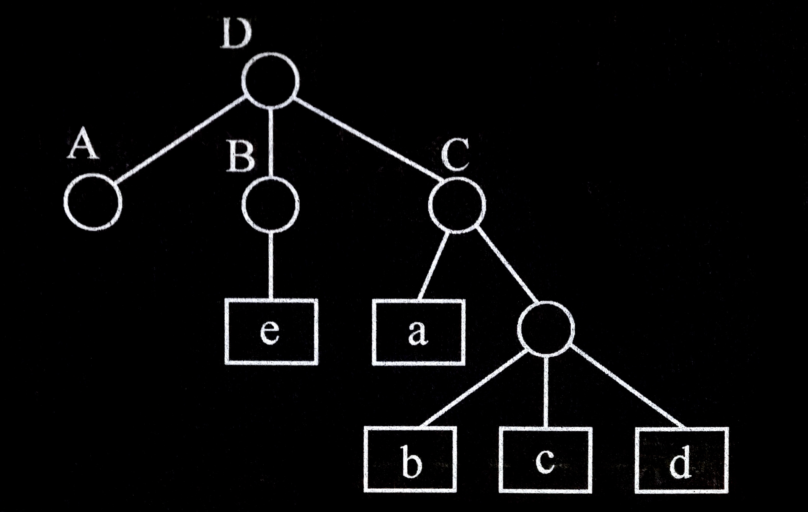
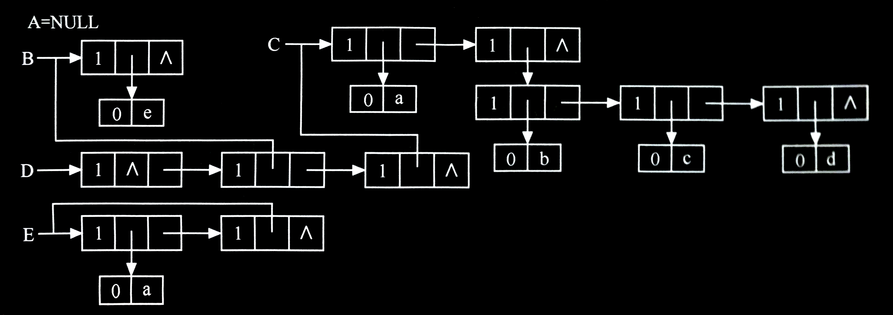
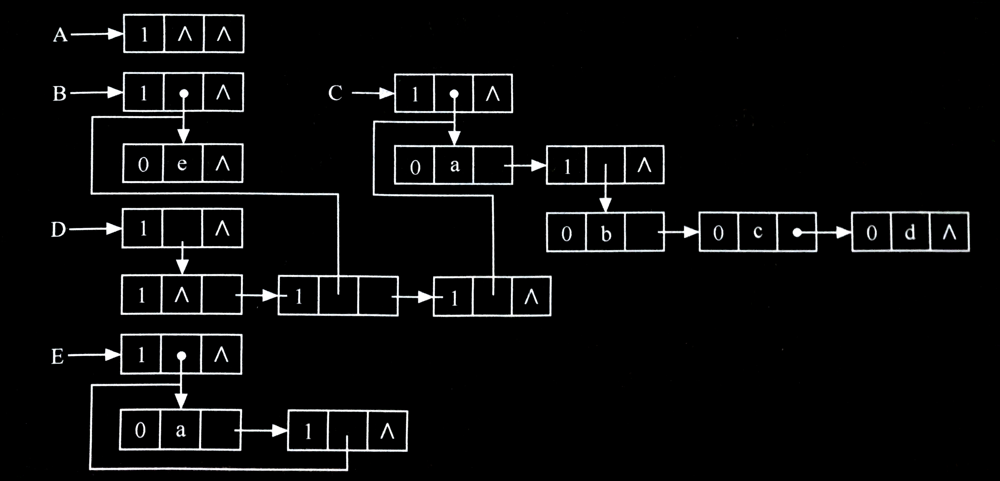

# 广义表

## <span id="4.5.1广义表的定义">**4.5.1 广义表的定义**</span>
顾名思义，广义表是线性表的推广，也称为列表。广泛地用于人工智能等领域的表处理语言 LISP 语言，把广义表作为基本的数据结构，就连程序也表示为一系列的广义表。

广义表一般记作

$$LS=(a_1,a_2,\cdots ,a_n)$$

其中， $LS$ 是广义表 $(a_1,a_2,\cdots ,a_n)$ 的**名称**， $n$ 是其**长度**。在线性表的定义中， $\begin{matrix} a & (1≤i≤n) \end{matrix}$ 只限于是单个元素。而在广义表的定义中， $a$ 可以是单个元素，也可以是广义表，分别称为广义表 $LS$ 的**原子**和**子表**。习惯上，用大写字母表示广义表的名称，用小写字母表示原子。

显然，广义表的定义是一个递归的定义，因为在描述广义表时又用到了广义表的概念。下面列举一些广义表的例子。

- 广义表的图形表示：
  

1. $A=()$ —— $A$ 是一个空表，其长度为零。
2. $B=(e)$ —— $B$ 只有一个原子 $e$ ，其长度为 $1$ 。
3. $C=(a,(b,c,d))$ —— $C$ 的长度为 $2$ ，两个元素分别为原子 $a$ 和子表 $(b,c,d)$ 。
4. $D=(A,B,C)$ —— $D$ 的长度为 $3$ ， $3$ 个元素都是广义表。显然，将子表的值代人后，则有 $D=((),(e),(a,(b,c,d)))$ 。
5. $E=(a,E)$ ——这是一个递归的表，其长度为 $2$ 。 $E$ 相当于一个无限的广义表 $E=(a,(a,(a,\cdots)))$ 。

从上述定义和例子可推出广义表的如下 3 个重要结论。
1. 广义表的元素可以是子表，而子表的元素还可以是子表……由此，广义表是一个多层次的结构，可以用图形象地表示。例如，上图表示的是广义表 $D$ ，图中以圆圈表示广义表，以方块表示原子。
2. 广义表可为其他广义表所共享。例如在上述例子中，广义表 $A$ 、 $B$ 和 $C$ 为 $D$ 的子表，则在 $D$ 中可以不必列出子表的值，而是通过子表的名称来引用。
3. 广义表可以是一个递归的表，即广义表也可以是其本身的一个子表。例如，表 $E$ 就是一个递归的表。

由于广义表的结构比较复杂，其各种运算的实现也不如线性表简单，其中，最重要的两个运算如下。
1. 取表头 $GetHead(LS)$ ：取出的表头为非空广义表的第一个元素，它可以是一个单原子，也可以是一个子表。
2. 取表尾 $GetTail(LS)$ ：取出的表尾为除去表头之外，由其余元素构成的表。即表尾一定是一个广义表。

   例如：

   $GetHead(B)=e,$

   $GetTail(B)=(),$
   
   $GetHead(D)=A,$
   
   $GetTail(D)=(B,C),$

   由于 $(B,C)$ 为非空广义表，则可继续分解得到：

   $GetHead(B,C)=B,$
   
   $GetTail(B,C)=(C),$

值得提醒的是，广义表 $()$ 和 $(())$ 不同。前者为空表，长度 $n=0$ ；后者长度 $n=1$ ，可分解得到其表头、表尾均为空表 $()$ 。


---


## 4.5.2 广义表的存储结构
由于广义表中的数据元素可以有不同的结构（或是原子，或是列表），因此难以用顺序存储结构表示，通常**采用链式存储结构**。常用的链式存储结构有两种，**头尾链表的存储结构**和**扩展线性链表的存储结构**。

<br>

### 头尾链表的存储结构
由于广义表中的数据元素可能为原子或广义表，由此需要两种结构的结点：一种是**表结点**，用以表示广义表；一种是**原子结点**，用以表示原子。从上节得知：若广义表不空，则可分解成表头和表尾，因此，一对确定的表头和表尾可唯一确定广义表。一个**表结点**可由 3 个域组成：**标志域**、**指示表头的指针域**和**指示表尾的指针域**。而**原子结点**只需两个域：**标志域**和**值域**。如表所示，其中 `tag` 是标志域，值为 `1` 时表明结点是子表，值为 `0` 时表明结点是原子。

- 头尾链表表示的结点结构：

  - 表结点

  | tag=1 | hp | tp |
  |:-----:|:--:|:--:|

  - 原子结点

  | tag=0 | atom |
  |:-----:|:----:|

- 头尾链表表示的存储结构示例：
  

**其形式定义说明如下**：

```cpp
// -----广义表的头尾链表存储表示-----
typedef enum {ATOM, LIST} ElemTag;  //ATOM == 0：原子       LIST == 1：子表
typedef struct GLNode {
    ElemTag tag;                    // 公共部分，用于区分原子结点和表结点
    union                           // 原子结点和表结点的联合部分
    {
        AtomType atom;              // atom 是原子结点的值域，AtomType 由用户定义
        struct {
            struct GLNode * hp, * tp;
        } ptr;                      // ptr 是表结点的指针域，ptr.hp 和 ptr.tp 分别指向表头和表尾
    };
} * GList;                          // 广义表类型
```

上节中曾列举了广义表的例子，它们的存储结构如图所示，在这种存储结构中有以下几种情况。

1. 除空表的表头指针为空外，对任何非空广义表，其表头指针均指向一个表结点，且该结点中的 `hp` 域指示广义表表头（或为原子结点，或为表结点）， `tp` 域指向广义表表尾（除非表尾为空，则指针为空，否则必为表结点）。
2. 容易分清列表中原子和子表所在层次。如在广义表 $D$ 中，原子 $a$ 和 $e$ 在同一层次上，而 $b$ 、 $c$ 和 $d$ 在同一层次且比 $a$ 和 $e$ 低一层， $B$ 和 $C$ 是同一层的子表。
3. 最高层的表结点个数即为广义表的长度。

以上 3 个特点在某种程度上给广义表的操作带来方便。

<br>

### 扩展线性链表的存储结构
在这种结构中，无论是原子结点还是表结点均由三个域组成，其结点结构如表所示。

- 扩展线性链表表示的结点结构：
  
  - 表结点

  | tag=1 | hp | tp |
  |:-----:|:--:|:--:|

  - 原子结点

  | tag=1 | atom | tp |
  |:-----:|:----:|:--:|

[*4.5.1 小节*](#4.5.1广义表的定义) 中广义表例子所对应的这种表示法的存储结构，如图所示。

- 扩展线性链表表示的存储结构示例：
  

