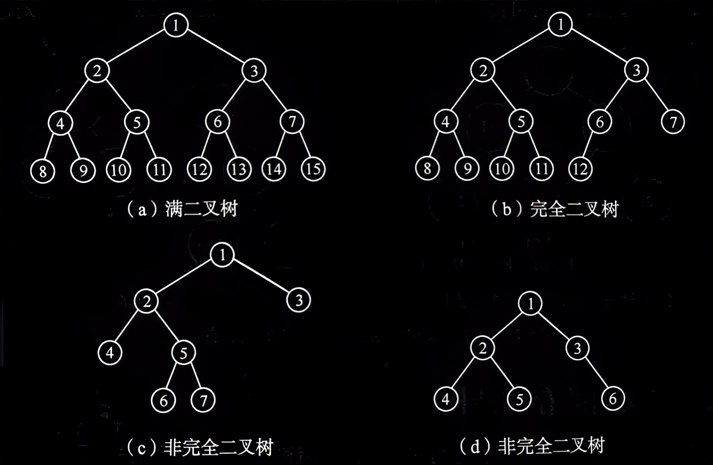
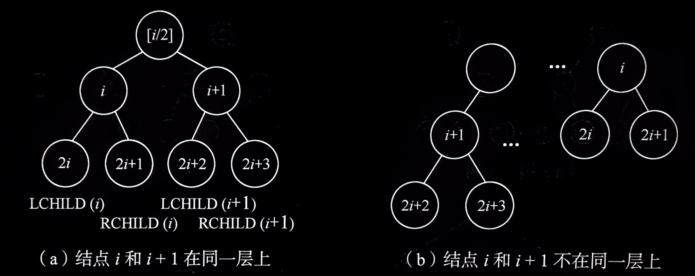
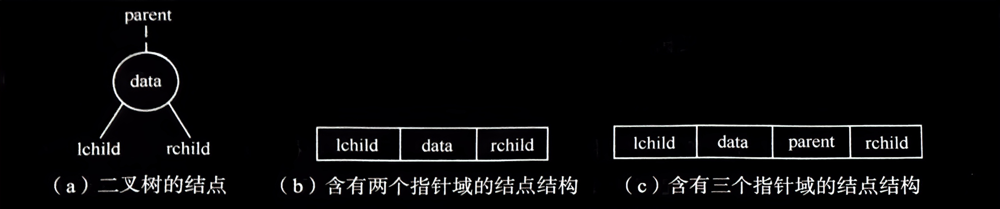
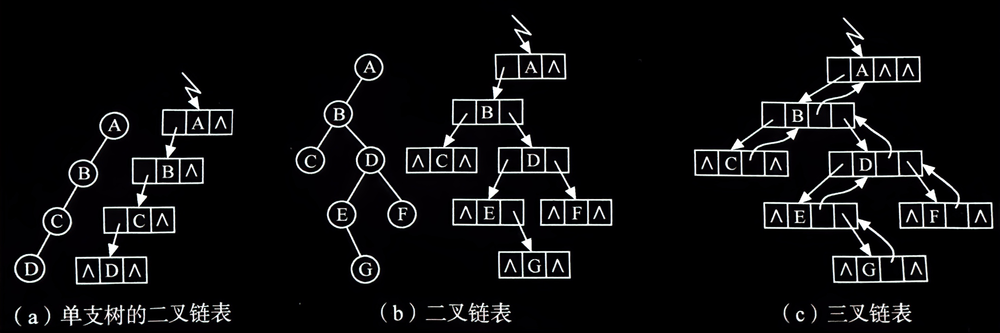

# 二叉树的性质和存储结构

## <spam id="5.4.1二叉树的性质">5.4.1 二叉树的性质</spam>

二叉树具有下列重要特性：

**<span id="性质1">性质 1</span>** 在二叉树的第 $i$ 层上至多有 $2^{i-1}$ 个结点（ $i≥1$ ）。

**证明**：利用归纳法容易证得此性质。

$i=1$ 时，只有一个根结点。显然， $2^{i-1}=2^0=1$ 是对的。

现在假定对所有的 $\begin{matrix} j & (1≤j<i) \end{matrix}$ ，命题成立，即第 $j$ 层上至多有 $2^{j-1}$ 个结点。那么，可以证明 $j=i$ 时命题也成立。

由归纳假设：第 $i-1$ 层上至多有 $2^{i-2}$ 个结点。由于二叉树每个结点的度至多为 $2$ ，故在第 $i$ 层上的最大结点数为第 $i-1$ 层上的最大结点数的2倍，即 $2\times 2^{i-2}=2^{i-1}$ 。

<br>

**<span id="性质2">性质 2</span>** 深度为 $k$ 的二叉树至多有 $2^k-1$ 个结点（ $k≥1$ ）。

**证明**：由 [*性质 1*](#性质1) 可见，深度为 $k$ 的二叉树的最大结点数为

$$\sum_{i=1}^{k}(第i层上的最大结点数)=\sum_{i=1}^{k}2^{i-1}=2^k-1$$

<br>

**性质 3** 对任何一棵二叉树 $T$ ，如果其终端结点数为 $n_0$ ，度为 $2$ 的结点数为 $n_2$ ，则 $n_0=n_2+1$ 。

**证明**：设 $n_1$ 为二叉树 $T$ 中度为 $1$ 的结点数。因为二叉树中所有结点的度均小于或等于 $2$ ，所以其结点总数为

$$n=n_0+n_1+n_2$$

再看二叉树中的分支数。除了根结点外，其余结点都有一个分支进入，设 $B$ 为分支总数，则 $n=B+1$ 。由于这些分支是由度为 $1$ 或 $2$ 的结点射出的，所以又有 $B=n_1+2n_2$ 。

于是得

$$n=n_1+2n_2+1$$

由上两式得

$$n_0=n_2+1$$

现在介绍两种特殊形态的二叉树，它们是满二叉树和完全二叉树。

- <spam id="特殊形态的二叉树">特殊形态的二叉树</spam>：
  

**满二叉树**：深度为 $k$ 且含有 $2^k-1$ 个结点的二叉树。图 (a) 所示是一棵深度为 $4$ 的满二叉树。

满二叉树的特点是：每一层上的结点数都是最大结点数，即每一层 $i$ 的结点数都具有最大值 $2^{i-1}$ 。

可以对满二叉树的结点进行连续编号，约定编号从根结点起，自上而下，自左至右。由此可引出完全二叉树的定义。

**完全二叉树**：深度为 $k$ 的，有 $n$ 个结点的二叉树，当且仅当其每一个结点都与深度为 $k$ 的满二叉树中编号从 $1$ 至 $n$ 的结点一一对应时，称之为完全二叉树。图 (b) 所示为一棵深度为 $4$ 的完全二叉树。

完全二叉树的特点是：
1. 叶子结点只可能在层次最大的两层上出现；
2. 对任一结点，若其右分支下的子孙的最大层次为 $l$ ，则其左分支下的子孙的最大层次必为 $l$ 或 $l+1$ 。图中 (c) 和 (d) 不是完全二叉树。

完全二叉树在很多场合下出现，下面的性质 4 和性质 5 是完全二叉树的两个重要特性。

<br>

**性质 4** 具有 $n$ 个结点的完全二叉树的深度为 $\left \lfloor log_2n \right \rfloor +1$ 。

**证明**：假设深度为 $k$ ，则根据 [*性质 2*](#性质2) 和完全二叉树的定义有

$$\begin{matrix} 2^{k-1}-1<n≤2^k-1 & 或 & 2^{k-1}≤n<2^k \end{matrix}$$

于是 $k-1≤log_2n<k$ ，因为 $k$ 是整数，所以 $k=\left \lfloor log_2n \right \rfloor +1$ 。

<br>

**性质 5** 如果对一棵有 $n$ 个结点的完全二叉树（其深度为 $\left \lfloor log_2n \right \rfloor+1$ ）的结点按层序编号（从第 $1$ 层到第 $\left \lfloor log_2n \right \rfloor+1$ 层，每层从左到右），则对任一结点 $\begin{matrix} i & (1≤i≤n) \end{matrix}$ ，有

1. 如果 $i=1$ ，则结点 $i$ 是二叉树的根，无双亲；如果 $i>1$ ，则其双亲 $PARENT(i)$ 是结点 $\left \lfloor i/2 \right \rfloor$ 。
2. 如果 $2i>n$ ，则结点 $i$ 无左孩子（结点 $i$ 为叶子结点）；否则其左孩子 $LCHILD(i)$ 是结点 $2i$ 。
3. 如果 $2i+1>n$ ，则结点 $i$ 无右孩子；否则其右孩子 $RCHILD(i)$ 是结点 $2i+1$ 。

- 完全二叉树中结点 $i$ 和 $i+1$ 的左、右孩子：
  


---


## 5.4.2 二叉树的存储结构
类似线性表，二叉树的存储结构也可采用顺序存储和链式存储两种方式。

<br>

### 顺序存储结构

```cpp
// -----二叉树的顺序存储表示-----
#define MAXTSIZE 100                    // 二叉树的最大结点数
typedef TElemType SqBiTree[MAXTSIZE];   // 0 号单元存储根结点
SqBiTree bt;
```
顺序存储结构使用一组地址连续的存储单元来存储数据元素，为了能够在存储结构中反映出结点之间的逻辑关系，必须将二叉树中的结点依照一定的规律安排在这组单元中。

对于完全二叉树，只要从根起按层序存储即可，依次自上而下、自左至右存储结点元素，将完全二叉树上编号为 $i$ 的结点元素存储在如上定义的一维数组中下标为 $i-1$ 的分量中。例如，[*下表*](#二叉树的顺序存储结构) (a) 所示为 [*上数第二张图*](#特殊形态的二叉树) (b) 所示完全二叉树的顺序存储结构。

对于一般二叉树，则应将其每个结点与完全二叉树上的结点相对照，存储在一维数组的相应分量中，[*上数第二张图*](#特殊形态的二叉树) (c) 所示二叉树的顺序存储结构如[*下表*](#二叉树的顺序存储结构) (b) 所示，表中以 `0` 表示不存在此结点。

- <spam id="二叉树的顺序存储结构">二叉树的顺序存储结构</spam>：
  
  (a) 完全二叉树

  | 1 | 2 | 3 | 4 | 5 | 6 | 7 | 8 | 9 | 10 | 11 | 12 |
  |:-:|:-:|:-:|:-:|:-:|:-:|:-:|:-:|:-:|:--:|:--:|:--:|

  (b) 一般二叉树

  | 1 | 2 | 3 | 4 | 5 | 0 | 0 | 0 | 0 | 6 | 7 |
  |:-:|:-:|:-:|:-:|:-:|:-:|:-:|:-:|:-:|:-:|:-:|

由此可见，这种顺序存储结构仅适用于完全二叉树。因为，在最坏的情况下，一个深度为 $k$ 且只有 $k$ 个结点的单支树（树中不存在度为 $2$ 的结点）却需要长度为 $2^k-1$ 的一维数组。这造成了存储空间的极大浪费，所以对于一般二叉树，更适合采取下面的链式存储结构。

<br>

### 链式存储结构

- 二叉树的结点及其存储结构：
  

设计不同的结点结构可构成不同形式的链式存储结构。由二叉树的定义得知，二叉树的结点（见上图 (a)）由一个数据元素和分别指向其左、右子树的两个分支构成，则表示二叉树的链表中的结点至少包含 3 个域：数据域和左、右指针域，如图 (b) 所示。有时，为了便于找到结点的双亲，还可在结点结构中增加一个指向其双亲结点的指针域，如图 (c) 所示。利用这两种结点结构所得二叉树的存储结构分别称之为二叉链表和三叉链表，如下图所示。链表的头指针指向二叉树的根结点。容易证得，在含有 $n$ 个结点的二叉链表中有 $n+1$ 个空链域。在 5.5 节中将会看到可以利用这些空链域存储其他有用信息，从而得到另一种链式存储结构——线索链表。

- 链表存储结构：
  

在不同的存储结构中，实现二叉树的操作方法也不同，如找结点 $x$ 的双亲 $PARENT(T,e)$ ，在三叉链表中很容易实现，而在二叉链表中则需从根指针出发巡查。由此，在具体应用中采用什么存储结构，除根据二叉树的形态之外还应考虑需进行何种操作。读者可试以 [*5.4.1 小节*](#5.4.1二叉树的性质) 中定义的各种操作对以上定义的各种存储结构进行比较。在下一节的二叉树遍历及其应用的算法均采用以下定义的二叉链表形式实现。

```cpp
// -----二叉树的二叉链表存储表示-----
typedef struct BiTNode {
    TElemType data;                     // 结点数据域
    struct BiTNode * lchild, * rchild;  // 左右孩子指针
} BiTNode, * BiTree;
```
